# Linktree — UI Audit Notes

## Scope

Screenshot-based audit of the real logged-in product experience + public marketing surface.

## 00. Landing Page — linktr.ee (public marketing site)

### Screen LT-LAND-001 — Full landing page (linktr.ee root)

- **Flow:** unauthenticated visitor → `https://linktr.ee/`
- **Source:** BrowserMCP accessibility snapshot + screenshot, 2026-04-24
- **URL:** `https://linktr.ee/`
- **Page title:** `Link in bio tool: Everything you are, in one simple link | Linktree`

#### What Linktree ships on the landing (section by section, top to bottom)

1. **Promo strip (top, dismissible)**
   - `Find your archetype with THE CREATOR INDEX` → CTA `/creatorindex` — a co-marketed quiz / personality-assessment lead-magnet. Linktree uses its own site traffic to cross-sell adjacent creator content.
   - `×` dismiss button. Delivers 1 extra engagement opportunity before the main content.

2. **Top nav (rounded white pill, floats on lime background)**
   - Logo: `Linktree✳` (name + asterisk icon — the asterisk is their signature brand mark, visible in every product surface)
   - Nav items: **`Products` (dropdown)**, **`Templates`**, **`Marketplace`**, **`Learn` (dropdown)**, **`Pricing`**
   - Right: `Log in` (white-filled pill) + **`Sign up free`** (black-filled pill)
   - **Critical delta vs Stan Store:** pricing + templates + marketplace + learn are ALL publicly nav-linked. Stan has none of these. Linktree is transparent about pricing, content-marketed via Learn, and ships a public Marketplace of creator templates.

3. **Hero**
   - Full-bleed lime-green `#C8F567` (approx) canvas — highly distinctive, almost toxic-bright. Instantly recognizable.
   - H1: `A link in bio built for you.` — oversized dark-green extra-bold sans-serif
   - Subtitle: "Join 70M+ people using Linktree for their link in bio. One link to help you share everything you create, curate and sell from your Instagram, TikTok, Twitter, YouTube and other social media profiles." — **scale claim (70M+) as primary trust signal**
   - Handle-claim form: `linktr.ee/` prefix + `yourname` input + `Get started for free` (dark-green pill button)
   - **Right column: lifestyle creator photography** — not device mockups (Stan), not figma (Beacons):
     - Top: "Kelsey Rose, Trainer and founder of Shaep" — real photo, gym setting, actual trainer
     - Bottom: "Perfect Person podcast" creator in a retro living-room styled shoot
     - Lifestyle photography = aspirational realism. Reads as editorial magazine more than SaaS marketing.

4. **Gallery carousel(s)** — 5+5 slides (auto-rotating image showcase of different creator archetypes / use cases — images not further identified in snapshot, likely custom product shots)

5. **Product positioning trio (3 H2 sections with CTAs)**
   - H2: `Create and customize your Linktree in minutes` + `Get started for free`
   - H2: `Share your Linktree anywhere you like!` (QR code reference in subtitle) + `Get started for free`
   - H2: `Analyze your audience and keep them engaged` (image + revenue/engagement language) + `Get started for free`
   - **Each section repeats the CTA** — 3 free-tier sign-up CTAs in a row, following Stan's pattern of single-CTA-repeated but **Linktree uses "Get started for FREE" explicitly** (vs Stan's `Continue`).

6. **Audience-segments ticker** — `The only link in bio trusted by 70M+`
   - Marquee / horizontal scroll ticker listing 22 audience niches:
     - creators · influencers · small businesses · athletes · models · monetizers · health educators · streamers · vloggers · fitness coaches · ecommerce sellers · retailers · products · wellness leaders · musicians · bands · podcasters · fashion designers · culture creators · merch sellers · writers · DJs
   - **Repeated 3× in snapshot** — implies infinite-loop CSS marquee animation
   - Strategic move: **inclusive positioning**. Compare Stan's narrow "monetize your following" creator-only framing. Linktree wants EVERYONE.

7. **Famous creator showcase** — 7 handle examples:
   - `/selenagomez` · `/funkynutmeg` · `/hbo` · `/comedycentral` · `/pharrell` · `/tonyhawk` · `/laclippers`
   - **Mix of A-list celebrities (Selena Gomez, Pharrell) + major brands (HBO, Comedy Central, LA Clippers) + athletes (Tony Hawk) + micro-creator (funkynutmeg)**
   - **Completely different tier than Stan's mid-sized creators.** Linktree flexes A-list + brands; Stan focuses on $1K/week mid-creator economy.
   - Handles shown as `/handlename` fragments — implies clickable to real public pages

8. **3 solution link blocks** (split entry points by creator intent)
   - `Share every type of content in limitless ways` → `/solutions/share-content`
   - `Sell products, collect payments and make monetization simple` → `/solutions/earn`
   - `Grow, own and engage your audience across all of your channels` → `/solutions/grow-followers`
   - Each links to a dedicated solutions sub-page — Linktree runs a full **solutions taxonomy** for SEO + conversion by intent. Stan doesn't have this.

9. **Plans teaser**
   - H2: `The fast, friendly and powerful link in bio tool.`
   - Single CTA: `Explore all plans` → `/s/pricing` (separate page)
   - Linktree pricing lives on its own page; teased from landing.

10. **"As featured in..."** testimonials carousel — 5 real creators with:
    - Professional photo portraits
    - Full name + role (e.g., "David Coleman, Founder, Mechanicallyincleyend"; "Riley Lemon, Youtuber, Content Creator"; "Patti Chimkire, Founder and Pastry Chef, Mali Bakes"; "Luke Kidgell, Comedian"; "Rise Utama, TV Reporter and Producer")
    - Quoted testimonials focusing on **lifestyle value** (monetization, audience understanding, discoverability) — NOT raw revenue screenshots like Stan
    - Previous / Next carousel navigation buttons
    - **Tonal difference vs Stan:** Stan shows `$32,012 in a week` dashboard screenshots. Linktree shows "It's fast and easy" / "I can definitely see the monetization becoming a full-time thing". Linktree is softer, corporate-safe; Stan is bolder, creator-flex.

11. **FAQ on landing** — `Questions? Answered` — 9 collapsed Q&A items:
    - Why should podcasters use Linktree?
    - Is Linktree the original link in bio tool? (brand-defensiveness signal — they claim originator status)
    - Can you get paid and sell things from a Linktree?
    - Is Linktree safe to use on all of my social media profiles?
    - What makes Linktree better than the other link in bio options? (competitive de-risk copy)
    - How can I drive more traffic to and through my Linktree?
    - How many links should I have on my Linktree?
    - Do I need a website to use Linktree?
    - Where can I download the app?
    - **FAQ as a landing section is Linktree pattern — Stan does NOT ship FAQ on landing.** Excellent SEO strategy (long-tail query matching) + excellent late-funnel conversion tool (answers last objections).

12. **Final CTA block**
    - H2: `Jumpstart your corner of the internet today`
    - Handle-claim form (repeated from hero) + `Claim your Linktree` button

13. **Footer — corporate grade (massive, 4 column groups + legal + apps + social + acknowledgement)**
    - **Company:** The Linktree Blog · Engineering Blog · Marketplace · What's New · About · Press · Careers · Link in Bio · Social Good · Contact
    - **Community:** Linktree for Enterprise · 2023 Creator Report · 2022 Creator Report · Charities · Creator Profile Directory · Explore Templates
    - **Support:** Help Topics · Getting Started · Linktree Pro · Features & How-Tos · FAQs · Report a Violation
    - **Trust & Legal:** Terms & Conditions · Privacy Notice · Cookie Notice · **Trust Center** · Cookies Preferences · **Transparency Report** · **Law Enforcement Access Policy** · **Human Rights**
    - **Mobile apps:** iOS App Store + Google Play store badges (visible links with playstore + appstore URLs)
    - **Social:** Linktr.ee own Linktree + Threads + TikTok + Instagram
    - **Indigenous land acknowledgement:** Australian Aboriginal flag + Torres Strait Islander Flag + "We acknowledge the Traditional Custodians of the land on which our office stands, The Wurundjeri people of the Kulin Nation, and pay our respects to Elders past, present and emerging. Linktree Pty Ltd (ABN 68 608 721 562), 1-9 Sackville St, Collingwood VIC 3066"

#### How the Linktree landing works — strategic reading

- **Pricing is public and nav-linked.** Visitor can qualify before signup.
- **Sign up is FREE, not trial.** Linktree's consistent copy: `Sign up free` / `Get started for free` / `Claim your Linktree`. No "14-day trial". No card at signup.
- **Scale-based trust** (70M+) vs Stan's rating-based trust (Trustpilot 4.8/1906). Linktree can afford to flex scale; Stan can't.
- **A-list celebrity + brand showcase** vs Stan's mid-creator showcase. Linktree positions itself as aspirational; Stan positions as achievable.
- **Inclusive niche list (22 segments)** vs Stan's narrow "creators only". Linktree plays TAM; Stan plays SAM.
- **Mobile apps shipped** (iOS + Android) vs Stan's web-only. Linktree's 70M scale justifies mobile engineering; Stan can't afford it yet.
- **Enterprise-grade trust surfaces** (Trust Center, Transparency Report, Law Enforcement Access Policy, Human Rights) — Stan has zero of these. Linktree is a regulated SaaS at scale; Stan is a startup.
- **Content marketing built into nav** (Learn dropdown + Engineering Blog + 2 Creator Reports + Templates gallery + Marketplace) — Linktree runs a full editorial + discovery engine; Stan has a single `Blog` link (not even rendered as a link in the nav per earlier STS-001 audit).
- **FAQ on landing** — Stan doesn't have, Linktree does. Major SEO + conversion pattern.

#### UI / usability assessment

- **Lime-green hero is aggressively distinctive** — highest recognition-at-a-glance of any competitor in the category. Almost a stunt colour (reads brand-confident; could read loud/obnoxious depending on taste).
- **Lifestyle photography** (trainer at gym, podcaster in retro room) instead of device mockups — feels editorial, not SaaS. Differentiator vs every other link-in-bio tool.
- **Nav pill layout** (floating rounded white pill on green) is a distinctive pattern; dark-filled primary button on white pill contrasts strongly.
- **Scroll experience** is long but paced — alternating lime + white sections, clear H2 section headers, multiple CTAs. Doesn't read exhausting.
- **Accessibility concerns:** lime `#C8F567` + dark green text — may pass WCAG contrast at large sizes but borderline. Not tested.

#### Strategic assessment for tadaify

1. **Linktree is the closest analog to our positioning** (free-tier, inclusive, link-in-bio-primary). Stan is a different category (creator commerce, trial-only). Linktree is the competitor whose model we most directly challenge.

2. **Pricing in nav + public** — already in feature-mix §5.4. Confirmed as correct call.

3. **"Sign up free" vs "Continue" vs "Start My Trial"** — Linktree's CTA copy is the strongest of the three. Tadaify adopts this ENERGY but with an **even stronger handle-claim**: `Claim tadaify.com/yourname` > `Sign up free`.

4. **Audience-segments marquee is a strong inclusive-positioning pattern.** Adopt. Generate a scrolling list of 20+ audience niches that signals "this is for you, whoever you are". Lower bar than Stan's monetize-your-following gate.

5. **Famous-creator showcase for tadaify cannot compete with Linktree's scale.** We cannot ship with `/selenagomez` on day 1. But we CAN ship with 5 real creators whose stores work — Stan's pattern (PAT-002). Tadaify uses Stan's playbook for showcase, Linktree's playbook for everything else.

6. **FAQ on landing is high-leverage low-cost addition.** Ship 6-8 FAQ items on the tadaify landing from day 1. SEO wins + late-funnel objection-handling.

7. **Lifestyle photography vs device mockups vs dashboard-screenshot social proof** — tadaify should MIX:
   - Hero: lifestyle photography (Linktree) — feels premium, editorial
   - Product section: admin dashboard screenshots (Stan PAT-003) — shows real product
   - Public-creator-showcase section: real tadaify stores (Stan PAT-002)

8. **Trust Center + Transparency Report + Law Enforcement Access Policy on tadaify landing footer.** Linktree ships enterprise-grade trust; Stan ships zero. This is a 50:50 play — Linktree scale justifies it; a new entrant can either (a) skip it for MVP and look like Stan, or (b) ship it from day 1 and look serious. Feature-mix §7.4 already has "Uptime + SLA publication" as `ORIGINATE`. Extend to full Trust Center for maturity signal.

9. **Mobile app is deferred.** Web-first MVP; mobile app is post-PMF. Linktree's $X00M funding paid for mobile; we cannot.

10. **"Solutions by intent" taxonomy** (`/solutions/share-content`, `/solutions/earn`, `/solutions/grow-followers`) is a deeper content-marketing pattern. Defer for MVP (no traffic yet); revisit at Y1 when we have enough demand per segment.

#### Irritation risk for visitors

- **Lime-green aesthetic is divisive.** Some visitors will love the confident brand; some will find it overwhelming. Niche win, polarizing choice. Tadaify's Indigo Serif palette is more timeless / less polarizing.
- **70M+ claim** may feel inaccessible — "I'm not 1 of 70M, I'm just me" bounce-risk. Linktree mitigates with the 22-segment ticker immediately below.
- **"Is Linktree the original link in bio tool?" FAQ** reads defensively — they're fighting the "cheap clone" narrative. Tadaify shouldn't engage this framing on our own landing.
- **Carousel testimonials with manual prev/next** — worse UX than Stan's masonry grid (no clicks needed to scan). Tadaify: prefer auto-visible grid or staggered layout.

#### Worth implementing for tadaify

**ADOPT:**
- Handle-claim form in hero with live `tadaify.com/yourname` preview (already in feature-mix §1.1)
- Single-CTA × 3 placements (already in feature-mix §5.3)
- `Sign up FREE` / `Claim your handle` explicit free-tier copy (not trial / not continue)
- Audience-segments marquee ticker (NEW pattern, inclusive positioning)
- FAQ on landing (6-8 items MVP)
- Public pricing in nav (already in feature-mix §5.4)
- Real creator showcase (already adopted from Stan PAT-002; Linktree confirms pattern)
- Lifestyle photography in hero (NEW pattern, editorial tone)

**ORIGINATE (inspired by Linktree patterns, taken further):**
- Trust Center live from launch (includes uptime + SLA + incident log)
- Transparency Report after Y1 (legal requests, content moderation, user data handled)
- Public creator directory with search + niche filter (Linktree has `Creator Profile Directory`; tadaify ships with SEO focus + Polish creator wedge)

**AVOID:**
- 70M+ / scale-claim copy (we don't have scale on day 1, don't fake it)
- A-list celebrity namedrops (we don't have them, don't pretend)
- Content-marketing depth (dedicated Learn / Blog / Templates / Marketplace) — defer to Y1, MVP is product not content
- Lime-green brand (we're locked on Indigo Serif per brand-lock §2)
- Manual prev/next carousel for testimonials (use staggered grid)
- Native mobile apps (defer post-PMF)
- Indigenous land acknowledgement (Linktree is Australian; we're not; don't copy-paste cultural signals)

#### How tadaify could do it better

1. **Hero copy:** replace Linktree's generic `A link in bio built for you.` with **`Your bio link, now your best first impression.`** (matches brand-lock tagline `Turn your bio link into your best first impression.`). Product-specific, not generic.

2. **Handle-claim input UX:** Linktree's is vanilla (`linktr.ee/yourname` → button). Tadaify: as user types, live-render the full `tada!ify` wordmark in brand typography below the input AS the handle materializes — giving a "this is what your public page header will look like" preview. Higher commitment feel.

3. **Audience-segments ticker:** Linktree lists 22 generic niches. Tadaify: localize — include PL-relevant niches (e.g., "copywriterzy", "trenerzy online", "edukatorzy", "mamy-blogerki") AND use more specific modern niches ("AI artists", "Notion coaches", "newsletter writers", "game streamers", "yoga teachers") — more honest, more current.

4. **FAQ with live AI-search** (ORIGINATE): instead of 9 collapsed items, ship a search box + semantic search over 40+ FAQs. Similar implementation cost, much better long-tail coverage.

5. **Mini public-creator gallery in hero** (on scroll): Stan's `/abigailpeugh` next to lifestyle photography + small `$X MRR · N products` stats per card = instant proof-of-works on landing fold.

6. **Honest "who we're NOT for" section** (ORIGINATE): Linktree and Stan both say "for everyone / for creators". Tadaify could include a "Looking to build a full business website? Try Carrd or Squarespace. Looking for the simplest free link list? Try Linktree. Looking to replace 5+ tools with commerce depth? Try Stan. Looking for a polished bio link that sells your first product in 10 minutes? You're in the right place." — comparative honesty as brand.

#### Open questions

- How does Linktree's `/s/pricing` page visually compare to Stan's trial-wall pricing? (Audit separately.)
- What does the Linktree Marketplace actually sell — 3rd-party integrations, template packs, creator services? (Click into `/marketplace`.)
- What's in the `Products` nav dropdown — does Linktree have distinct product surfaces beyond the link-in-bio core? (Hover to reveal.)
- What is "Linktree Pro for free" (footer link `/s/join-linktree-pro-for-free`)? — sounds like a student / non-profit / qualifying program.
- Does Linktree publish actual SLA numbers + incident log on their Trust Center, or just a page that says "we care about security"? (Depth check.)
- What's the Creator Profile Directory UX? Browse by niche? Free SEO for creators? (Audit potential — strong tadaify ORIGINATE target.)

## 11. Paywalls / Plan Gating

### Screen LT-PAY-001 — Full public pricing page (`/s/pricing`)

- **URL:** `https://linktr.ee/s/pricing`
- **Page title:** `Linktree Free, Starter, Pro and Premium Pricing`
- **Source:** BrowserMCP snapshot, 2026-04-24

#### Full tier structure (public, transparent)

| Tier | Annual price | Monthly price | Free trial | Seller fee | SLA |
|---|---|---|---|---|---|
| **Free** | $0 forever | — | N/A | **12% fee** on courses + digital products | 48 hrs |
| **Starter** | $6 USD/mo | $8/mo | — (no trial, direct paid) | 9% fee | 24 hrs |
| **Pro** ⭐ Recommended | $12 USD/mo | $15/mo | **7 days free trial** | 9% fee | 12 hrs |
| **Premium** | $30 USD/mo | $35/mo | — | **0% fee** + 100% affiliate commission | **4 hrs** |
| Agency / Enterprise | Custom — contact | — | — | — | — |

**Annual savings:** "save up to 20%" (tab toggle Monthly/Annually, Annually pre-selected)

#### Per-tier features — ladder

**Free** (entry):
- Unlimited links
- Social icons, videos & embeds
- Essential analytics (last 28 days)
- SEO optimized design
- Unique QR code
- Linktree Shops & sponsored links
- Digital products + courses (with 12% fee — friction driver)

**Starter $6** (Everything in Free +):
- Custom themes
- Own your audience (subscriber email management)
- Redirect links (temporary redirect to one key link for promos/launches)
- Reduced seller fees (9%)
- Analytics window extends to 90 days
- Basic link shortener

**Pro $12** ⭐ RECOMMENDED (Everything in Starter +):
- Personalized Linktree (own logo, full-screen visuals)
- Highlight key links (featured + animated)
- Comprehensive analytics (365 days, lifetime analytics)
- **Automated Instagram replies** (NEW, 2.5k sends/month)
- Link shortener: custom backhalves + skip Linktree
- Email integrations (Mailchimp, Google Sheets, Kit, Klaviyo)
- Conversion tracking, Facebook Conversion API, Google Analytics, UTM parameters, Data export
- Zapier Integration

**Premium $30** (Everything in Pro +):
- Concierge onboarding
- Unlimited social posts (3 brands)
- Optional add-on team tools (chat + approval workflows)
- Unlimited Instagram replies
- **0% seller fees** (the killer feature)
- **Earn 100% commissions** on affiliate products
- 4-hour support SLA
- Custom T&Cs, Add Admins, all-time analytics

#### The genius of Linktree's pricing architecture — seller fee ladder as upgrade engine

This is the single most important lesson in this audit.

Linktree doesn't sell features — it sells **progressive fee reduction** tied to creator revenue. Math for a creator with $1,000/month in digital product sales:

| Tier | Monthly platform cost | Monthly fees | Total monthly cost | Creator keeps |
|---|---|---|---|---|
| Free | $0 | $120 (12%) | **$120** | $880 |
| Starter | $6 | $90 (9%) | $96 | $904 |
| Pro | $12 | $90 (9%) | $102 | $898 |
| **Premium** | **$30** | **$0 (0%)** | **$30** | **$970** |

- **Break-even Premium vs Pro:** $333/month in sales — above that, 0% beats 9%+$18
- **Break-even Premium vs Free:** $250/month — above that, 0%+$30 beats 12%+$0
- **Each tier is better than the previous once creator hits a revenue threshold** — creators self-upgrade as they grow

This is **strictly superior to Stan's single pricing model** (all tiers 0% fees, but no free entry). Linktree captures:
- Absolute beginners ($0 revenue) → Free (lock-in + data)
- Early earners ($100-$300/mo) → Starter or Pro
- Mid creators ($300-$3k/mo) → Pro
- Scaled creators ($3k+/mo) → Premium

**This is also why Linktree doesn't need to advertise Premium features beyond Pro aggressively** — creators arrive at Premium automatically when the maths works for them.

#### Secondary pricing levers

- **"Recommended" badge on Pro** — nudges the decision to the middle-tier (proven SaaS psychology)
- **7-day free trial only on Pro** (not Free→Starter, not Pro→Premium) — drops creators into the "recommended" tier with reduced commitment
- **Monthly/Annually toggle with Annually pre-selected** — standard
- **Support SLA published per tier** (48h/24h/12h/**4h**) — this is the first competitor to publicly commit to response times. Linktree treats SLA as a paid feature, not a trust signal.
- **Volume-tiered features** (Instagram Auto-reply: 1k / 1.5k / 2.5k / unlimited sends) — variable-cost AI features get volume-gated
- **Time-window tiered analytics** (28d / 90d / 365d / all-time) — retention data is cheap to store, rewarding to unlock
- **Depth-tiered analytics** (Top 10 referrers on Pro → full list on Premium) — same data, different cut

#### Comparison table: Linktree Earn vs Other Platforms

Pricing page includes a side-by-side comparison on monetization:

| Dimension | Linktree Earn | Other Platforms |
|---|---|---|
| Instant checkout | ✅ no extra tools | ❌ requires separate storefront |
| Courses powered by | Kajabi, no extra account | ❌ monthly fees, complex setup |
| Sponsored links | ✅ built-in | ❌ no native monetization |
| Affiliate commissions | Industry-leading | ❌ lower payouts |
| Setup time | Minutes | Hours/days |

Linktree runs this comparative positioning directly on pricing page — aggressive but within taste.

#### Strategic assessment for tadaify

**CRITICAL re-examination of our existing feature-mix §6.2 "0% fees at all tiers" decision.**

Current tadaify plan: Free + Pro (2-tier Notion-style), 0% fees at both. After seeing Linktree's fee ladder, we need to reconsider:

**Option A — Keep "0% fees at all tiers" (current feature-mix §6.2):**
- Pros: simplest pricing, honest, creator-friendly, direct anti-Linktree wedge
- Cons: no fee-based upgrade driver; $0 ARPU from non-paying creators; we lose the genius of Linktree's self-upgrading ladder
- Implication: we need OTHER strong upgrade drivers (custom domain, email, analytics depth, etc.)

**Option B — Adopt tiered fees (Linktree-like):**
- Pros: self-upgrading ladder, $ from free tier (even if small), captures creator economy growth
- Cons: less creator-friendly, complicates marketing, clashes with "0% always" brand message

**Option C — Hybrid: 0% fees on PAID tiers, small fee (e.g. 5%) on FREE tier:**
- Pros: free-tier monetization + absolute-0% on paid
- Cons: dilutes "0% always" copy
- Sub-variant: free tier instead gets NO digital product sales (must upgrade) — cleaner

**Recommended decision: Option C sub-variant.** Free tier is a link-in-bio ONLY (no digital products, no courses, no checkout) — upgrade to sell. Paid tier is 0% fees always. This is cleaner than a fee ladder, simpler to market, preserves our "0% always" messaging for paid tiers, and removes pressure to charge free-tier creators fees.

Decision to update: **tadaify-feature-mix §6.1.2 (new) + §6.2 refinement.**

#### Other tadaify-relevant lessons

1. **Publish tier-based SLA on pricing page** — Linktree is the only competitor doing this. ORIGINATE beyond them by publishing REAL-TIME SLA adherence on Trust Center (feature-mix §7.4).

2. **"Recommended" badge** — if we go 2-tier (Free / Pro), the concept doesn't apply cleanly. If we go 3-tier (Free / Pro / Business), put Recommended on Pro.

3. **7-day free trial of Pro from Free account** — nice pattern. Adopt: creator on Free can "Try Pro for 7 days" with one click, revert back at end of trial without card collection if paid tier doesn't collect card.

4. **Volume-tiered AI features** (Instagram auto-replies) — as we add AI features (AI-write-product-description, AI-write-page-copy), use volume tiers. Free: 5 generations/mo; Pro: 50/mo; Business: unlimited.

5. **Time-window tiered analytics** — cheap retention win. Free: 28 days; Pro: 365 days; Business: all-time. Zero storage cost difference, real perceived value.

6. **Depth-tiered analytics** (Top 10 → full) — another cheap differentiator.

7. **Comparative pricing positioning table** — adopt for tadaify vs Linktree / Stan / Beacons. Risk: can read as defensive; benefit: directly addresses "why not them?" objection.

8. **Enterprise / Agency tier as "Contact us"** — standard SaaS pattern, defer to Y1.

#### Irritation risk for Linktree's pricing page

- **Four tiers + Enterprise is decision paralysis.** Visitor has to compare 4 feature columns × 40+ features. Linktree mitigates with the Recommended badge + 7-day trial on Pro.
- **12% fee on Free tier is aggressive** — sold as "free to start" but creators only learn about the 12% fee on scroll-down or when they actually sell something. This is a dark-pattern-adjacent framing.
- **Feature table is overwhelming** — 40+ features across 7 categories. Expert-creator friendly; noob creator bails.

#### Worth implementing for tadaify

**ADOPT:**
- Public pricing page with nav link (already in feature-mix §5.4)
- Tier-based SLA publication (4h/12h/24h/48h model adapted)
- "Recommended" badge if we go 3+ tiers
- 7-day trial of Pro from Free account (one-click, no card)
- Volume-tiered AI features (as AI features land)
- Time-window tiered analytics
- Annual savings toggle with Annually pre-selected (20%+ savings)

**AVOID / RECONSIDER:**
- 12% fee on Free tier (too aggressive; we're either 0%-or-nothing or we do Option C sub-variant = no digital sales on Free)
- 4-tier ladder (too complex for MVP; start 2-tier Free + Pro, expand to 3-tier if needed)
- 40+ feature compare table on pricing (start with top-10 features per tier; add depth only if conversion demands it)

**ORIGINATE:**
- Real-time SLA adherence on Trust Center (Linktree publishes SLA commitment; we publish SLA adherence history)
- Transparent fee schedule (Linktree buries 12% fee in tier description; we publish fees in simple table at top)
- PL/EU VAT pre-calculated in displayed price (Linktree shows USD only)

#### Open questions

- Does Linktree's 12% fee apply to the gross sale or the creator's share after Stripe fees? (Check help article.)
- Is the 7-day Pro trial card-gated or truly frictionless? (Requires sign-up flow test.)
- What do "sponsored links" actually earn a creator? (Help article reference implied but not surfaced on pricing.)
- Kajabi-powered courses — does Linktree white-label Kajabi or is it OAuth? (Product audit.)
- Why is Starter $6 and not $5 (common SaaS pricing anchor)? Answer: likely because annual-vs-monthly math lands at $6.

---

## 08. Growth / Integrations / Embeds

### Screen LT-MKT-001 — Marketplace (`/marketplace`)

- **URL:** `https://linktr.ee/marketplace`
- **Page title:** `Linktree Marketplace: Browse the best apps to customize your link in bio`

#### Structure

- **Heading:** `Connect more of you` / "Bring the best experiences across the internet to one place: your Linktree"
- **Search box:** full-width `Search Link Apps and integrations...`
- **4 categorized sections:**
  1. **Share your content** (25 apps) — Audiomack, SoundCloud, TikTok, X, YouTube, Cameo, Spotify, Facebook, Pinterest, Podcasts, etc.
  2. **Make and collect money** (14 apps) — GoFundMe, Amaze/Spring, Shopify
  3. **Grow your following** (20 apps) — Snapchat, Reddit, Contact Details, Community SMS, Gleam, Form
  4. **All link apps and integrations** — See All → `/marketplace/browse`
- **Developer program callout** (mid-page): `Join our developer program` / "We're expanding access to our APIs and SDKs." → `/marketplace/developer`
- **URL distinction:** `/marketplace/apps/<slug>` vs `/marketplace/integrations/<slug>` — Linktree distinguishes **Link Apps** (native embed blocks) from **Integrations** (OAuth data bridges)

#### Critical observation — correction to earlier notes

**Linktree HAS a developer program** with API/SDK access — "expanding access" wording implies limited-availability (probably partner-first, not open-self-serve). This partially contradicts the earlier tadaify-feature-mix §8 claim that "no competitor offers an open API". Updated positioning: **tadaify's wedge is open, self-serve, documented from day 1** — Linktree has partner-API, we have creator-API.

#### Strategic observations

1. **59+ native integrations is a deep feature moat.** Any tadaify MVP will be outmatched by Linktree's breadth. We cannot win on integration count in Y1.
2. **Strategic alternative: plug into Zapier from day 1** — removes the integration-count arms race. Every Zapier app becomes a tadaify integration.
3. **Intent-based category grouping** (Share / Make money / Grow) mirrors Linktree's Solutions-by-intent pattern (PAT-041).
4. **Two-tier integration model** (apps vs integrations) — tadaify should mirror: lightweight embed blocks (Link Apps) + deep OAuth-connected integrations (CRM, email tools, analytics).
5. **Developer program is gated** — Linktree's API is not public enough for indie developers. Tadaify ships **public self-serve API + webhooks + OpenAPI spec + docs portal day 1** as a real wedge.

#### Tadaify implications

- **ADOPT:** categorized marketplace structure (Share / Earn / Grow), search box, 2-tier apps vs integrations model
- **DEFER:** ship only 8-10 MVP integrations + Zapier webhook bridge (deflate the 59-integration gap via Zapier instead of match)
- **ORIGINATE:** public self-serve developer portal day 1 — fills the gap Linktree's partner-only dev program leaves

---

## 10. Design System / UX Patterns

### Screen LT-TPL-001 — Templates gallery (`/s/templates`)

- **URL:** `https://linktr.ee/s/templates`
- **Page title:** `Templates - Linktree`

#### Structure

- **Heading:** `A Linktree template to suit every brand and creator`
- **10 category filters:** Fashion · Health and Fitness · Influencer and Creator · Marketing · Music · Small Business · Social Media · Sports · Telegram · WhatsApp
- **46 named templates** visible: Artemis, Balcombe, Boultont, Bourke, Constance, Coromandel, Crombie, Gordon, Guildford Sport, Hanna, Hay, Healeys, Heape, Heffernan, Iris, Knox, Lane, Lingham, Louden, Merlin, Merlin Biz, Merriman, Meyers, Middleton, Mitre, Music 14, Oliver, Paynes, Pender, Platypus, Presgrave, Ridgway, Russell, Rutledge, Sampson, Singers, Smythe, Smythe Sports, Somerset, Star, Stubbs, Sugden, Throssell, Turner, Ulster, Warburton
- **Naming convention:** Australian place names + surnames — brand-locale signal (Linktree is Melbourne Pty Ltd)
- **Links href=`#`** — template preview opens as modal or requires login; cannot deep-link
- **7 famous creators section** repeated (same as landing)

#### Strategic observations

1. **Templates as SEO acquisition channel** — each category page (`/s/templates/fashion`, `/s/templates/health-and-fitness`) ranks for long-tail keywords like "best linktree template for fitness coaches"
2. **Templates as onboarding shortcut** — creator picks a template in 10 seconds, skips empty-canvas paralysis, ships faster
3. **46 templates is a healthy library** — enough variety without choice-overload; Linktree's editor team curated this
4. **Naming = brand-locale signature.** Australian names signal "Australian-founded, editorial feel". For tadaify: use PL-culture names (e.g., Kraków, Tatra, Wawel, Gdynia, Warszawa, Bałtyk, Wisła, Beskid — or surname-based: Chopin, Kopernik, Skłodowska, Mickiewicz) — brand-locale signal signals our origin

#### Tadaify implications

- **ADOPT:** category-filtered template gallery + 8-12 MVP templates across 6 niches (fashion / fitness / creator / music / SMB / sports)
- **ADOPT:** template naming convention as brand-locale signature — use PL place/surname names as identity signal
- **ORIGINATE:** public template deep-link (`/t/<name>` preview without login) — Linktree hides templates behind auth, we show them openly for SEO
- **DEFER:** Telegram / WhatsApp specialized templates — MVP-niche

#### Open questions

- What does clicking a template actually do — full preview, half-preview, login-gate?
- Can creators share / submit their own templates? (Paid per use? Free? Marketplace economy?)
- Can templates be modified after applied, or are they "snapshots" at apply-time?

---

## 01. Onboarding & Auth

### Screen LT-001 — Post-Google login username step

- **Flow:** onboarding, immediately after Google sign-in
- **Source:** screenshot provided in Codex chat on 2026-04-23

### Evidence

- Chat screenshot: 2026-04-23 / Linktree / post-Google username step
- Context note: username appears to be prefilled from the Google account email
  local-part (`pawel.wasowski.dev`)
- Artifact id: `LT-001`
- Local screenshot path: [lt-001-post-google-username-step.png](./screens/lt-001-post-google-username-step.png)

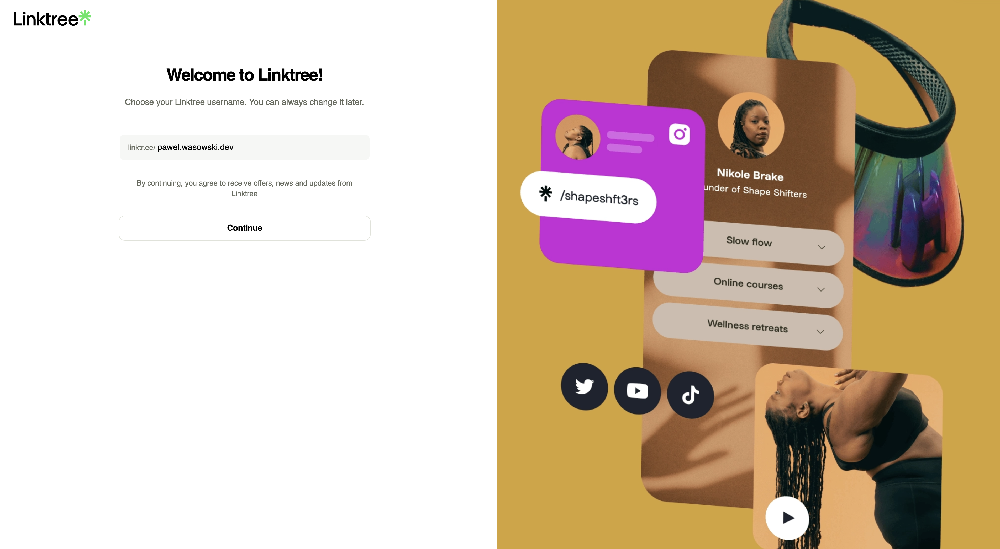

### Layout and visible functionality

- Split layout: form on the left, aspirational product visual on the right.
- Main heading: `Welcome to Linktree!`
- Single task: choose a Linktree username.
- Username field is prefilled as `linktr.ee/pawel.wasowski.dev`.
- Reassurance copy says the username can be changed later.
- Single primary CTA: `Continue`.

### How the flow works

- Google OAuth does **not** drop the user straight into the dashboard.
- Linktree inserts a lightweight activation step before the product proper.
- The product pre-populates the public slug from the Google email local-part
  / account identity instead of forcing an empty-field decision.
- The public profile URL is established very early in the onboarding flow.

### UI / usability assessment for users

- Strong pattern overall: one field, one CTA, no distractions.
- Good friction reduction: prefilled username + `you can always change it later`.
- Very low cognitive load for a first-run screen.
- Clear downside: user still cannot reach the product until they complete one
  more setup step.

### Strategic assessment for tadaify

- After Google sign-in, consider sending the user straight to slug selection.
- Prefill the slug from email local-part or display name.
- Check availability live and propose 2-3 clean alternatives if taken.
- Keep the copy low-pressure: the slug is important, but reversible.

### Irritation risk

- Low.
- This is a required setup step, but it feels legitimate rather than salesy.
- The reassurance copy reduces friction and makes the ask feel reversible.

### Is it worth implementing?

- Yes, broadly.
- A post-social-login slug step is worth implementing in tadaify because it
  creates a public identity early and reduces empty-state friction.

### How tadaify could do it better

- Add live availability feedback directly below the field.
- Offer 2-3 smart alternatives if the first slug is taken.
- Show a tiny live preview of the final URL and maybe the future public page
  title/avatar beside it.
- If possible, allow a soft skip and default draft slug assignment for users
  who want to explore first.

### Screen LT-004 — Goal-selection onboarding step

- **Flow:** post-pricing / early product onboarding; shown after the pricing
  sequence when the user continues without taking a paid trial
- **Source:** screenshot provided in Codex chat on 2026-04-23

### Evidence

- Chat screenshot: 2026-04-23 / Linktree / goal-selection onboarding step
- Artifact id: `LT-004`
- Local screenshot path: [lt-004-goal-selection-onboarding-step.png](./screens/lt-004-goal-selection-onboarding-step.png)

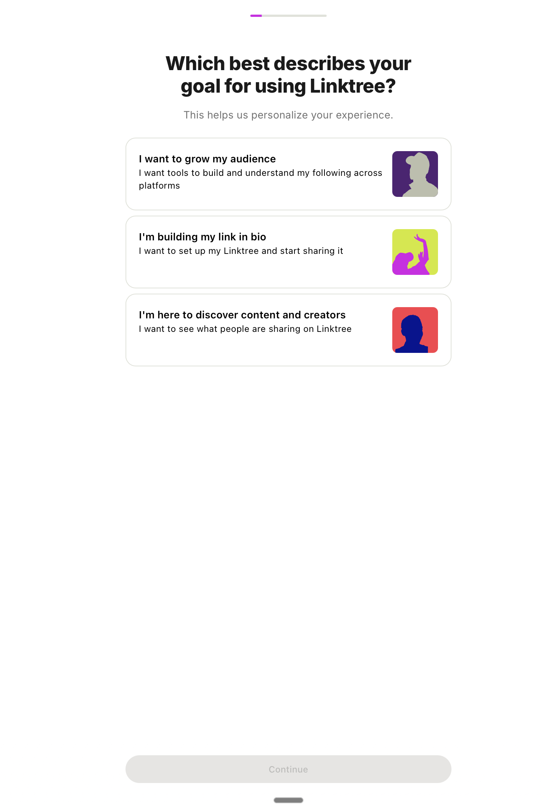

### Layout and visible functionality

- Full-screen onboarding question with a progress indicator at the top.
- Main question: `Which best describes your goal for using Linktree?`
- Supporting copy: `This helps us personalize your experience.`
- Three large choice cards:
  - `I want to grow my audience`
  - `I'm building my link in bio`
  - `I'm here to discover content and creators`
- Each card has:
  - a bold title
  - one-line explanatory copy
  - a colored visual tile/icon on the right
- Bottom CTA `Continue` is disabled until a choice is selected.

### How the flow works

- After the monetization sequence, Linktree transitions into a
  segmentation/personalization onboarding flow.
- The product is asking for user intent, likely to:
  - personalize templates or starter flows
  - adapt dashboard recommendations
  - tune feature education and nudges
  - improve internal lifecycle segmentation for growth/CRM
- The disabled `Continue` indicates this step is mandatory before moving on.

### UI / usability assessment for users

- Strong onboarding pattern:
  - clear single question
  - large tappable choices
  - simple copy
  - visible progress indicator
- Good parts:
  - feels more product-helpful than salesy
  - choices are understandable even for first-time users
  - visual treatment makes the step approachable and quick to scan
- Downsides:
  - still one more forced step before reaching the product
  - the third option (`discover content and creators`) is surprising and may
    dilute the core use case
  - if this does not produce visibly better onboarding, users may see it as
    unnecessary friction

### Strategic assessment for tadaify

- This pattern is much more transferable to tadaify than the early paywalls.
- A lightweight intent-question step can be strategically useful for:
  - selecting the right initial setup path
  - prioritizing relevant templates
  - choosing starter recommendations
  - tailoring upgrade messaging later
- For tadaify, likely useful intent buckets would be closer to:
  - `creator / personal brand`
  - `business / freelancer`
  - `adult creator / spicy-safe profile`
  - `just getting started / migrating from Linktree`

### Irritation risk

- Low to medium.
- Lower than a paywall, because the user can understand why the product is
  asking this.
- Risk increases if too many mandatory questions follow or if personalization
  is not visible afterward.

### Is it worth implementing?

- Yes, likely worth implementing in a lighter form.
- Especially useful for tadaify if it changes:
  - default page setup
  - recommended modules
  - starter templates
  - onboarding copy and upsell timing
- It is not worth doing if the answer is collected but ignored.

### How tadaify could do it better

- Ask one concise intent question maximum, not a long survey.
- Use options tightly aligned to tadaify's actual personas.
- Immediately reflect the choice in the next screen:
  - preselected template
  - recommended blocks
  - onboarding checklist
- Add a subtle `Skip for now` only if personalization is non-critical.
- Consider including a migration-specific option (`I'm switching from another
  link in bio tool`) because that is strategically important for tadaify.

### Screen LT-005 — Skipable theme-selection onboarding grid

- **Flow:** early onboarding, after goal-selection; user is asked to choose a
  visual theme before adding content
- **Source:** screenshot provided in Codex chat on 2026-04-23

### Evidence

- Chat screenshot: 2026-04-23 / Linktree / theme-selection onboarding step
- Artifact id: `LT-005`
- Local screenshot path: [lt-005-theme-selection-onboarding-grid.png](./screens/lt-005-theme-selection-onboarding-grid.png)

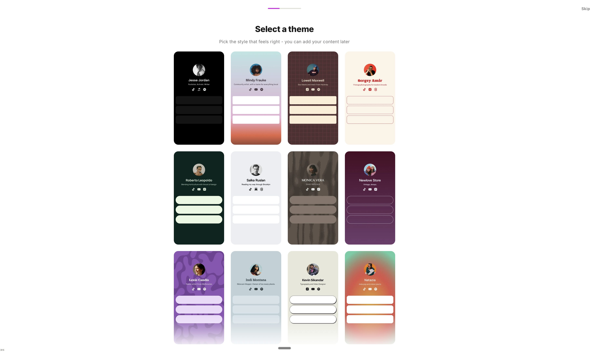

### Layout and visible functionality

- Full-screen onboarding step with progress indicator at the top.
- Title: `Select a theme`.
- Supporting copy: pick the style now, content can be added later.
- Visible `Skip` action in the top-right corner.
- Large grid of theme cards showing many visual styles at once.
- Selecting a concrete template changes the state of the step instead of moving
  to a brand-new screen.
- In the selected state, Linktree reveals a confirmation CTA:
  `Start with this template`.
- Each card is a realistic mini-preview of a profile:
  - avatar
  - name
  - short bio
  - social icons
  - button/link styling
  - background / color treatment
- The visible selection set is broad: dark, minimal, editorial, gradient,
  textured, colorful, soft, etc.

### How the flow works

- Linktree moves from user-intent segmentation into visual personalization.
- Instead of sending the user directly to a blank editor, it gives a curated
  set of ready-made starting aesthetics.
- This step is explicitly optional via `Skip`.
- After selecting a specific theme, the same screen reveals a confirmation CTA:
  `Start with this template`, so selection becomes a two-step micro-flow:
  choose -> confirm.
- The phrase `you can add your content later` lowers pressure and frames theme
  selection as a reversible head start, not a permanent decision.

### UI / usability assessment for users

- Strong onboarding UX.
- Good parts:
  - visually inspiring
  - fast to understand
  - users can choose by feel, not by configuration knowledge
  - optionality (`Skip`) makes the step feel helpful instead of coercive
  - selection leads to a clear next action (`Start with this template`)
  - large catalog creates a sense of product richness
- Potential downsides:
  - a very large grid can create choice overload for some users
  - if many themes are too similar, the apparent abundance may be more
    decorative than useful
  - without filtering or recommendation, some users may just skip because the
    choice set is too wide

### Strategic assessment for tadaify

- This is a very good pattern for tadaify.
- It directly supports one of the biggest user jobs:
  `make my page look good quickly without needing design skills`.
- It also reinforces perceived product quality: a big, polished theme catalog
  makes the product feel more complete and more worth paying for later.
- Strategically, this is much more aligned with tadaify's value proposition
  than aggressive early paywalls.

### Irritation risk

- Low.
- The step is visually pleasant and clearly useful.
- The presence of `Skip` is critical: it prevents the flow from feeling
  mandatory or annoying.
- Irritation would rise only if:
  - there were too many such setup steps in a row
  - the chosen theme did not actually map cleanly into the later editor

### Is it worth implementing?

- Yes, absolutely.
- This is one of the stronger patterns seen so far for tadaify.
- It is especially worth implementing if the selected theme meaningfully affects
  the starting editor state and the public page preview.

### How tadaify could do it better

- Keep the step optional, like Linktree does here.
- Use fewer but more clearly differentiated starter themes at first instead of
  overwhelming users with too many near-duplicates.
- Add intent-aware recommendations based on the previous goal question, e.g.:
  - creator themes
  - business/freelancer themes
  - adult-safe / low-brand / privacy-oriented themes
- Show a tiny badge like `Recommended for creators` or `Best for businesses`
  to reduce choice overload.
- Make sure the chosen theme fully translates into editable settings in the
  later editor, so the user does not feel baited by a nice preview that is hard
  to actually customize.

### Screen LT-006 — Platform selection onboarding step

- **Flow:** early onboarding, after theme selection; optional social/platform
  selection step before entering the editor
- **Source:** screenshot provided in Codex chat on 2026-04-23

### Evidence

- Chat screenshot: 2026-04-23 / Linktree / platform-selection onboarding step
- Artifact id: `LT-006`
- Local screenshot path: [lt-006-platform-selection-onboarding.png](./screens/lt-006-platform-selection-onboarding.png)

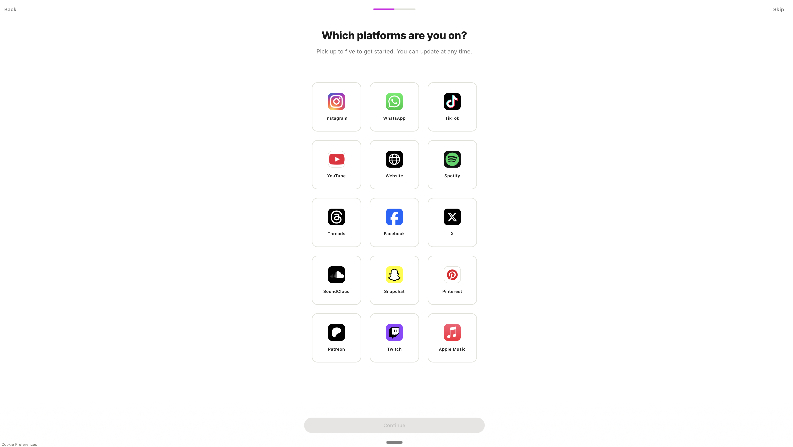

### Layout and visible functionality

- Full-screen onboarding step with progress indicator at the top.
- Top-left `Back` action and top-right `Skip` action.
- Main heading: `Which platforms are you on?`
- Supporting copy: `Pick up to five to get started. You can update at any time.`
- Grid of selectable platform cards.
- Bottom CTA `Continue` is disabled until at least one platform is selected.
- The step is explicitly non-blocking because `Skip` is available.
- Visible platforms in the screenshot:
  - Instagram
  - WhatsApp
  - TikTok
  - YouTube
  - Website
  - Spotify
  - Threads
  - Facebook
  - X
  - SoundCloud
  - Snapchat
  - Pinterest
  - Patreon
  - Twitch
  - Apple Music

### How the flow works

- Linktree continues onboarding by asking the user which channels matter most
  to them.
- The choice set is capped: the user can select up to five platforms.
- The step is structured as helpful setup, not as a hard requirement:
  - `Back` allows correction
  - `Skip` allows bypassing
  - `You can update at any time` reduces fear of making a wrong choice
- Most likely product purpose:
  - prefill social icons / blocks
  - personalize suggested links
  - tailor editor defaults
  - improve future onboarding nudges

### UI / usability assessment for users

- Strong usability overall.
- Good parts:
  - easy to scan
  - recognizable platform logos
  - simple one-question interaction model
  - optionality lowers pressure
  - the limit of five helps avoid an excessively noisy first profile setup
- Potential downsides:
  - users with many channels may find the cap artificial
  - `Website` is mixed into social platforms, which is practical but a little
    conceptually inconsistent
  - if the next step does not visibly reflect the chosen platforms, this can
    feel like redundant data collection

### Strategic assessment for tadaify

- This is a valuable pattern for tadaify.
- It helps bridge onboarding into actual content creation:
  instead of dropping the user into a blank editor, the product starts
  collecting the ingredients for a first usable page.
- The platform set itself is also strategically useful as competitive input.
- Current Linktree visible starter set to remember:
  - Instagram
  - WhatsApp
  - TikTok
  - YouTube
  - Website
  - Spotify
  - Threads
  - Facebook
  - X
  - SoundCloud
  - Snapchat
  - Pinterest
  - Patreon
  - Twitch
  - Apple Music

### Irritation risk

- Low.
- This feels much less annoying than a paywall because it is clearly tied to
  building the user's page.
- Risk increases only if:
  - there are too many mandatory onboarding steps in sequence
  - selected platforms do not produce visible value right after the choice

### Is it worth implementing?

- Yes, likely worth implementing.
- Especially useful if tadaify uses the selection immediately to:
  - prefill social links
  - preselect icon rows
  - recommend relevant blocks
  - reorder starter suggestions in the editor

### How tadaify could do it better

- Keep it optional, just like Linktree does here.
- Reflect the chosen platforms immediately on the next screen or in the first
  editor state.
- Consider allowing `social`, `music`, `commerce`, and `messaging` categories
  instead of one flat list once the catalog grows.
- Consider adding creator-relevant platforms that fit tadaify strategy, e.g.
  OnlyFans-style or adult-creator-safe destinations, if that remains part of
  positioning.
- If using a selection cap, explain why; otherwise allow unlimited selection
  and simply prioritize the top few in the default page setup.

### Screen LT-007 — Link entry onboarding step

- **Flow:** early onboarding, after platform selection; optional step for
  filling in selected platform handles and extra URLs
- **Source:** screenshot provided in Codex chat on 2026-04-23

### Evidence

- Chat screenshot: 2026-04-23 / Linktree / link-entry onboarding step
- Artifact id: `LT-007`
- Local screenshot path: [lt-007-link-entry-onboarding-step.png](./screens/lt-007-link-entry-onboarding-step.png)

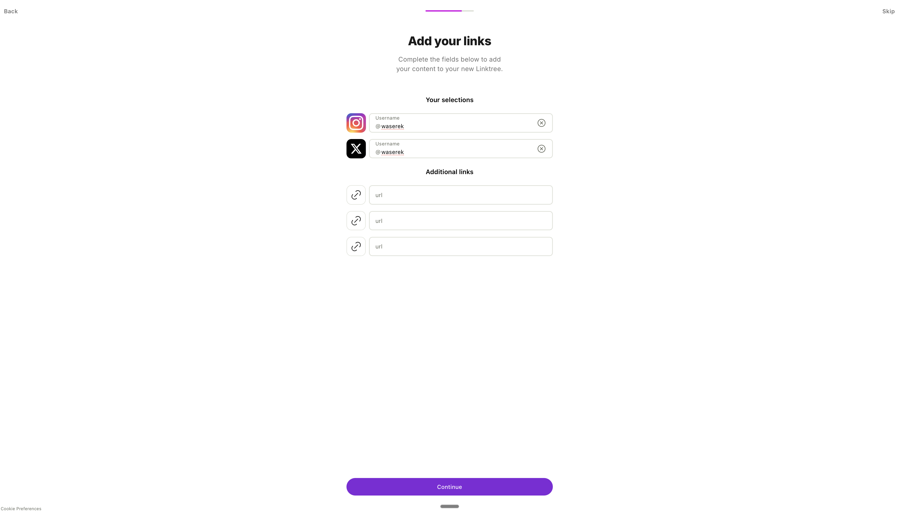

### Layout and visible functionality

- Full-screen onboarding step with progress indicator at the top.
- Top-left `Back` action and top-right `Skip` action.
- Main heading: `Add your links`.
- Supporting copy frames this step as adding content to the new Linktree.
- The form is split into two groups:
  - `Your selections`
  - `Additional links`
- `Your selections` shows the platforms chosen in the previous step, here:
  - Instagram
  - X
- Each selected platform row contains:
  - the platform icon
  - a labeled input field (`Username`)
  - a prefilled `@handle`-style value
  - a remove / clear control on the right
- `Additional links` provides three empty generic URL rows.
- Bottom CTA `Continue` is active.
- The step remains optional because `Skip` is available.

### How the flow works

- Linktree takes the abstract platform choices from the previous step and turns
  them into concrete data entry.
- Instead of asking the user to configure everything manually in the editor,
  onboarding collects the first real content immediately.
- Selected platforms appear as structured rows with dedicated fields.
- Generic non-social destinations can be added via free-form URL inputs.
- This creates a useful bridge between onboarding preferences and an actually
  publishable starter page.

### UI / usability assessment for users

- Strong step overall because it starts producing real page content.
- Good parts:
  - makes previous platform selection feel meaningful
  - mixes structured platform-specific inputs with flexible generic links
  - allows quick removal of wrongly selected platforms
  - still keeps the flow optional with `Skip`
- Potential downsides:
  - only three visible additional URL rows may feel arbitrary
  - users may wonder whether usernames are enough or whether full URLs are
    needed for some platforms
  - if later editing works differently than this onboarding form, users may
    experience a small model mismatch

### Strategic assessment for tadaify

- This is a very valuable pattern for tadaify.
- It is one of the first onboarding steps that directly improves activation,
  because the user is not only choosing preferences but actually building the
  first version of their page.
- Strategically, this is much better than abstract setup steps with no
  immediate output.
- It also suggests a strong design principle:
  every onboarding question should earn its place by feeding into real page
  creation as fast as possible.

### Irritation risk

- Low.
- The step asks for useful, concrete information and visibly builds toward a
  finished result.
- Irritation would rise only if:
  - too many fields were required
  - validation was confusing
  - skipping later caused the user to lose previously selected platforms

### Is it worth implementing?

- Yes, strongly worth implementing.
- For tadaify this is one of the best patterns seen so far, because it turns
  onboarding into actual setup work with immediate product value.

### How tadaify could do it better

- Keep the optional structure, but show a clearer live preview of how entered
  handles and URLs will appear on the page.
- Support platform-aware validation and auto-formatting:
  - accept `@username`
  - accept pasted full URLs
  - normalize both into the right destination
- Let users add more generic links dynamically instead of showing a fixed count
  only.
- Consider grouping by type:
  - social profiles
  - messaging/contact
  - music/media
  - custom links
- If tadaify keeps an adult-creator-friendly positioning, include tailored
  destination types relevant to that audience as first-class options.

### Screen LT-008 — Profile details prefill + AI bio rewrite

- **Flow:** early onboarding, after link entry; optional profile-details step
  where the user confirms avatar, display name, and bio
- **Source:** screenshot provided in Codex chat on 2026-04-23

### Evidence

- Chat screenshot: 2026-04-23 / Linktree / profile-details prefill step
- Artifact id: `LT-008`
- Local screenshot path: [lt-008-profile-details-prefill-and-ai-rewrite.png](./screens/lt-008-profile-details-prefill-and-ai-rewrite.png)

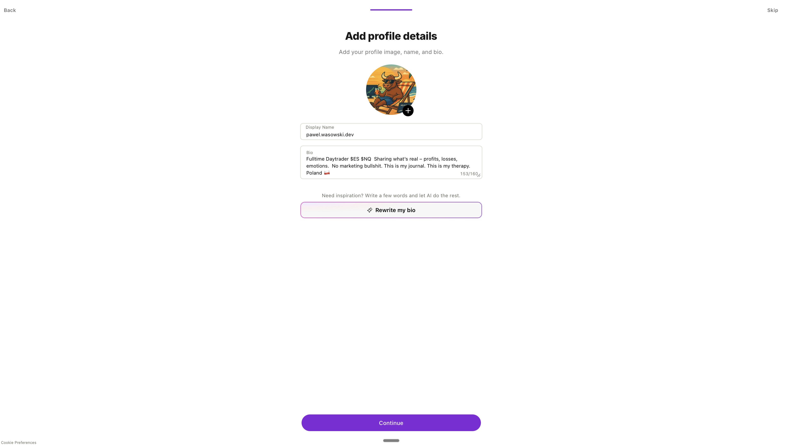

### Layout and visible functionality

- Full-screen onboarding step with progress indicator at the top.
- Top-left `Back` action and top-right `Skip` action.
- Main heading: `Add profile details`.
- Supporting copy: add profile image, name, and bio.
- Visible editable fields:
  - profile image / avatar
  - `Display Name`
  - `Bio`
- The screenshot shows that Linktree prefilled:
  - avatar
  - display name
  - bio text
- There is also an AI-assisted CTA:
  - `Rewrite my bio`
- Bottom CTA `Continue` is active.

### How the flow works

- Linktree moves from collecting raw destinations into shaping the public
  profile identity.
- This step is not starting from blank fields; it appears to use previously
  supplied social handles to import likely profile defaults.
- In the screenshot, the imported data appears to come from X:
  - avatar matches the public X avatar
  - display name is prefilled
  - bio is prefilled
- The `Rewrite my bio` action adds an AI polish step on top of imported source
  data rather than asking the user to write from scratch.
- This is a strong setup-shortening pattern:
  collect handles -> fetch public profile data -> let the user edit ->
  optionally AI-rewrite.

### UI / usability assessment for users

- Very strong usability pattern.
- Good parts:
  - dramatically reduces blank-page friction
  - imported defaults make the product feel smart and helpful
  - users still retain manual control over the final values
  - AI rewrite is framed as optional enhancement, not forced generation
- Potential downsides:
  - users may be surprised if imported data is stale, wrong, or too personal
  - imported bios from social platforms may not fit the link-in-bio context
  - if AI rewrite loses tone/authenticity, users may distrust it quickly

### Strategic assessment for tadaify

- This is one of the most strategically valuable patterns seen so far.
- It shortens onboarding in a way users immediately understand:
  `the product already did useful work for me`.
- It can raise activation materially because avatar + name + bio are among the
  most annoying blank-state fields in profile setup.
- For tadaify, this is likely worth prioritizing above many purely cosmetic
  onboarding improvements.

### Irritation risk

- Low to medium.
- The import itself is helpful, but irritation appears if:
  - users do not understand where the data came from
  - the import is inaccurate
  - AI rewrite overwrites authentic voice with generic marketing copy
- A subtle `Imported from X` or `Based on your selected profile` explanation
  would reduce that risk.

### Is it worth implementing?

- Yes, strongly.
- This is the kind of feature that can make tadaify feel meaningfully more
  intelligent than a generic editor.

### How tadaify could do it better

- Show source attribution for imported data, e.g. `Imported from X`.
- Allow one-click reset to imported values after edits.
- Offer multiple rewrite styles instead of one generic AI button, e.g.:
  - cleaner
  - more professional
  - more creator-style
  - more playful
- Preserve authenticity by showing the AI result as a suggestion / diff instead
  of blindly replacing the original bio.
- If tadaify keeps a creator/adult-friendly positioning, allow tone presets
  that fit those audiences rather than defaulting to bland SaaS-style copy.

### Technical implementation hypotheses

- Most likely implementation for X specifically does **not** require user OAuth.
- A plausible pipeline:
  - user enters `@handle` in the earlier platform step
  - backend fetches the public profile page for that handle
  - backend extracts avatar, display name, and bio
  - onboarding pre-fills those values into the form
  - AI rewrite runs only on demand
- I verified on 2026-04-23 that the public HTML for `https://x.com/<handle>`
  contains a `window.__INITIAL_STATE__` payload with fields including:
  - `description`
  - `name`
  - `screen_name`
  - `profile_image_url_https`
- That makes a server-side fetch + parse approach highly plausible for X.
- Practical implementation options for tadaify:
  - server-side profile fetcher (Lambda / Edge Function) that downloads public
    profile HTML and parses known fields from embedded JSON
  - official platform API where practical, but this is less likely here because
    the user only typed a handle, not a platform OAuth connection
  - stored import pipeline with retry/fallback:
    if scrape fails, leave fields blank and continue normally
- Recommended v1 approach for tadaify:
  - implement public-profile import only for the easiest / highest-value
    platforms first
  - X is a good candidate because public HTML appears parseable without login
  - treat imported data as best-effort, not guaranteed

### AI bio rewrite cost estimate for tadaify (as of 2026-04-23)

- Assumption for one rewrite request:
  - ~300 input tokens
  - ~120 output tokens
- Estimated per-request cost under that assumption:
  - Anthropic Claude Haiku 4.5 direct API:
    about `$0.0009` per rewrite
  - OpenAI `gpt-5.4-nano` direct API:
    about `$0.00021` per rewrite
  - Amazon Bedrock using DeepSeek v3.2:
    about `$0.00041` per rewrite
  - Amazon Bedrock using Gemma 3 4B:
    about `$0.000022` per rewrite
  - Amazon Titan Text Lite on Bedrock:
    inferred from AWS pricing example at about `$0.00014` per rewrite
- Rough monthly cost at 100k rewrites / month:
  - Claude Haiku 4.5: about `$90`
  - `gpt-5.4-nano`: about `$21`
  - DeepSeek v3.2 on Bedrock: about `$41`
  - Gemma 3 4B on Bedrock: about `$2`
  - Titan Text Lite: about `$14`
- Self-hosted / own-model option on AWS:
  - an `inf2.xlarge` instance is listed by AWS at `$0.76/hour`
  - that is about `$555/month` if kept on continuously
  - for a simple rewrite-bio feature, self-hosting is usually not worth it
    early, unless volume is very large or you need strict control / privacy
- Practical recommendation for tadaify:
  - start with cheap external inference, not with a self-hosted model
  - best initial tradeoff is likely:
    - `gpt-5.4-nano` for cost/performance balance, or
    - Claude Haiku 4.5 if tone quality is noticeably better in your tests
  - Bedrock is attractive if you want AWS-centralized billing and operations,
    but the winning choice still depends on rewrite quality, not only raw price

### Source notes for the cost estimate

- OpenAI official pricing:
  [developers.openai.com/api/docs/pricing](https://developers.openai.com/api/docs/pricing)
- Anthropic official pricing:
  [platform.claude.com/docs/en/about-claude/pricing](https://platform.claude.com/docs/en/about-claude/pricing)
- AWS Bedrock official pricing:
  [aws.amazon.com/bedrock/pricing](https://aws.amazon.com/bedrock/pricing/)
- AWS EC2 Inf2 pricing:
  [aws.amazon.com/ec2/instance-types/inf2](https://aws.amazon.com/ec2/instance-types/inf2/)

### Screen LT-009 — Onboarding summary preview of the prepared profile

- **Flow:** final onboarding summary / preview; Linktree shows the prepared
  profile before sending the user deeper into the product
- **Source:** screenshot provided in Codex chat on 2026-04-23

### Evidence

- Chat screenshot: 2026-04-23 / Linktree / onboarding summary profile preview
- Artifact id: `LT-009`
- Local screenshot path: [lt-009-onboarding-profile-preview-summary.png](./screens/lt-009-onboarding-profile-preview-summary.png)

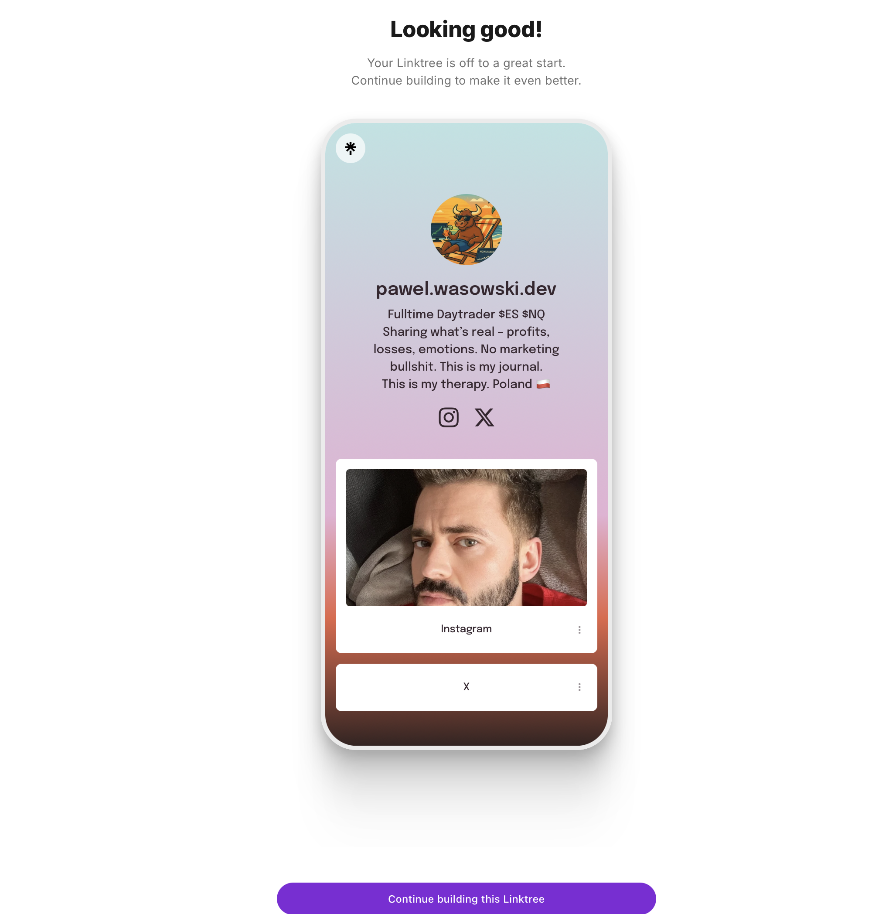

### Layout and visible functionality

- Large celebratory heading: `Looking good!`
- Supporting copy says the Linktree is off to a great start and encourages the
  user to continue building.
- Main content is a large mobile-style preview of the prepared profile.
- The preview includes:
  - chosen theme/background
  - imported avatar
  - display name
  - bio
  - social icons
  - prepared links/cards
- Primary CTA at the bottom:
  `Continue building this Linktree`
- The screen is focused on showing the assembled result, not on asking for more
  data.

### How the flow works

- Linktree closes the onboarding loop by showing the user a concrete result of
  all previous setup steps.
- Instead of dropping the user directly into an editor with no framing, it
  pauses to say:
  `here is what we already built for you`.
- This creates a psychological milestone:
  - user sees visible progress
  - product demonstrates competence
  - continuing feels like refinement, not starting from zero
- The CTA then moves the user into deeper editing/building from a position of
  momentum.

### UI / usability assessment for users

- Very strong onboarding ending.
- Good parts:
  - gives instant payoff after several setup steps
  - reduces anxiety because the page already looks real
  - helps users understand how earlier choices affected the final result
  - keeps the focus on progress rather than configuration
- Potential downsides:
  - if the generated result looks weak, generic, or wrong, this screen will
    amplify disappointment
  - if the preview differs materially from the actual editor/public page, trust
    can drop quickly

### Strategic assessment for tadaify

- This is a highly transferable pattern for tadaify.
- It turns onboarding into a `time-to-first-proud-result` flow instead of a
  sequence of forms.
- Strategically, this matters because users judge link-in-bio products very
  quickly:
  if they can see a decent-looking page within minutes, activation odds improve
  a lot.
- This screen also makes the product feel more premium, because it shows that
  setup choices were not abstract; they produced something tangible.

### Irritation risk

- Low.
- This is one of the least annoying onboarding screens because it rewards the
  user instead of asking for more work.
- Irritation risk is mostly downstream:
  only if the preview is misleading or low quality.

### Is it worth implementing?

- Yes, strongly.
- This is one of the best patterns to copy from the full Linktree onboarding
  sequence.

### How tadaify could do it better

- Show a side-by-side option:
  - `Preview page`
  - `Edit details`
- Let the summary screen highlight what was auto-created, e.g.:
  - imported profile
  - selected theme
  - added social links
- Add one or two smart next-step suggestions under the preview, e.g.:
  - add one custom CTA
  - connect analytics
  - customize button style
- Keep the preview extremely faithful to the real public/mobile page so the
  user never feels baited by a nicer mock preview than the actual output.

### Screen LT-010 — Suggested links discovered from usernames

- **Flow:** late onboarding discovery step, after profile/link setup and before
  final completion; optional suggestion screen for extra links found from the
  user's known accounts
- **Source:** screenshot provided in Codex chat on 2026-04-23

### Evidence

- Chat screenshot: 2026-04-23 / Linktree / suggested links discovery step
- Artifact id: `LT-010`
- Local screenshot path: [lt-010-suggested-links-discovery-step.png](./screens/lt-010-suggested-links-discovery-step.png)

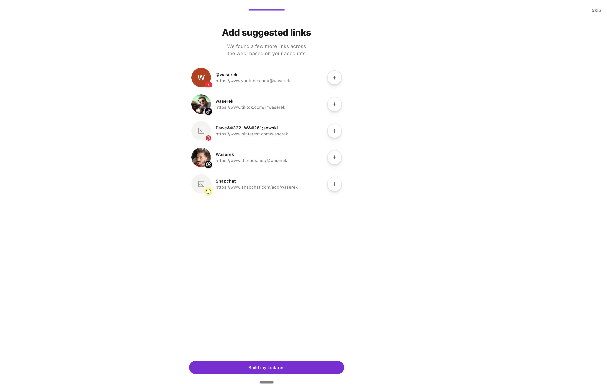

### Layout and visible functionality

- Full-screen onboarding step with progress indicator at the top.
- Top-right `Skip` action.
- Title: `Add suggested links`.
- Supporting copy says Linktree found more links across the web based on the
  user's accounts.
- Vertical list of suggested profiles/links, each with:
  - avatar or placeholder
  - profile/display label
  - canonical-looking URL
  - platform badge/icon
  - add button (`+`) on the right
- Visible suggested platforms:
  - YouTube: `https://www.youtube.com/@waserek`
  - TikTok: `https://www.tiktok.com/@waserek`
  - Pinterest: `https://www.pinterest.com/waserek`
  - Threads: `https://www.threads.net/@waserek`
  - Snapchat: `https://www.snapchat.com/add/waserek`
- Bottom CTA: `Build my Linktree`.

### How the flow works

- Linktree uses already known identifiers, most likely the username/handles
  entered earlier, to propose additional public links the user may own.
- This is not framed as required data entry; it is a late optional enrichment
  step.
- The user can selectively add individual suggestions via `+`, or skip the
  whole thing.
- Product goal:
  - increase page completeness
  - raise the number of populated links
  - reduce manual effort
  - make the final profile look richer before the user ever enters the editor

### UI / usability assessment for users

- This is simultaneously impressive and a little creepy.
- Good parts:
  - can save real time if the guesses are correct
  - selective add buttons are safer than auto-adding everything
  - being skippable reduces the feeling of coercion
- Risky parts:
  - users may feel surveilled or over-profiled
  - false positives can damage trust quickly
  - once the product starts inferring identity across platforms, the emotional
    line between `helpful` and `too much` gets much thinner
- My read: this is near the upper limit of what still feels acceptable in a
  consumer onboarding flow.

### Strategic assessment for tadaify

- This can be strategically powerful, but it is also easy to overdo.
- For tadaify, the upside is obvious:
  more links populated automatically means faster activation and a better first
  page.
- The downside is trust:
  a challenger brand usually cannot afford to feel invasive early.
- So the pattern is valuable, but only in a much more transparent and cautious
  implementation than what Linktree appears to do here.

### Irritation risk

- Medium.
- Lower than an aggressive paywall, but higher than the other helpful
  onboarding steps.
- Main annoyance factors:
  - `how did you find that?`
  - wrong account suggestions
  - the sense that the app is doing identity matching across the web without
    explicitly asking first

### Is it worth implementing?

- Maybe, but not as an immediate v1 default.
- The core idea is worth exploring:
  suggest likely links from known handles.
- The exact Linktree-style execution is risky for tadaify unless it is made
  more transparent and more conservative.

### How tadaify could do it better

- Explicitly explain the mechanism:
  `We found public profiles that may match your username. Review before adding.`
- Only suggest links for platforms the user opts into scanning.
- Limit suggestions to high-confidence matches first.
- Clearly label confidence, e.g.:
  - `Exact username match`
  - `Possible match`
- Never auto-add; always require confirmation.
- Allow a privacy-first toggle:
  `Do not suggest links from other platforms`

### Technical implementation hypotheses

- This likely does **not** require full web search in the generic sense.
- The strongest hypothesis is deterministic platform URL generation plus
  lightweight verification.
- A likely pipeline:
  - take the known handle, e.g. `waserek`
  - generate canonical public URLs for many platforms:
    - `youtube.com/@waserek`
    - `tiktok.com/@waserek`
    - `threads.net/@waserek`
    - `snapchat.com/add/waserek`
    - `pinterest.com/waserek`
  - fetch each public page server-side
  - if the page resolves and contains plausible profile metadata, show it as a
    suggestion
- The Pinterest row is a very interesting clue:
  `Pawe&#322; W&#261;sowski` appears with raw HTML entities, which suggests a
  scraped/parsed title or metadata field that was not fully decoded before
  rendering.
- That makes the implementation look more like:
  - URL template generation
  - HTML fetch
  - metadata/title extraction
  than a polished official API integration.
- So yes: this may be "webfetch profile", but likely platform-template fetches
  plus parsing, not open-ended web crawling.

### Product judgment for tadaify

- My take: this is clever, but already close to the point where users may ask
  `why are you doing identity discovery on me?`
- If tadaify wants the benefit without the creepiness, the better version is:
  - after user adds one handle, offer:
    `Want us to check a few common platforms for the same username?`
  - user opts in
  - results are shown as suggestions only
  - each suggestion explains why it was proposed
- That preserves the activation upside without making the product feel sneaky.

## 02. Dashboard & Navigation

### Screen LT-011 — Post-login dashboard / design editor view

- **Flow:** first real product workspace after onboarding; logged-in editor view
  with the `Design` area open
- **Source:** screenshot provided in Codex chat on 2026-04-23

### Evidence

- Chat screenshot: 2026-04-23 / Linktree / post-login design editor view
- Artifact id: `LT-011`
- Local screenshot path: [lt-011-design-editor-header-section.png](./screens/lt-011-design-editor-header-section.png)

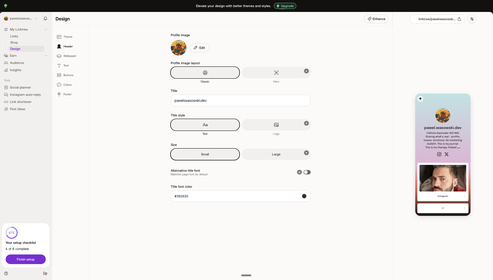

### Layout and visible functionality

- The screen uses a four-zone layout:
  - top global promo/action bar
  - left primary navigation rail
  - center editing workspace
  - right live mobile preview
- The most visually dominant non-content element is the black top banner.
- Top black banner:
  - full-width dark strip across the top
  - marketing copy: `Elevate your design with better themes and styles.`
  - strong `Upgrade` CTA in green
  - this is the first thing the eye catches because of the color contrast
- Top-right utility area under the banner:
  - `Enhance` button
  - public URL pill (`linktr.ee/...`)
  - share/export icon
  - sliders/settings-style icon button
- Left account/navigation rail:
  - account chip with avatar + truncated account name
  - notification bell
  - `My Linktree` section with nested items:
    - `Links`
    - `Shop`
    - `Design` (selected)
  - additional top-level items:
    - `Earn`
    - `Audience`
    - `Insights`
  - `Tools` section with:
    - `Social planner`
    - `Instagram auto-reply`
    - `Link shortener`
    - `Post ideas`
  - bottom-left setup widget:
    - circular progress indicator (`67%`)
    - `Your setup checklist`
    - `4 of 6 complete`
    - `Finish setup` CTA
  - small bottom utility icons
- Center editing workspace:
  - page title: `Design`
  - left-side secondary settings menu inside the editor:
    - `Theme`
    - `Header` (selected)
    - `Wallpaper`
    - `Text`
    - `Buttons`
    - `Colors`
    - `Footer`
  - main editable controls currently shown for `Header`:
    - `Profile image` with avatar preview and `Edit`
    - `Profile image layout` with options:
      - `Classic` (selected)
      - `Hero`
    - `Title` text input
    - `Title style` with options:
      - `Text` (selected)
      - `Logo`
    - `Size` with options:
      - `Small` (selected)
      - `Large`
    - `Alternative title font` toggle
    - `Title font color` with hex input and color swatch
  - some options show a lightning-bolt premium marker
  - on hover, that marker animates / expands into a visible `Pro` label,
    making it explicit that the option is part of the paid plan
- Right live preview:
  - narrow mobile mock preview of the actual page
  - reflects current theme, avatar, title, bio, icons, and link cards
  - acts as immediate visual feedback for the settings on the left

### How the flow works

- After onboarding, Linktree lands the user inside a full editor, not a simple
  dashboard homepage.
- The chosen default workspace here is `Design`, which suggests Linktree wants
  users to personalize appearance early.
- Editing flow structure appears layered:
  - global product navigation on the far left
  - feature-specific design navigation just inside the editor
  - individual controls in the central canvas
  - live result preview on the far right
- There is also a constant monetization layer present even after login via the
  black top upgrade banner and likely premium-gated control variants.

### UI / usability assessment for users

- The strongest positive pattern is the live preview on the right.
- Good parts:
  - clear separation between app navigation and design controls
  - the editor feels substantial and feature-rich immediately
  - right-hand preview lowers uncertainty because users see effects in context
  - setup checklist in the lower-left creates momentum and nudges completion
- What jumps out visually:
  - the black upsell banner at the top dominates attention right away
  - the right preview is the second strongest focal point
  - the central form itself is comparatively calm and minimal
- Downsides:
  - there are many navigation layers at once
  - left rail + inner design menu + top actions + preview can feel dense
  - the black promo banner steals attention from the actual editing task
  - some segmented controls appear to have premium-style lock/lightning markers,
    and on hover they reveal `Pro`, which is a clear but somewhat salesy form
    of gating inside the editing flow

### Strategic assessment for tadaify

- There is a lot worth learning here.
- Strong ideas for tadaify:
  - land users directly in a meaningful editor, not an empty admin shell
  - keep a persistent live preview
  - use a setup checklist to drive activation
  - separate global navigation from feature-local editing controls
- But there is also a caution:
  - Linktree layers monetization directly into the main working surface
  - that may work for them, but a challenger should be careful not to make the
    editor feel like an ad surface

### Irritation risk

- Medium.
- The editor itself is useful, but the constant monetization presence increases
  ambient friction.
- The top black upgrade banner is the main source of that feeling:
  it is visually loud, persistent, and unrelated to the user's immediate task.

### Is it worth implementing?

- The editor layout pattern: yes.
- The live preview: definitely yes.
- The lower-left setup checklist: yes, likely.
- The always-visible black upsell banner: probably no, at least not in this
  exact form for tadaify.

### How tadaify could do it better

- Keep the four-zone clarity, but reduce visual noise:
  - global navigation
  - local controls
  - edit surface
  - live preview
- Make the live preview larger or more interactive if possible.
- Use monetization more contextually:
  show upgrade prompts near locked controls instead of running a permanent
  global black banner across the entire app.
- Make premium gating informative rather than disruptive.
- If marking premium options inline, make the signal clear from the start
  instead of relying mainly on hover animation to reveal `Pro`.
- Consider collapsing or simplifying the left rail for first-time users so the
  editor feels less crowded.

### Screen LT-020 — Main `Links` tab / link management workspace

- **Flow:** logged-in main workspace, `My Linktree > Links`
- **Source:** screenshot provided in Codex chat on 2026-04-23

### Evidence

- Chat screenshot: 2026-04-23 / Linktree / main Links tab
- Artifact id: `LT-020`
- Local screenshot path: [lt-020-links-tab-main-list.png](./screens/lt-020-links-tab-main-list.png)

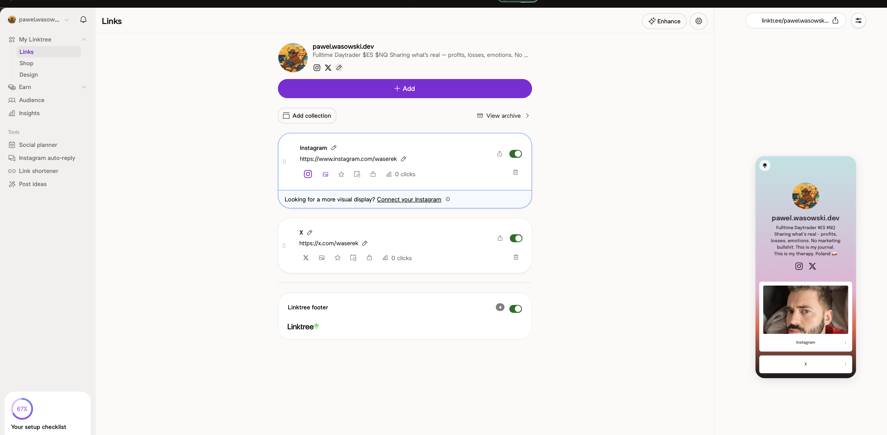

### Layout and visible functionality

- The overall product shell remains similar to `LT-011`:
  - left global navigation
  - center working surface
  - right live mobile preview
- Left global navigation:
  - `My Linktree` section with:
    - `Links` (selected)
    - `Shop`
    - `Design`
  - top-level items:
    - `Earn`
    - `Audience`
    - `Insights`
  - `Tools` section:
    - `Social planner`
    - `Instagram auto-reply`
    - `Link shortener`
    - `Post ideas`
  - setup checklist still visible in the lower-left corner
- Top utility area on the right side:
  - `Enhance` button
  - public URL pill
  - share/export icon
  - settings/sliders icon
- Center content is the real `Links` management UI:
  - page title: `Links`
  - compact profile/header strip at the top with avatar, title, short bio, and
    social icons
  - big purple primary CTA: `+ Add`
  - secondary actions row:
    - `Add collection`
    - `View archive`
  - list of existing links as cards
- Each link card appears to include:
  - drag handle on the left
  - link title
  - URL
  - edit icons near title/URL
  - row of feature/action icons under the URL
  - click count (`0 clicks`)
  - visibility toggle on the right
  - delete/trash icon
- One card shows a contextual upsell/helper row:
  - `Looking for a more visual display? Connect your Instagram`
- Below the links there is also a `Linktree footer` row with a toggle, which
  suggests some footer/branding controls are surfaced directly in the links
  area as well.
- Right-side mobile preview reflects the current link stack and profile state.

### How the flow works

- This is the main operational screen for building and managing the page
  content itself.
- Linktree treats the profile and link list as one continuous composition
  surface:
  - top profile/header summary
  - then content actions
  - then ordered link blocks
- The UI supports several tasks in one place:
  - add new links
  - organize links
  - toggle visibility
  - inspect basic performance
  - discover richer link/display formats
  - access archived content
- The `Connect your Instagram` prompt shows a pattern of context-aware
  enrichment: Linktree looks at the current link type and nudges the user
  toward a richer integration, not just a plain URL.

### UI / usability assessment for users

- Strong core workspace overall.
- Good parts:
  - the big `+ Add` CTA is unmistakable
  - the ordered card list is easy to understand
  - visibility toggles and drag handles make list management feel direct
  - the right live preview helps connect editor actions to final output
  - collections and archive suggest the product can scale beyond a tiny list
- What stands out:
  - this is much more clearly the heart of the product than many of the design
    screens
  - the contextual Instagram prompt is a smart upgrade/growth nudge embedded
    inside actual work
- Potential downsides:
  - there are many small icons per row, which may require learning
  - some functionality is only inferred from icons, not explicit labels
  - the mix of content rows and branding/footer row in one list may feel a bit
    inconsistent

### Strategic assessment for tadaify

- This is one of the most important screens to study for tadaify.
- It shows a mature model of the core workflow:
  build, reorder, toggle, enrich, measure.
- Strong ideas worth reusing:
  - big obvious add CTA
  - ordered link cards
  - per-link visibility toggle
  - archive concept
  - collection/grouping support
  - contextual prompts for richer formats/integrations
- The key product lesson:
  the links tab is not just a CRUD list; it is the main content operating
  system for the page.

### Irritation risk

- Low to medium.
- The core experience is useful and task-oriented.
- Irritation mainly comes from:
  - icon overload
  - upsell/context prompts if they become too frequent
  - mixed presence of branding-related rows in the content flow

### Is it worth implementing?

- Yes, strongly.
- This is one of the highest-priority reference screens for tadaify.

### How tadaify could do it better

- Keep the links tab laser-focused on the main job:
  adding and managing the page content.
- Use slightly more explicit labels/tooltips for per-link actions so users do
  not have to learn icon language by trial and error.
- Keep contextual enrichment prompts, but make sure they feel helpful first and
  upsell second.
- Consider separating branding/footer controls from the main content list if
  mixing them weakens the mental model.

### Screen LT-021 — `Add` modal overview / integration catalog entry point

- **Flow:** inside `Links`; shown after clicking the main `+ Add` CTA
- **Source:** screenshots provided in Codex chat on 2026-04-23

### Evidence

- Chat screenshot: 2026-04-23 / Linktree / add modal overview
- Artifact id: `LT-021`
- Local screenshot path: [lt-021-add-modal-categories-overview.png](./screens/lt-021-add-modal-categories-overview.png)

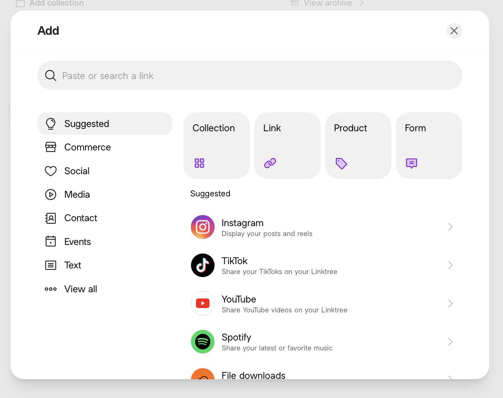

### Layout and visible functionality

- Large centered modal with:
  - title `Add`
  - close `X`
  - top search field: `Paste or search a link`
- Left-side category rail:
  - `Suggested`
  - `Commerce`
  - `Social`
  - `Media`
  - `Contact`
  - `Events`
  - `Text`
  - `View all`
- Main panel shows:
  - quick top-level add cards:
    - `Collection`
    - `Link`
    - `Product`
    - `Form`
  - then a suggested integration list
- Visible suggested integrations in the screenshot:
  - Instagram
  - TikTok
  - YouTube
  - Spotify
  - File downloads

### How the flow works

- Linktree treats `add new link` as opening a block/integration marketplace,
  not a simple URL form.
- The modal supports several entry modes:
  - paste a URL directly
  - search by provider/type
  - browse categories
  - use quick block archetypes
  - pick from suggested integrations
- This is a major product move:
  adding content is framed as choosing capabilities, not only adding links.

### UI / usability assessment for users

- Very strong pattern.
- Good parts:
  - fast search path for power users
  - browse path for exploratory users
  - categories reduce overwhelm
  - suggested items accelerate common use cases
- Potential downsides:
  - the catalog can become intimidating if too many options pile up
  - users may not always know whether they need `Link`, `Product`, or a
    provider-specific integration

### Strategic assessment for tadaify

- This is one of the most important competitive observations so far.
- If tadaify wants to compete seriously with Linktree, it needs either:
  - a similarly broad integration/block catalog, or
  - a narrower but much sharper catalog focused on a specific wedge/persona
- A generic `URL list + a few embeds` will feel underpowered next to this.

### Irritation risk

- Low.
- The modal is broad, but it feels empowering rather than annoying.

### Is it worth implementing?

- Yes, strongly.
- The add-modal-as-catalog pattern is worth implementing in tadaify.

### How tadaify could do it better

- Keep the same dual entry model:
  search + category browse.
- Start with fewer categories, but make them extremely relevant to your target
  users.
- Show richer previews/examples for each block type so users understand the
  output faster.

### Screen LT-022 — `Text` category inside the `Add` modal

- **Flow:** `Add` modal, `Text` category selected
- **Source:** screenshot provided in Codex chat on 2026-04-23

### Evidence

- Artifact id: `LT-022`
- Local screenshot path: [lt-022-add-modal-text-category.png](./screens/lt-022-add-modal-text-category.png)

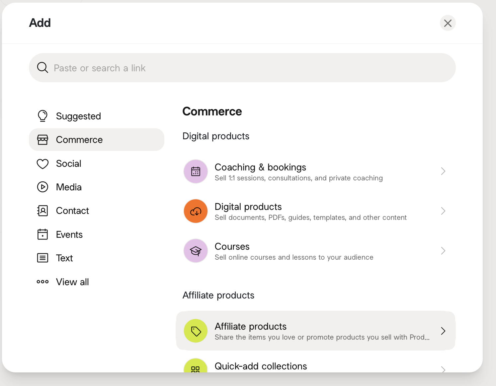

### Layout and visible functionality

- Category selected: `Text`
- Visible block types:
  - `Text`
  - `Header`
- Each item has icon, title, one-line description, and chevron.

### How the flow works

- Linktree treats text not as one thing, but as multiple content block types.
- This suggests a block model where informational structure matters, not just
  raw rich text.

### UI / usability assessment for users

- Clear and low-friction.
- Easy to understand which block is better for heading vs body text.

### Strategic assessment for tadaify

- Worth copying.
- Even basic text content benefits from being broken into semantic block types.

### Irritation risk

- Low.

### Is it worth implementing?

- Yes.

### How tadaify could do it better

- Add tiny visual previews of each text block style.

### Screen LT-023 — `Events` category inside the `Add` modal

- **Flow:** `Add` modal, `Events` category selected
- **Source:** screenshot provided in Codex chat on 2026-04-23

### Evidence

- Artifact id: `LT-023`
- Local screenshot path: [lt-023-add-modal-events-category.png](./screens/lt-023-add-modal-events-category.png)

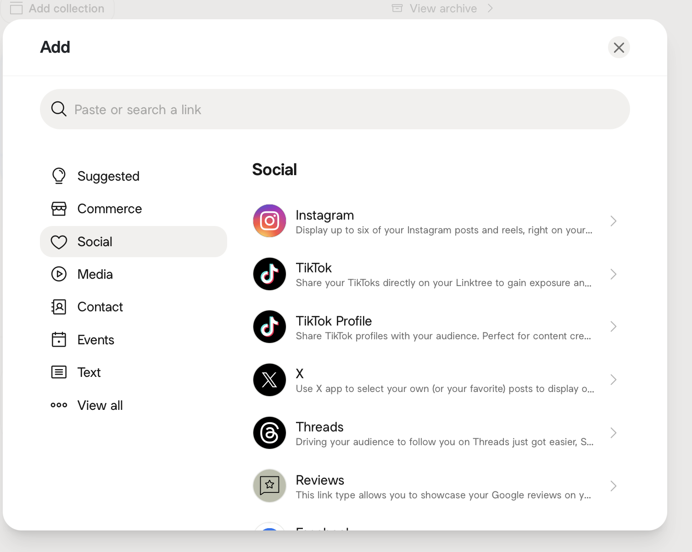

### Layout and visible functionality

- Category selected: `Events`
- Visible integrations:
  - `Tour and Events`
  - `Seated`
  - `Bands In Town`

### How the flow works

- Linktree has a dedicated events/live-performer slice, not just generic links.
- This indicates real verticalization for music/creator/event use cases.

### UI / usability assessment for users

- Clear if you are the target user; irrelevant otherwise.

### Strategic assessment for tadaify

- Important lesson:
  breadth can come from vertical integrations, not only from general-purpose
  blocks.
- Linkofme does not need this exact set unless targeting artists/events, but it
  likely needs an equivalent vertical cluster for its chosen niche.

### Irritation risk

- Low.

### Is it worth implementing?

- Only if aligned with the target segment.

### How tadaify could do it better

- Replace event/music verticals with niche-specific integrations if your
  audience is different.

### Screen LT-024 — `Contact` category inside the `Add` modal

- **Flow:** `Add` modal, `Contact` category selected
- **Source:** screenshot provided in Codex chat on 2026-04-23

### Evidence

- Artifact id: `LT-024`
- Local screenshot path: [lt-024-add-modal-contact-category.png](./screens/lt-024-add-modal-contact-category.png)

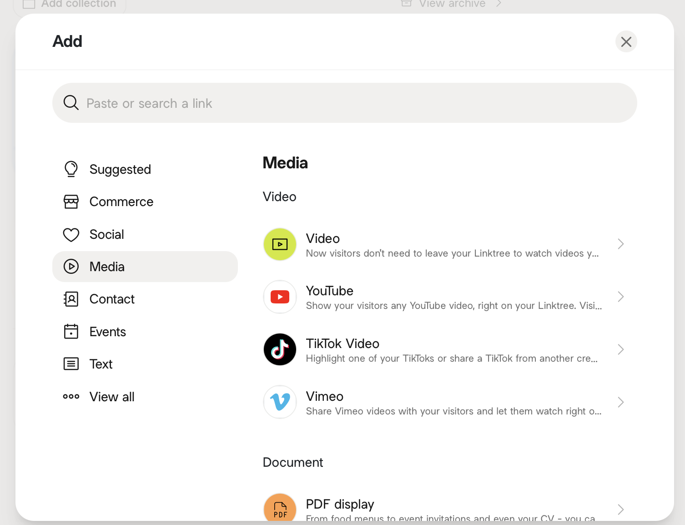

### Layout and visible functionality

- Category selected: `Contact`
- Visible integrations:
  - `Form`
  - `Contact Form`
  - `Email signup`
  - `SMS signup`
  - `Typeform`
  - `Laylo`

### How the flow works

- Linktree merges contact capture, email growth, SMS growth, and third-party
  form tools into one acquisition category.

### UI / usability assessment for users

- Strong because it groups similar conversion jobs together.

### Strategic assessment for tadaify

- Very important category.
- If tadaify wants to compete beyond basic profile pages, audience capture
  blocks are essential.

### Irritation risk

- Low.

### Is it worth implementing?

- Yes, strongly.

### How tadaify could do it better

- Start with one native contact form + email signup, then layer partner/native
  integrations as you grow.

### Screen LT-025 — `Media` category inside the `Add` modal

- **Flow:** `Add` modal, `Media` category selected
- **Source:** screenshot provided in Codex chat on 2026-04-23

### Evidence

- Artifact id: `LT-025`
- Local screenshot path: [lt-025-add-modal-media-category.png](./screens/lt-025-add-modal-media-category.png)

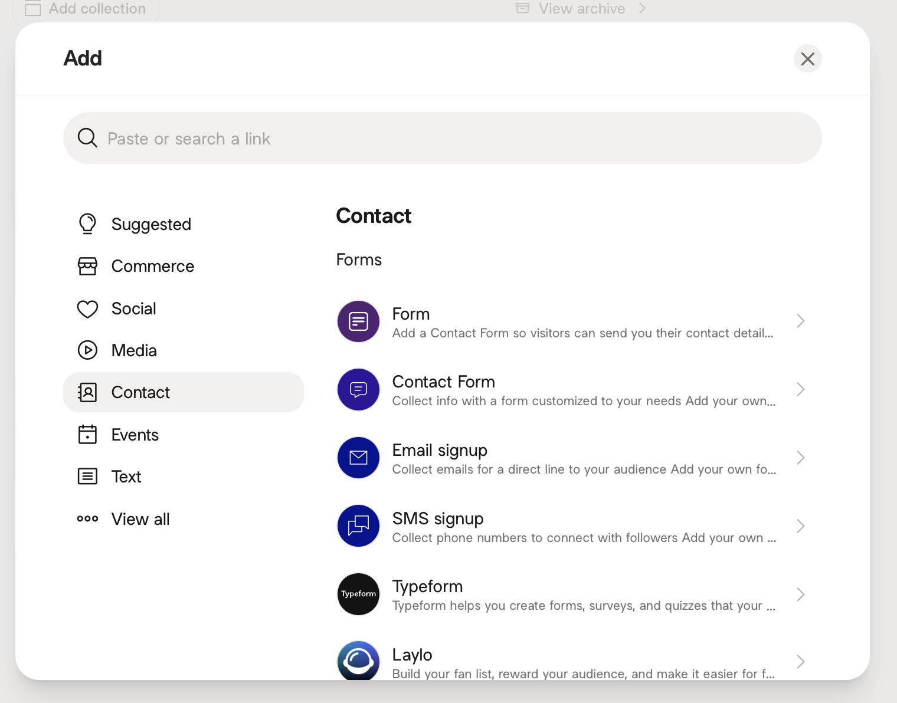

### Layout and visible functionality

- Category selected: `Media`
- Visible integrations:
  - `Video`
  - `YouTube`
  - `TikTok Video`
  - `Vimeo`
  - `PDF display`

### How the flow works

- Media is not limited to social embeds; it also includes documents.
- That broadens the product from `social link page` into `content display page`.

### UI / usability assessment for users

- Strong and intuitive.

### Strategic assessment for tadaify

- Important category.
- If you want to compete, embedded media and document blocks are table stakes.

### Irritation risk

- Low.

### Is it worth implementing?

- Yes.

### How tadaify could do it better

- Prioritize the media sources most relevant to your audience, then add PDFs and
  richer file display early.

### Screen LT-026 — `Social` category inside the `Add` modal

- **Flow:** `Add` modal, `Social` category selected
- **Source:** screenshot provided in Codex chat on 2026-04-23

### Evidence

- Artifact id: `LT-026`
- Local screenshot path: [lt-026-add-modal-social-category.png](./screens/lt-026-add-modal-social-category.png)

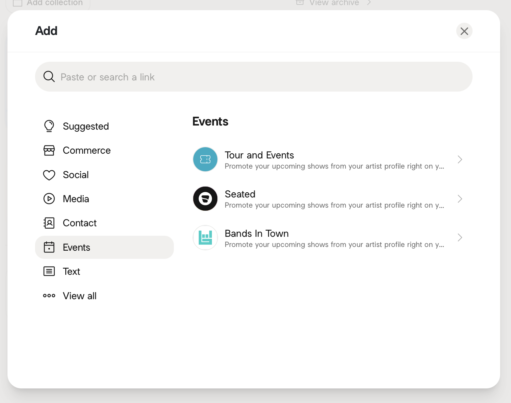

### Layout and visible functionality

- Category selected: `Social`
- Visible integrations:
  - `Instagram`
  - `TikTok`
  - `TikTok Profile`
  - `X`
  - `Threads`
  - `Reviews`

### How the flow works

- Linktree distinguishes between different block semantics even within one
  platform, e.g. `TikTok` vs `TikTok Profile`.
- This means the catalog is not only provider-based; it is provider + content
  mode based.

### UI / usability assessment for users

- Strong, because it gives platform-specific paths instead of forcing generic
  embeds.

### Strategic assessment for tadaify

- Very important.
- To compete, tadaify likely needs:
  - platform-specific blocks
  - and sometimes multiple modes per platform

### Irritation risk

- Low.

### Is it worth implementing?

- Yes, strongly.

### How tadaify could do it better

- Focus first on the 5-8 highest-value platforms for your actual target users,
  but support multiple block modes where it matters.

### Screen LT-027 — `Commerce` category inside the `Add` modal

- **Flow:** `Add` modal, `Commerce` category selected
- **Source:** screenshot provided in Codex chat on 2026-04-23

### Evidence

- Artifact id: `LT-027`
- Local screenshot path: [lt-027-add-modal-commerce-category.png](./screens/lt-027-add-modal-commerce-category.png)

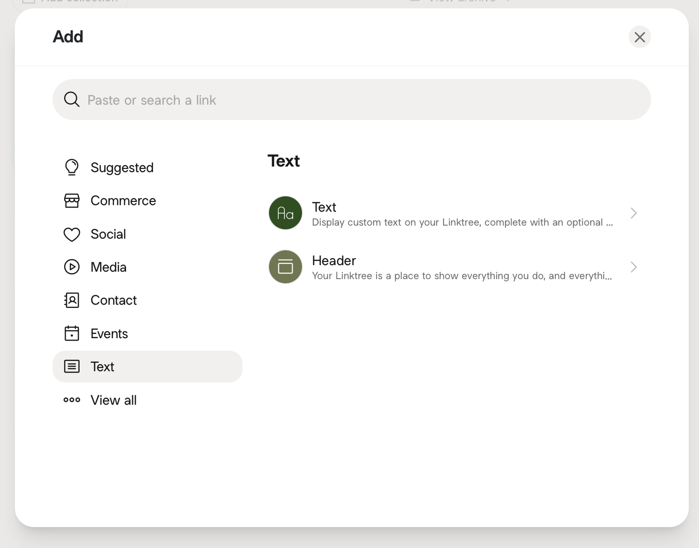

### Layout and visible functionality

- Category selected: `Commerce`
- Visible integrations/features:
  - `Coaching & bookings`
  - `Digital products`
  - `Courses`
  - `Affiliate products`
  - `Quick-add collections`

### How the flow works

- Linktree clearly wants to be more than link distribution; it wants to be part
  of the creator monetization stack.
- Commerce here includes direct selling, bookings, education, and affiliate
  monetization.

### UI / usability assessment for users

- Strong if monetization is the user's goal.

### Strategic assessment for tadaify

- This is the clearest proof that the product is competing as a creator
  business platform, not just a bio page.
- If tadaify wants to compete broadly, some commerce/lead-gen story is
  necessary.

### Irritation risk

- Low.

### Is it worth implementing?

- Yes, but in phases.

### How tadaify could do it better

- Choose one monetization wedge first:
  e.g. bookings, digital downloads, or creator subscriptions.
- Do not try to clone the whole catalog on day one.

### Screen LT-012 — Dependency modal after switching profile image layout to `Hero`

- **Flow:** inside the logged-in design editor; shown after changing `Profile
  image layout` from `Classic` to `Hero`
- **Source:** screenshot provided in Codex chat on 2026-04-23

### Evidence

- Chat screenshot: 2026-04-23 / Linktree / hero layout dependency modal
- Artifact id: `LT-012`
- Local screenshot path: [lt-012-hero-layout-wallpaper-dependency-modal.png](./screens/lt-012-hero-layout-wallpaper-dependency-modal.png)

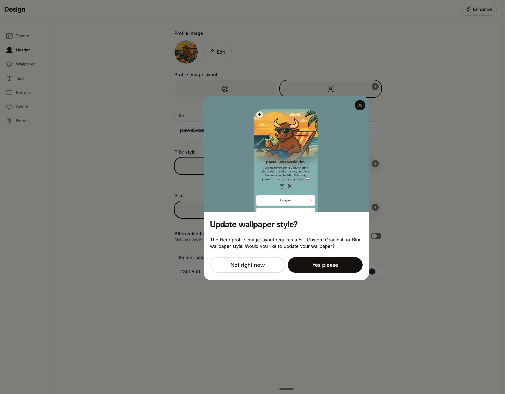

### Layout and visible functionality

- The editor remains visible in the dimmed background, confirming this is an
  in-context modal rather than a route change.
- The `Hero` option in `Profile image layout` is visibly selected behind the
  modal.
- Center modal includes:
  - large preview image/mockup of the `Hero` result
  - close `X` button in the top-right of the modal
  - headline: `Update wallpaper style?`
  - explanatory copy:
    the `Hero` profile image layout requires a `Fill`, `Custom Gradient`, or
    `Blur` wallpaper style
  - two clear CTA choices:
    - `Not right now`
    - `Yes please`
- This is not a generic confirmation dialog; it contains a visual explanation
  and names the dependent setting explicitly.

### How the flow works

- Linktree detects that the newly chosen header layout has a compatibility
  dependency on another design setting: wallpaper style.
- Instead of silently failing, hard-blocking, or forcing the user to discover
  the dependency manually, it interrupts with a contextual explanation.
- The modal effectively says:
  - this option is valid
  - but it works best only with certain wallpaper styles
  - would you like us to update that related setting for you?
- So the pattern is:
  dependency detected -> explain why -> offer guided fix -> let user defer.

### UI / usability assessment for users

- This is a strong editor pattern.
- Good parts:
  - explains the rule instead of hiding it
  - keeps the user in flow by proposing a fix immediately
  - visual mockup helps users understand the effect of the `Hero` style
  - `Not right now` preserves agency
- Potential downsides:
  - it is still an interruption
  - users may feel the system has too many hidden dependencies if modals like
    this appear often
  - if `Yes please` makes multiple changes without clearly showing what changed,
    some users may feel the editor is acting on their behalf too aggressively

### Strategic assessment for tadaify

- This is a very good pattern for tadaify.
- It solves a classic builder problem:
  one setting often depends on another, but users should not need to understand
  the full design system just to make progress.
- The strategic value is high because it reduces confusion without requiring a
  huge help center or complex onboarding.
- It makes the product feel smarter and more guided, especially for users who
  are not design-savvy.

### Irritation risk

- Low to medium.
- Much lower than a promotional modal because this one is directly tied to the
  user's current action.
- Risk rises only if:
  - too many such rules exist
  - the modal appears repeatedly
  - the "guided fix" changes more than expected

### Is it worth implementing?

- Yes.
- This is one of the better advanced UX patterns visible in the editor so far.

### How tadaify could do it better

- Use this only for meaningful dependencies, not for every small rule.
- Be explicit about what will change if the user accepts, e.g.:
  `We’ll switch your wallpaper style to Blur`.
- After applying the change, highlight the affected setting briefly so the user
  understands the result.
- Offer `Don’t ask again for this combination` if repeated prompts become
  possible.
- Consider inline dependency hints for simpler cases, reserving modals only for
  higher-impact changes.

### Screen LT-013 — Theme-matching modal after accepting the `Hero` wallpaper update

- **Flow:** inside the logged-in design editor; shown immediately after
  accepting the wallpaper-compatible `Hero` layout change
- **Source:** screenshot provided in Codex chat on 2026-04-23

### Evidence

- Chat screenshot: 2026-04-23 / Linktree / theme-match color assist modal
- Artifact id: `LT-013`
- Local screenshot path: [lt-013-theme-match-color-assist-modal.png](./screens/lt-013-theme-match-color-assist-modal.png)

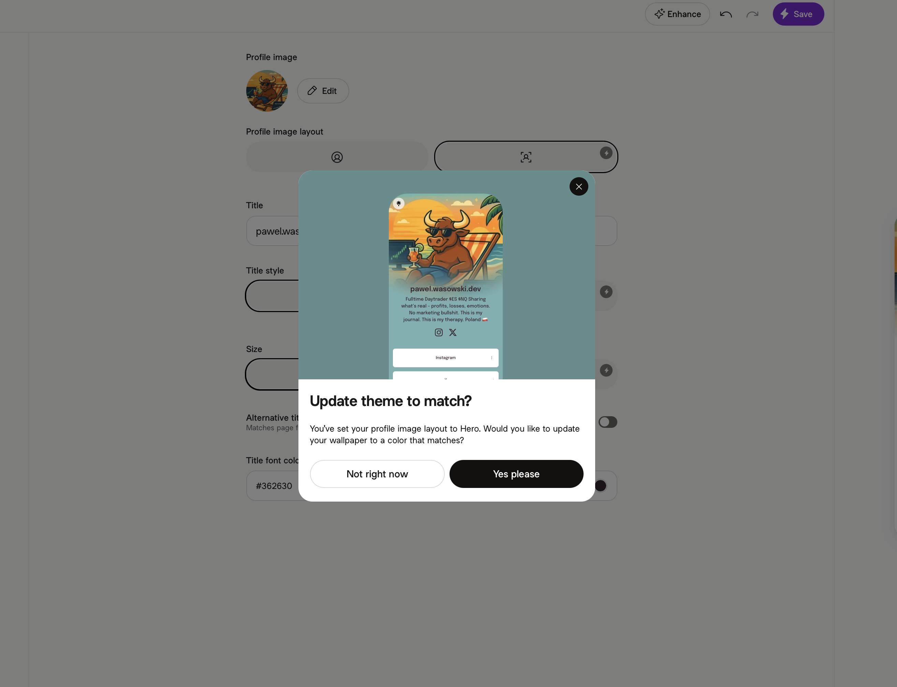

### Layout and visible functionality

- The editor remains dimmed in the background, confirming this is another
  in-context modal in the same configuration flow.
- Center modal includes:
  - a preview of the revised page state with the `Hero` presentation
  - close `X` button
  - headline: `Update theme to match?`
  - explanatory copy:
    because the profile image layout is now `Hero`, Linktree offers to update
    the wallpaper/theme color so it matches better
  - two CTA choices:
    - `Not right now`
    - `Yes please`
- Compared with `LT-012`, this modal is less about hard compatibility and more
  about visual refinement / cohesion.

### How the flow works

- Linktree appears to run a second-step recommendation after the required
  compatibility fix.
- The sequence looks like:
  - user chooses `Hero`
  - system detects required wallpaper-style dependency
  - user accepts
  - system then proposes an aesthetic improvement on top of that
- This suggests two different rules in the editor:
  - a compatibility rule
  - a visual optimization rule
- Most likely the optimization is based on one or more of:
  - dominant colors from the profile image
  - current wallpaper values
  - predefined theme pairings for `Hero` layouts
  - simple palette extraction plus heuristic matching

### UI / usability assessment for users

- This is smart, but also more debatable than `LT-012`.
- Good parts:
  - keeps the user from ending up with an awkward-looking combination
  - suggests that the editor is actively helping create a polished result
  - still preserves user control via `Not right now`
- Potential downsides:
  - back-to-back modals can start feeling heavy
  - users may wonder why the system needs multiple confirmations for one change
  - if the suggested "better match" feels subjective, some users may find it
    annoying rather than helpful

### Strategic assessment for tadaify

- The underlying idea is very good:
  assist with design coherence automatically.
- But for tadaify, the exact modal-heavy execution should be used carefully.
- A better principle to copy is:
  detect likely ugly combinations and suggest better ones with minimal friction.
- This can become a real differentiator if tadaify helps non-designers create
  attractive pages without overwhelming them with manual tuning.

### Irritation risk

- Medium.
- Higher than `LT-012`, because this one is no longer about strict necessity;
  it is about taste/optimization.
- The main risk is cumulative friction:
  one user action -> first modal -> second modal.

### Is it worth implementing?

- Yes, the smart matching idea is worth implementing.
- The exact modal chain: probably not as-is.

### How tadaify could do it better

- Prefer one combined guidance flow when possible:
  if a change requires both a compatibility fix and a recommended style match,
  present it in one clear step instead of two stacked modals.
- Use softer UI for aesthetic suggestions, e.g.:
  - inline suggestion pill
  - toast with `Apply suggested match`
  - preview diff beside the current state
- Make the recommendation explainable, e.g.:
  `We found colors in your profile image that work well with this wallpaper`.
- Let users preview `before / after` instead of only asking for consent in the
  abstract.
- Store accepted style preferences so the system learns whether the user wants
  help or prefers manual control.

### Technical implementation hypotheses

- This does not have to be full AI.
- The simplest plausible implementation is heuristic:
  - extract dominant colors from the profile image
  - compare them with wallpaper/theme presets
  - choose the nearest matching preset for contrast and harmony
- A stronger version could use:
  - palette extraction (top 3-5 colors)
  - contrast scoring for readability
  - predefined safe mappings for `Hero` layouts
- So yes, it may "recognize colorystyke", but it is likely classical image
  analysis / palette matching plus rules, not necessarily a generative model.

### Screen LT-016 — Text/font controls in the design editor

- **Flow:** logged-in design editor, `Design > Text`
- **Source:** screenshot provided in Codex chat on 2026-04-23

### Evidence

- Chat screenshot: 2026-04-23 / Linktree / text-font controls
- Artifact id: `LT-016`
- Local screenshot path: [lt-016-text-style-font-picker.png](./screens/lt-016-text-style-font-picker.png)

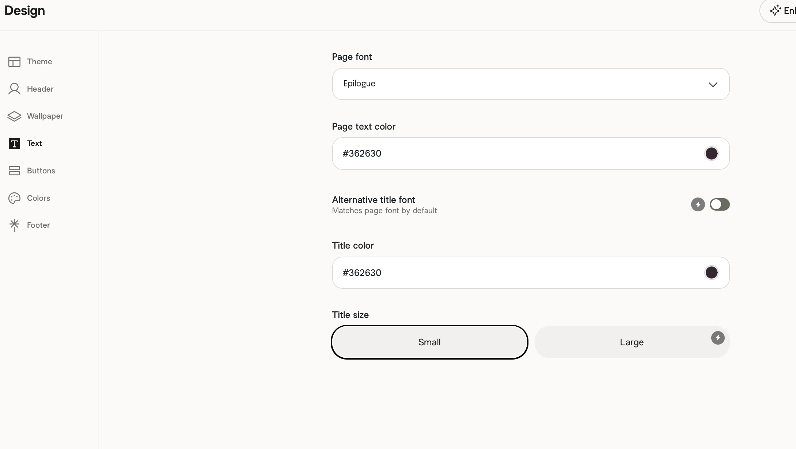

### Layout and visible functionality

- The editor is focused on the `Text` subsection inside `Design`.
- Left-side local design navigation shows:
  - `Theme`
  - `Header`
  - `Wallpaper`
  - `Text` (selected)
  - `Buttons`
  - `Colors`
  - `Footer`
- Main content includes typography-related controls:
  - `Page font` dropdown, with `Epilogue` selected
  - `Page text color` with hex input and swatch
  - `Alternative title font` toggle
    - helper copy: `Matches page font by default`
    - premium lightning marker next to the toggle
  - `Title color` with hex input and swatch
  - `Title size` segmented control:
    - `Small` (selected)
    - `Large` (premium-marked with lightning)
- The screen suggests a typography model with both global defaults and title-
  specific overrides.

### How the flow works

- Linktree appears to structure text styling in layers:
  - global page font
  - global body/page text color
  - optional separate title font behavior
  - title-specific color
  - title size
- This is a useful pattern because it gives users meaningful control without
  turning typography into a fully professional design tool.
- It also allows Linktree to gate a few expressive typography options as
  premium while keeping the basic text system usable for everyone.

### UI / usability assessment for users

- Strong and understandable.
- Good parts:
  - clean separation between page-wide text settings and title-specific ones
  - a font dropdown is more scalable than a grid of font cards in a dense editor
  - color inputs are consistent with the rest of the design system
  - helper copy explains the `Alternative title font` toggle clearly
- Potential downsides:
  - typography is less visual here than wallpaper or button controls
  - users may not immediately understand the creative impact of changing the
    font just from the dropdown name
  - premium gating on title size / title font behavior may feel slightly
    nitpicky if overused

### Strategic assessment for tadaify

- This is a solid pattern for tadaify.
- Typography controls matter, but they should not dominate the editor; this
  level of abstraction feels about right for mainstream users.
- The split between page font and title overrides is especially valuable,
  because headings often need a bit more personality than body text.

### Irritation risk

- Low.
- This feels like normal design editing.
- Irritation would come mainly from premium-gated micro-controls if too many of
  them are scattered across the text system.

### Is it worth implementing?

- Yes.
- The general control model is worth implementing in tadaify.

### How tadaify could do it better

- Keep the layered typography model:
  page font, body color, title overrides.
- Make font choice more visual by showing a live inline sample next to the font
  name.
- If gating premium typography, make sure the free tier still has enough strong
  font personality so the product does not feel intentionally bland.
- Consider grouping all title-specific controls together with a small preview,
  so the relationship between them is more obvious.

### Screen LT-015 — Button style picker in the design editor

- **Flow:** logged-in design editor, `Design > Buttons`
- **Source:** screenshot provided in Codex chat on 2026-04-23

### Evidence

- Chat screenshot: 2026-04-23 / Linktree / button style picker
- Artifact id: `LT-015`
- Local screenshot path: [lt-015-button-style-picker.png](./screens/lt-015-button-style-picker.png)

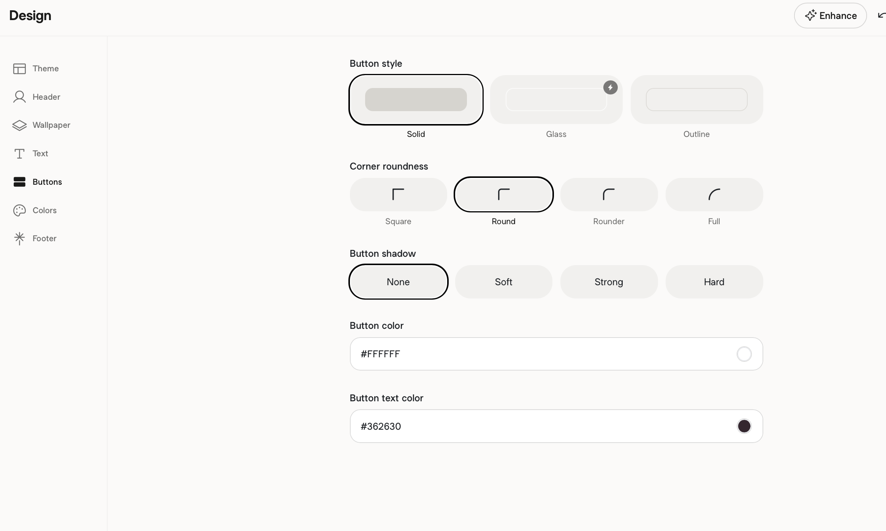

### Layout and visible functionality

- The editor is focused on the `Buttons` subsection inside `Design`.
- Left-side local design navigation shows:
  - `Theme`
  - `Header`
  - `Wallpaper`
  - `Text`
  - `Buttons` (selected)
  - `Colors`
  - `Footer`
- Main content is structured as a series of simple styling dimensions.
- `Button style` options:
  - `Solid` (selected)
  - `Glass`
  - `Outline`
- The `Glass` option has a premium lightning marker.
- `Corner roundness` options:
  - `Square`
  - `Round` (selected)
  - `Rounder`
  - `Full`
- `Button shadow` options:
  - `None` (selected)
  - `Soft`
  - `Strong`
  - `Hard`
- Color controls shown below:
  - `Button color` with hex input and swatch
  - `Button text color` with hex input and swatch
- The whole screen is organized as style primitives rather than individual
  button-by-button editing.

### How the flow works

- Linktree treats buttons as a small design system with a few orthogonal axes:
  - style family
  - corner shape
  - shadow depth
  - colors
- Instead of exposing many one-off presets, it lets users compose a button
  look from a limited set of high-leverage choices.
- This likely enables a large number of visual combinations while keeping the
  editor understandable.

### UI / usability assessment for users

- Very strong pattern for usability.
- Good parts:
  - simple and readable
  - users can understand each decision independently
  - visual previews on the segmented options communicate the effect well
  - the model is composable without feeling too technical
- Potential downsides:
  - advanced users may still want finer control later
  - premium gating on `Glass` may feel slightly arbitrary if users view it as a
    small stylistic variation rather than a major premium feature

### Strategic assessment for tadaify

- This is a strong pattern to copy for tadaify.
- Button styling matters a lot in link-in-bio products because buttons are the
  main interactive elements on the final page.
- The decomposition into a few clear axes is a smart middle ground:
  powerful enough to create variation, simple enough for mainstream users.

### Irritation risk

- Low.
- This feels like normal design editing.
- Irritation would mainly come from premium gating if too many small stylistic
  differences are paywalled.

### Is it worth implementing?

- Yes.
- This is one of the clearest and most transferable editor patterns seen so
  far.

### How tadaify could do it better

- Keep the axis-based approach:
  style, roundness, depth, colors.
- Make sure premium gating feels proportional:
  avoid paywalling too many tiny cosmetic differences.
- Consider a small live preview strip directly under each option group for even
  faster feedback.
- If you want stronger differentiation, add one or two distinct high-style
  families that feel more branded than `Solid / Glass / Outline`.

### Screen LT-014 — Wallpaper style picker in the design editor

- **Flow:** logged-in design editor, `Design > Wallpaper`
- **Source:** screenshot provided in Codex chat on 2026-04-23

### Evidence

- Chat screenshot: 2026-04-23 / Linktree / wallpaper style picker
- Artifact id: `LT-014`
- Local screenshot path: [lt-014-wallpaper-style-picker.png](./screens/lt-014-wallpaper-style-picker.png)

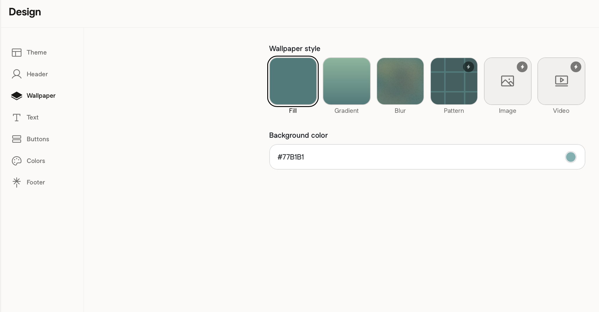

### Layout and visible functionality

- The editor is focused on the `Wallpaper` subsection inside `Design`.
- Left-side local design navigation shows:
  - `Theme`
  - `Header`
  - `Wallpaper` (selected)
  - `Text`
  - `Buttons`
  - `Colors`
  - `Footer`
- Main content area starts with `Wallpaper style`.
- Visible wallpaper style options:
  - `Fill`
  - `Gradient`
  - `Blur`
  - `Pattern`
  - `Image`
  - `Video`
- `Fill` is selected in the screenshot.
- Some styles have premium markers with the lightning icon:
  - `Pattern`
  - `Image`
  - `Video`
- Below the style picker there is a `Background color` control:
  - hex color input (`#77B1B1`)
  - color swatch on the right
- The layout is much simpler than the `Header` screen: it is mainly a style
  picker plus one concrete color control.

### How the flow works

- Linktree breaks wallpaper customization into:
  - style family selection
  - then parameter editing for the chosen family
- In this screenshot, `Fill` is active, so the editable parameter shown is
  simply the background color.
- The structure strongly suggests that each wallpaper type exposes different
  controls:
  - `Fill` -> color
  - `Gradient` -> gradient controls
  - `Blur` -> blur/image-related controls
  - `Pattern` -> pattern-related controls
  - `Image` -> upload / placement controls
  - `Video` -> video source / playback controls

### UI / usability assessment for users

- Strong pattern overall.
- Good parts:
  - the options are easy to scan visually
  - style families are separated cleanly before the user deals with detailed
    parameters
  - premium gating is embedded directly in the option cards
  - the selected state is clear
- Potential downsides:
  - some premium options are only marked by the lightning icon, which may be
    less explicit than a full `Pro` badge until hover
  - without the right-side live preview visible here, the effect is less
    immediate than on some other editor screens

### Strategic assessment for tadaify

- This is a good builder pattern for tadaify.
- Wallpaper/background is one of the highest-leverage visual controls in a
  link-in-bio product, so grouping it into clear style families makes sense.
- It also gives a clean place to differentiate free vs premium presentation
  features without mixing everything into one long form.

### Irritation risk

- Low.
- This feels like a normal customization screen, not a disruptive monetization
  step.
- Irritation risk mainly comes from premium options if users click them too
  often and repeatedly hit upsell friction.

### Is it worth implementing?

- Yes.
- The family-based wallpaper picker is worth implementing in tadaify.

### How tadaify could do it better

- Keep the family structure, but make premium labeling explicit even before
  hover.
- Ensure the live preview is always visible while changing wallpaper, because
  this setting is highly visual.
- Consider adding tiny helper text under each family, e.g.:
  - `Solid color`
  - `Soft color blend`
  - `Blurred image backdrop`
  - `Decorative pattern`
- If premium styles are gated, show the visual benefit clearly before users
  click into them.

### Screen LT-017 — Color token editor in the design editor

- **Flow:** logged-in design editor, `Design > Colors`
- **Source:** screenshot provided in Codex chat on 2026-04-23

### Evidence

- Chat screenshot: 2026-04-23 / Linktree / colors editor
- Artifact id: `LT-017`
- Local screenshot path: [lt-017-color-token-editor.png](./screens/lt-017-color-token-editor.png)

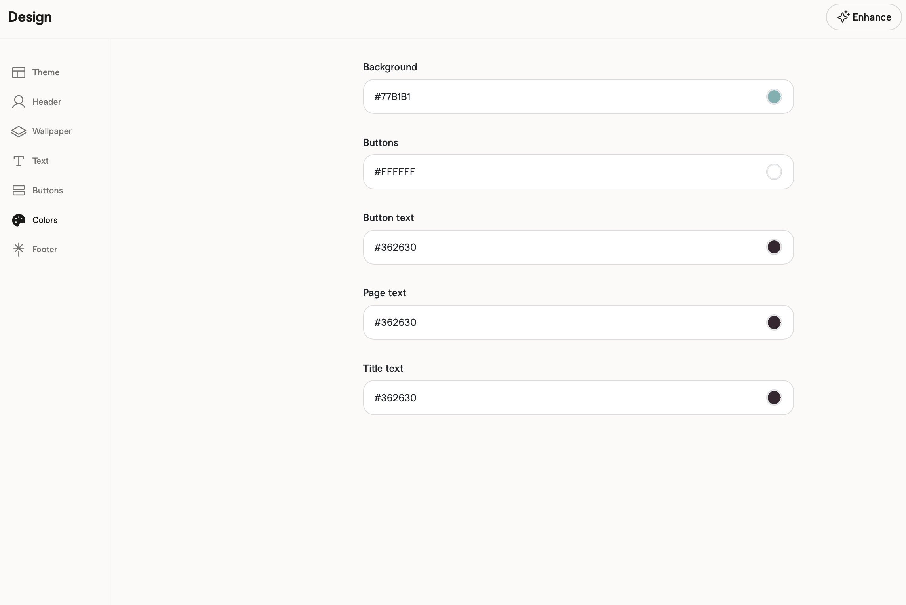

### Layout and visible functionality

- The editor is focused on the `Colors` subsection inside `Design`.
- Left-side local design navigation shows:
  - `Theme`
  - `Header`
  - `Wallpaper`
  - `Text`
  - `Buttons`
  - `Colors` (selected)
  - `Footer`
- Main content is a vertical list of color token controls:
  - `Background`
  - `Buttons`
  - `Button text`
  - `Page text`
  - `Title text`
- Each row has:
  - label
  - hex color input
  - color swatch on the right
- Example values visible in the screenshot:
  - `Background`: `#77B1B1`
  - `Buttons`: `#FFFFFF`
  - `Button text`: `#362630`
  - `Page text`: `#362630`
  - `Title text`: `#362630`
- The screen is intentionally plain and system-like; it focuses on raw color
  control rather than inspiration or presets.

### How the flow works

- Linktree separates color editing from the more structural style pickers.
- Instead of attaching every color to each individual module forever, it also
  provides one centralized token panel where the main semantic colors can be
  edited directly.
- This suggests a dual model in the editor:
  - module-specific controls for local styling choices
  - centralized token editing for global color consistency

### UI / usability assessment for users

- Strong for intermediate users, decent for mainstream users.
- Good parts:
  - very clear and predictable
  - hex + swatch pattern is consistent with other design screens
  - centralizing major colors makes broad visual tuning faster
  - semantic labels (`Background`, `Button text`, `Title text`) are easier to
    understand than raw CSS-like variables
- Potential downsides:
  - this screen is more utilitarian and less visually guided than others
  - non-design users may not always know which token they should change first
  - without live preview nearby, color editing can become slightly abstract

### Strategic assessment for tadaify

- This is a good pattern for tadaify, especially once the editor grows.
- A centralized color-token panel helps keep the design system coherent and
  prevents users from hunting through multiple subsections for basic palette
  changes.
- It also gives a clean internal architecture:
  if your UI is driven by semantic color tokens, many controls become easier to
  maintain.

### Irritation risk

- Low.
- This is a straightforward settings screen.
- Risk is mostly about complexity, not annoyance.

### Is it worth implementing?

- Yes.
- Especially worthwhile if tadaify is built on semantic design tokens rather
  than one-off per-component colors.

### How tadaify could do it better

- Keep semantic labels exactly like this instead of exposing raw theme vars.
- Pair each row with a tiny preview snippet so users can see what each token
  affects.
- Consider adding a few suggested palettes at the top, with manual token
  editing below for refinement.
- If possible, keep live preview visible while editing colors, because palette
  changes are much easier to judge in context than from swatches alone.

### Screen LT-018 — Footer branding toggle in the design editor

- **Flow:** logged-in design editor, `Design > Footer`
- **Source:** screenshot provided in Codex chat on 2026-04-23

### Evidence

- Chat screenshot: 2026-04-23 / Linktree / footer branding toggle
- Artifact id: `LT-018`
- Local screenshot path: [lt-018-footer-branding-toggle.png](./screens/lt-018-footer-branding-toggle.png)

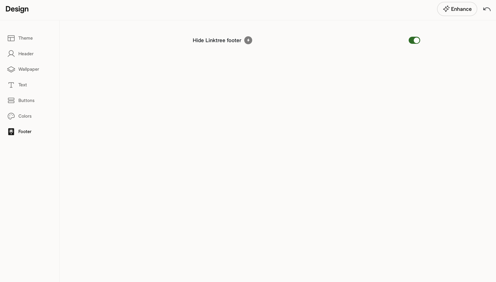

### Layout and visible functionality

- The editor is focused on the `Footer` subsection inside `Design`.
- Left-side local design navigation shows:
  - `Theme`
  - `Header`
  - `Wallpaper`
  - `Text`
  - `Buttons`
  - `Colors`
  - `Footer` (selected)
- Main content is extremely minimal and contains one key control:
  - `Hide Linktree footer`
- Next to the label there is a premium lightning marker.
- On the far right there is a toggle switch for the setting.
- The entire screen communicates that footer branding visibility is treated as
  a single premium customization control.

### How the flow works

- Linktree exposes branding removal as a direct product setting, not as a
  hidden billing-only rule.
- But the presence of the lightning marker indicates that hiding the Linktree
  footer is a Pro/premium feature.
- Product meaning:
  - free users keep `Powered by Linktree`
  - paid users can remove/disable that branding
- This is a very common monetization lever in link-in-bio tools, but also one
  of the most emotionally charged ones.

### UI / usability assessment for users

- From a pure UI perspective, the screen is simple and clear.
- The user instantly understands what the setting does.
- But from a user-feelings perspective, this kind of gating often annoys
  people disproportionately because it touches identity/control rather than an
  "extra" feature.
- Many users do not perceive hiding platform branding as a luxury upgrade;
  they perceive it as basic ownership of their page.

### Strategic assessment for tadaify

- This is exactly the kind of thing that can be used as product
  differentiation.
- If tadaify allows footer branding removal on the free tier, that is not just
  a nice feature; it is a sharp emotional positioning against Linktree.
- The upside of gating it is obvious for revenue.
- The downside is also obvious:
  users often resent paying just to remove someone else's brand from their own
  page.

### Irritation risk

- High.
- This is one of the most annoying kinds of premium gating in creator tools.
- The irritation comes from perceived unfairness more than from complexity:
  `why do I need Pro just to hide Powered by Linktree?`

### Is it worth implementing?

- For tadaify as a paid gate: probably no, unless your monetization strategy
  clearly depends on it.
- For tadaify as a differentiation point: yes, very much.

### How tadaify could do it better

- Strongest option:
  allow removing platform branding for free and use it as a positioning wedge.
- If branding must exist on free, make it softer and less intrusive than the
  standard `Powered by ...` footer.
- If monetized at all, consider gating more advanced white-label features
  instead of basic footer removal.
- In general, this is one of the clearest opportunities for tadaify to feel
  more user-aligned than Linktree.

### Screen LT-019 — Save-time premium gate modal after editing paid features

- **Flow:** logged-in design editor; shown after clicking persistent `Save`
  when the current draft includes premium-only customizations
- **Source:** screenshot provided in Codex chat on 2026-04-23

### Evidence

- Chat screenshot: 2026-04-23 / Linktree / save-time premium gate modal
- Artifact id: `LT-019`
- Local screenshot path: [lt-019-save-time-premium-gate-modal.png](./screens/lt-019-save-time-premium-gate-modal.png)

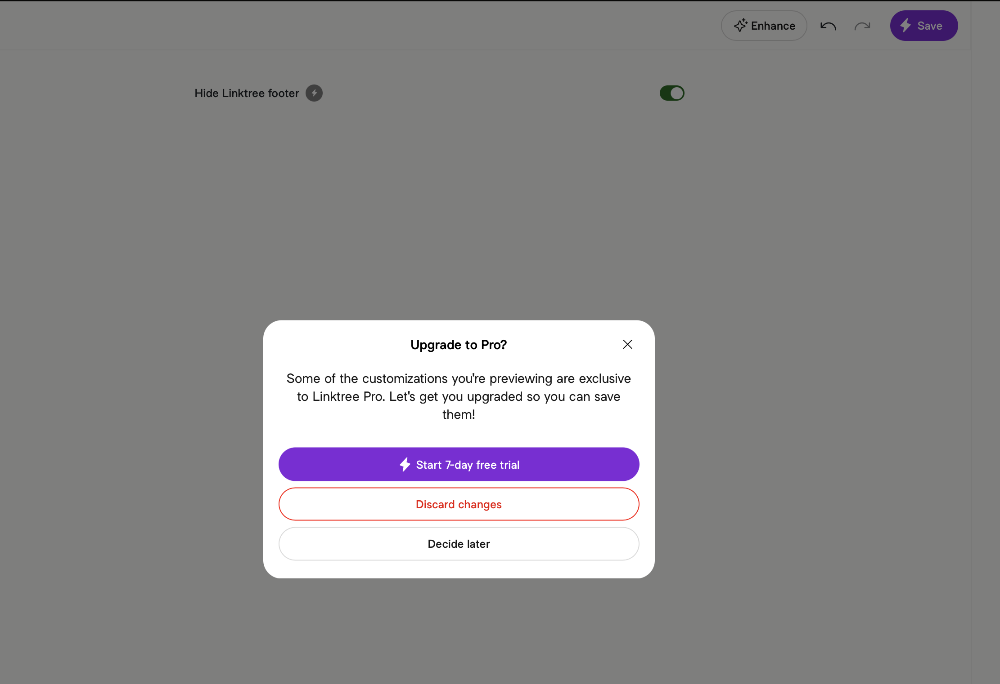

### Layout and visible functionality

- The editor is dimmed in the background.
- The top-right `Save` button is still visible behind the modal, reinforcing
  that the modal was triggered by a save attempt.
- Center modal includes:
  - headline: `Upgrade to Pro?`
  - explanatory copy saying some previewed customizations are exclusive to
    Linktree Pro
  - primary CTA:
    `Start 7-day free trial`
  - secondary destructive-feeling action:
    `Discard changes`
  - tertiary softer action:
    `Decide later`
  - close `X` button
- The wording makes it clear that the editor allowed previewing paid features
  before enforcing the subscription gate.

### How the flow works

- Linktree keeps the `Save` affordance always available in the top bar.
- It appears to allow users to interact with some premium controls and preview
  the result inside the editor.
- The actual premium enforcement is deferred until save time:
  - user edits
  - user clicks `Save`
  - system checks whether the draft includes paid-only settings
  - if yes, it interrupts with an upgrade/trial modal
- This is a very deliberate monetization pattern:
  let the user feel the value first, then gate persistence.

### UI / usability assessment for users

- This can be effective, but it is also risky.
- Good parts:
  - users get to experience premium polish before being asked to pay
  - save-time gating is more understandable than gating every click instantly
  - the modal explains that the issue is not saving in general, but saving
    premium customizations
- Bad parts:
  - users may feel baited if they invested time into edits they cannot keep
  - `Discard changes` is a harsh fallback after the work has already been done
  - a persistent always-enabled `Save` button can create false confidence
  - this pattern shifts frustration later, when the emotional cost is higher

### Strategic assessment for tadaify

- This is a sophisticated monetization tactic, but I would treat it carefully
  for tadaify.
- For an incumbent like Linktree, it may convert well because users already
  trust the brand and may accept some friction.
- For a challenger, this can backfire:
  the user may interpret it as `you let me do the work and only then told me I
  need to pay`.
- If tadaify uses this at all, it should do so only with very clear premium
  labeling before the user invests too much effort.

### Irritation risk

- High.
- This is one of the more frustrating gating patterns because the user discovers
  the real limitation only at the moment of commitment.
- The emotional pain is not the modal itself; it is the sunk time before the
  modal appears.

### Is it worth implementing?

- As-is for tadaify: probably no.
- The idea of allowing premium preview before upsell: maybe, but only with much
  stronger upfront signaling.

### How tadaify could do it better

- If a control is premium, signal that clearly before the user edits it.
- If allowing temporary preview, show a persistent inline notice such as:
  `You can preview this Pro style, but saving requires Pro.`
- Avoid `Discard changes` as the main secondary path; a better fallback is:
  `Revert premium changes and save the rest`.
- Let users keep their work in draft even if they do not upgrade immediately.
- In general, reduce the feeling of trap / sunk-cost monetization.

## 03. Page Editor

### Early observations

- `LT-011` confirms that Linktree's editor is not a generic settings page; it
  is a live visual builder with immediate preview.
- The `Design > Header` module suggests a modular editor architecture:
  appearance is broken into smaller customizable areas rather than one long
  monolithic form.
- `LT-012` shows that the editor has cross-setting dependency logic and uses
  guided repair modals instead of leaving the user with unexplained conflicts.
- `LT-013` suggests a second layer on top of that:
  the editor is not only enforcing compatibility, but also proposing aesthetic
  matching based on the current visual state.
- `LT-014` shows a clean family-based control model:
  first choose the wallpaper type, then edit the parameters for that type.
- `LT-015` shows the same design-system logic applied to buttons:
  a few composable styling axes instead of one giant preset list.
- `LT-016` shows the typography equivalent of that same pattern:
  global defaults plus a small set of title-specific overrides.
- `LT-017` shows that Linktree also exposes centralized semantic color tokens,
  not only local styling controls inside each module.
- `LT-018` highlights one of the most emotionally sensitive monetization moves:
  charging users to remove platform branding from their own page.
- `LT-019` reveals another key monetization pattern:
  premium enforcement is sometimes deferred until `Save`, not at the first
  interaction with the premium control.
- `LT-020` shows that the real product core is the links workspace:
  not just a URL list, but an operational surface for add/reorder/toggle/enrich
  flows.

## 04. Public Page / Profile

No screens documented yet.

## 05. Analytics

### Screen LT-038 — Insights overview with sample-data cards and mixed free/pro analytics blocks

- **Flow:** logged-in `Insights` area; overview state mixing connected-source
  prompts, sample cards, and gated insight modules
- **Source:** screenshot provided in Codex chat on 2026-04-23

### Evidence

- Artifact id: `LT-038`
- Local screenshot path: [lt-038-insights-overview-sample-data-pro-cards.png](./screens/lt-038-insights-overview-sample-data-pro-cards.png)

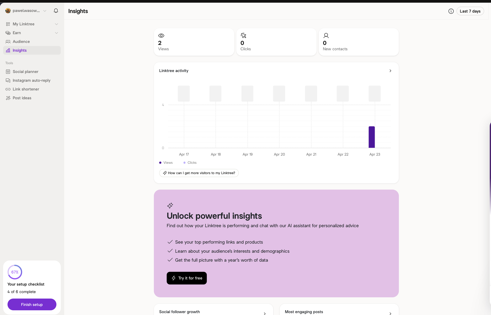

### Layout and visible functionality

- Left nav shows `Insights` as a first-class product area.
- Top-right has a date range selector: `Last 7 days`.
- Visible cards include:
  - `Social follower growth`
  - `Most engaging posts`
  - `Most clicked links` (`Pro`)
  - `Linktree visitors` (`Pro`)
  - `Contacts` (`Pro`)
  - `Lifetime totals`
- Some cards show `Show sample data`.
- Some cards ask the user to connect:
  - Instagram
  - TikTok
  - YouTube
- Cards also include AI-like prompt buttons such as:
  - `How do I grow my followers?`
  - `What should I post next?`
  - `How can I optimize my links?`
  - `Which sources drive most visits?`

### How the flow works

- Linktree's analytics surface is not only reporting; it is positioned as:
  - analytics
  - content guidance
  - growth coaching
  - monetized audience intelligence
- Free/basic state is still visually populated via:
  - sample data
  - connect prompts
  - partially visible modules
- Pro state is teased inside the same surface rather than hidden elsewhere.

### UI / usability assessment for users

- Strong:
  - the page looks rich even before real data exists
  - sample data reduces the empty-dashboard problem
  - cards are easy to scan
  - growth-oriented prompt buttons make analytics feel actionable
- Weak:
  - some of the value is simulated rather than real
  - too many `Pro` locks can make the page feel like a showroom
  - if users realize most of the exciting cards are gated, frustration can rise

### Strategic assessment for tadaify

- This is one of the most important screens in the whole audit.
- The key lesson is not "copy the same cards", but:
  analytics should answer:
  - what happened
  - why it happened
  - what to do next
- Tadaify should absolutely think in terms of:
  - activity
  - top performers
  - audience sources
  - conversion/contact capture
  - next-step recommendations

### Irritation risk

- Medium.
- The biggest risk is overusing locked sample cards in a way that makes the
  page feel like upsell theater.

### Is it worth implementing?

- Yes, strongly.

### How tadaify could do it better

- Use fewer, more honest cards in the free state.
- Show real data wherever possible, even if small.
- If using example/preview cards, label them clearly as previews of paid
  capabilities rather than making the whole page feel fake.

### Screen LT-039 — Insights overview with large hero upsell and supporting cards

- **Flow:** logged-in `Insights` area; upper overview state emphasizing the
  premium insights proposition
- **Source:** screenshot provided in Codex chat on 2026-04-23

### Evidence

- Artifact id: `LT-039`
- Local screenshot path: [lt-039-insights-overview-hero-upsell-and-cards.png](./screens/lt-039-insights-overview-hero-upsell-and-cards.png)

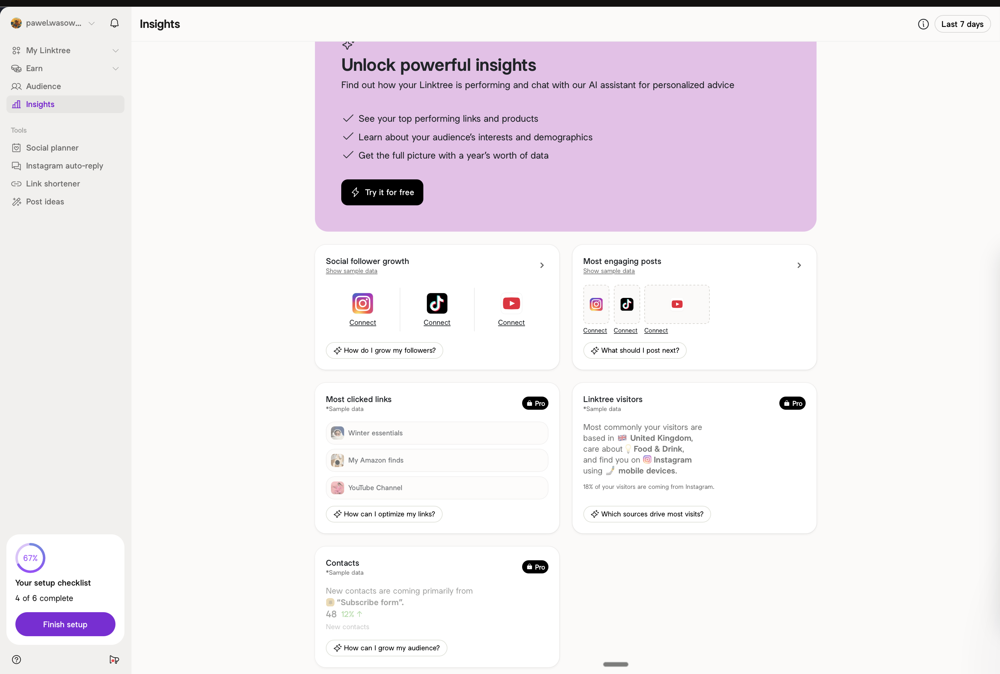

### Layout and visible functionality

- Large pink/purple hero banner at the top:
  `Unlock powerful insights`
- Banner promises:
  - top performing links and products
  - audience interests and demographics
  - a year's worth of data
  - personalized advice / AI assistant
- Primary CTA: `Try it for free`
- Below the hero, the same card-based analytics modules continue.

### How the flow works

- Linktree frames advanced analytics as a premium growth system, not a basic
  reporting utility.
- The banner acts as:
  - value framing
  - monetization anchor
  - explanation of why paid insights matter
- The rest of the page acts as supporting evidence.

### UI / usability assessment for users

- Strong:
  - very clear premium value proposition
  - easy to understand what the upgrade unlocks
  - card surface below gives the upsell context
- Weak:
  - the banner is large and sales-heavy
  - it dominates the page before the user finishes reading actual metrics

### Strategic assessment for tadaify

- Worth learning from, but not copying too literally.
- Tadaify should explain premium analytics in business terms, not just `more
  charts`.
- A hero upsell can work if the premium layer is genuinely differentiated.

### Irritation risk

- Medium.
- Mostly because it pushes upgrade messaging hard inside what users may expect
  to be a neutral reporting surface.

### Is it worth implementing?

- Maybe, once analytics has a real premium tier.
- Not necessary for early Tadaify unless the premium analytics story is very
  strong.

### How tadaify could do it better

- Use a smaller inline premium explainer rather than a dominating hero at
  first.
- Tie premium upgrade copy to concrete creator outcomes:
  - better conversions
  - better content selection
  - better traffic understanding

### Screen LT-040 — Insights activity chart with KPI cards and premium hero below

- **Flow:** logged-in `Insights` area; basic activity state with real but low
  current metrics
- **Source:** screenshot provided in Codex chat on 2026-04-23

### Evidence

- Artifact id: `LT-040`
- Local screenshot path: [lt-040-insights-activity-chart-and-upsell.png](./screens/lt-040-insights-activity-chart-and-upsell.png)

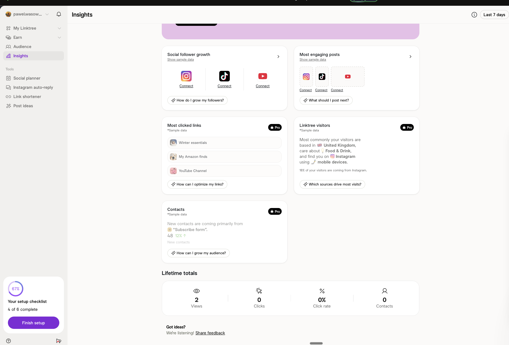

### Layout and visible functionality

- Top KPI cards:
  - `Views`
  - `Clicks`
  - `New contacts`
- Main card:
  - `Linktree activity`
  - date-based chart for the last 7 days
  - legend for `Views` and `Clicks`
  - contextual prompt button:
    `How can I get more visitors to my Linktree?`
- Premium hero block appears directly below the chart.

### How the flow works

- Linktree gives users some genuinely useful baseline analytics for free:
  simple KPIs and activity trend.
- Then, after showing that core activity, it upsells the richer analytics
  layer.
- This is a stronger pattern than pure locked cards, because the user first
  receives real value.

### UI / usability assessment for users

- Strong:
  - activity chart is familiar and trustworthy
  - free value exists before the upgrade push
  - the page can still work for low-volume users
- Weak:
  - below-the-chart upsell is still heavy
  - if the chart is sparse for new users, the premium promise may feel
    disproportionate

### Strategic assessment for tadaify

- This is probably the best analytics pattern seen so far.
- For tadaify, the ideal model is:
  - free core metrics
  - then premium interpretation / segmentation / recommendations
- That feels much fairer and more credible than hiding everything behind a pay
  layer from the start.

### Irritation risk

- Low to medium.
- Much lower than other Linktree upsells because the user gets real baseline
  data first.

### Is it worth implementing?

- Yes.

### How tadaify could do it better

- Start with a clean analytics MVP:
  - views
  - clicks
  - CTR
  - source/referrer
  - top blocks
- Then build premium on top of that:
  - audience patterns
  - content recommendations
  - campaign/source comparisons
  - contact conversion analysis

### Insights observations

- `LT-038` to `LT-040` show that Linktree treats analytics as a growth product,
  not a plain reporting page.
- The surface combines:
  - real base metrics
  - sample/preview cards
  - connect prompts
  - AI/growth suggestion entry points
  - premium upsell framing
- The strongest transferable lesson for Tadaify:
  analytics should not stop at `views` and `clicks`.
  It should help answer:
  - what is working
  - where people are coming from
  - what to improve next
- The strongest anti-pattern to avoid:
  making too much of the page feel fake or locked if the user has not upgraded.

## 06. Monetization / Billing

No screens documented yet.

## 07. Audience / CRM / Email

No screens documented yet.

## 08. Growth / Integrations / Embeds

### Add modal observations

- `LT-021` to `LT-027` show that Linktree treats `Add` as an integration/block
  marketplace, not a simple add-link dialog.
- The visible category system spans:
  - `Suggested`
  - `Commerce`
  - `Social`
  - `Media`
  - `Contact`
  - `Events`
  - `Text`
- Visible examples across those screenshots include:
  - Instagram
  - TikTok
  - YouTube
  - Spotify
  - File downloads
  - Text
  - Header
  - Tour and Events
  - Seated
  - Bands In Town

### Screen LT-028 — Settings overview focused on `Subscribe`, `SEO`, `Affiliate programs`, and `Billing`

- **Flow:** logged-in settings area; lower-middle section of the settings
  surface
- **Source:** screenshot provided in Codex chat on 2026-04-23

### Evidence

- Artifact id: `LT-028`
- Local screenshot path: [lt-028-settings-overview-subscribe-seo-affiliate-billing.png](./screens/lt-028-settings-overview-subscribe-seo-affiliate-billing.png)

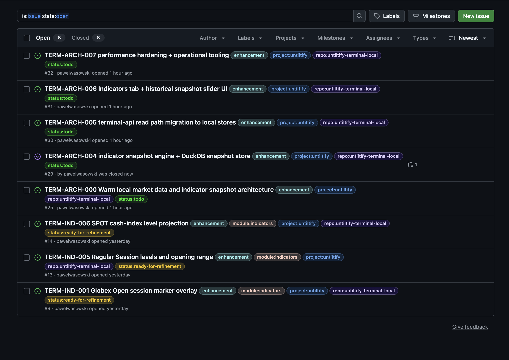

### Layout and visible functionality

- Left rail contains settings categories such as:
  - `Integrations`
  - `Social integrations`
  - `Mailing list integrations`
  - `Design integrations`
  - `Analytics`
  - `Earn`
  - `Support banner`
  - `Sensitive material`
  - `Subscribe`
  - `SEO`
  - `Affiliate programs`
  - `Billing`
- Main content column shows stacked settings cards.
- Visible cards on this screen:
  - `Let visitors subscribe`
  - `SEO` / `Custom metadata`
  - `Hide profile from search engines`
  - `Affiliate programs`
  - `Billing`
- Some cards show lock icons, signaling premium or restricted capabilities.
- The visual pattern is consistent:
  section heading -> white card -> short explanation -> input/toggle/button.

### How the flow works

- Linktree treats settings as one broad account-and-page control center, not
  only account preferences.
- The page mixes:
  - growth controls
  - SEO controls
  - monetization controls
  - visitor/subscriber controls
  - billing controls
- This means the user can move from profile configuration into monetization and
  discoverability without leaving the same area.

### UI / usability assessment for users

- Good parts:
  - clear left-rail navigation
  - card-based sections are easy to scan
  - the page feels comprehensive and mature
- Weak parts:
  - a lot of different concerns are grouped together in one large settings
    surface
  - this can make the area feel administrative rather than product-led
  - some users may not know whether a feature belongs in `Links`, `Design`,
    `Audience`, or `Settings`

### Strategic assessment for tadaify

- Tadaify should absolutely have a settings hub eventually, but likely a
  simpler one at first.
- The most valuable idea to copy is the information architecture pattern:
  grouped left navigation + card-based settings panels.
- The least valuable thing to copy 1:1 is the sheer breadth on day one.

### Irritation risk

- Low to medium.
- The page is not annoying in itself, but it can feel heavy or overbuilt if
  too many categories exist before the user needs them.

### Is it worth implementing?

- Yes, in a reduced version.

### How tadaify could do it better

- Start with a tighter settings IA, for example:
  - `Integrations`
  - `Audience`
  - `Discoverability`
  - `Monetization`
  - `Billing`
- Keep page-building actions inside the builder, and reserve settings for
  account/page policies and integrations.

### Screen LT-029 — Settings view around `Support banner`, `Sensitive material`, `Subscribe`, and `SEO`

- **Flow:** logged-in settings area; mid-page view showing policy- and
  discoverability-related controls
- **Source:** screenshot provided in Codex chat on 2026-04-23

### Evidence

- Artifact id: `LT-029`
- Local screenshot path: [lt-029-settings-support-sensitive-subscribe-seo.png](./screens/lt-029-settings-support-sensitive-subscribe-seo.png)

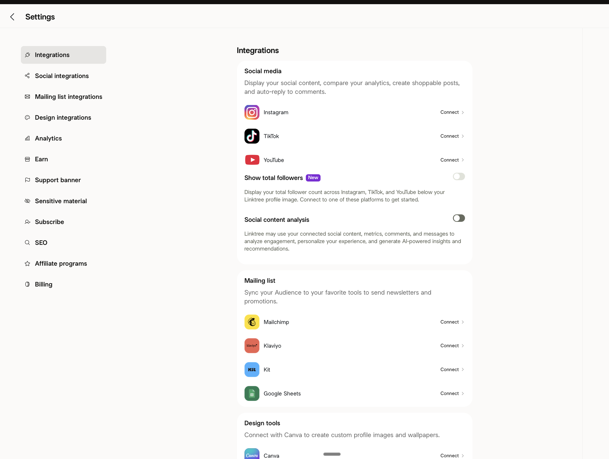

### Layout and visible functionality

- `Support banner` appears as its own settings category.
- `Sensitive material` is a standalone toggle-based policy control.
- `Subscribe` enables a subscriber CTA on the public page.
- `SEO` includes:
  - custom metadata inputs
  - `Hide profile from search engines` toggle
- This screen shows that Linktree treats moderation/discoverability/commercial
  growth as peer-level concerns in settings.

### How the flow works

- Linktree exposes profile policy and visibility controls directly in settings
  instead of burying them in advanced menus.
- The user can independently choose:
  - whether the page shows a support banner
  - whether content warning behavior is enabled
  - whether visitors can subscribe
  - whether search engines should index the profile

### UI / usability assessment for users

- Good:
  - clear, plain-language control labels
  - no complicated setup flow for policy-like settings
  - these controls are easy to understand at a glance
- Weak:
  - `Support banner` is slightly odd as a first-class global category
  - the overall settings IA starts to feel crowded

### Strategic assessment for tadaify

- `Sensitive material` is strategically very relevant for Tadaify if the brand
  wants to support adult creators or creators with sensitive content.
- `SEO` is also worth exposing clearly, because discoverability is a real
  selling point for serious creators and personal brands.
- `Support banner` is much lower priority and does not need to be top-level in
  tadaify v1.

### Irritation risk

- Low.

### Is it worth implementing?

- `Sensitive material`: yes.
- `SEO controls`: yes.
- `Support banner`: probably later, not early.

### How tadaify could do it better

- Combine `Sensitive material` and SEO visibility into a cleaner
  `Discoverability & Safety` section.
- Keep unusual low-frequency features like `Support banner` out of the main
  left rail until there is strong usage.

### Screen LT-030 — Settings `Integrations` overview with social, mailing, design, and analytics-related connections

- **Flow:** logged-in settings area; integration hub view
- **Source:** screenshot provided in Codex chat on 2026-04-23

### Evidence

- Artifact id: `LT-030`
- Local screenshot path: [lt-030-settings-integrations-social-mailing-design-analytics.png](./screens/lt-030-settings-integrations-social-mailing-design-analytics.png)

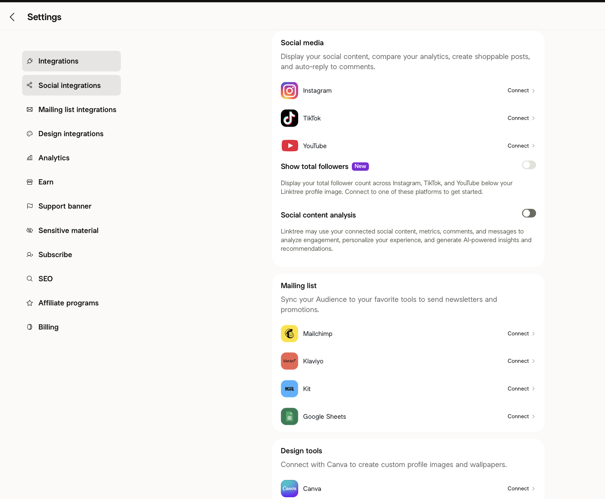

### Layout and visible functionality

- Main section title: `Integrations`.
- Visible grouped cards:
  - `Social media`
  - `Mailing list`
  - `Design tools`
  - `Analytics` (partially visible)
- Visible connectable services include:
  - Instagram
  - TikTok
  - YouTube
  - Mailchimp
  - Klaviyo
  - Kit
  - Google Sheets
  - Canva
- There are also toggles for:
  - `Show total followers`
  - `Social content analysis`

### How the flow works

- Linktree centralizes integrations in one admin-style view.
- Integrations are grouped by business function, not by technical provider.
- This creates a strong feeling that Linktree is an orchestration layer across
  the creator's existing tools.

### UI / usability assessment for users

- Strong:
  - the grouping is easy to understand
  - connect actions are uniform
  - the page makes the product look bigger and more capable
- Weak:
  - it is not obvious where the boundary is between:
    - an integration that powers a block on the page
    - an integration that powers analytics
    - an integration that powers CRM/workflows

### Strategic assessment for tadaify

- This is one of the strongest surfaces Linktree has.
- Tadaify does not need all these integrations immediately, but it does need
  the same product story:
  the page is a hub for your creator stack, not only a static profile.

### Irritation risk

- Low.

### Is it worth implementing?

- Yes, strongly, but with a narrower first wave.

### How tadaify could do it better

- Launch with a smaller but clearer integration map:
  - `Social`
  - `Audience`
  - `Design`
  - `Analytics`
- Make each integration clearly explain where it shows up:
  - on the page
  - in audience capture
  - in insights

### Screen LT-031 — Cleaner `Integrations` shot confirming the settings IA

- **Flow:** logged-in settings area; cleaner framing of the main integrations
  surface
- **Source:** screenshot provided in Codex chat on 2026-04-23

### Evidence

- Artifact id: `LT-031`
- Local screenshot path: [lt-031-settings-integrations-cleaner-shot.png](./screens/lt-031-settings-integrations-cleaner-shot.png)

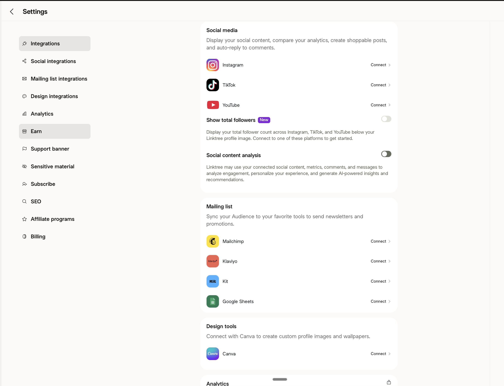

### Layout and visible functionality

- Same area as LT-030, but framed more cleanly.
- Confirms the left-rail category structure and the stacked integration cards.
- Reinforces that Linktree gives integrations their own first-class home, not
  a hidden submenu.

### How the flow works

- This is not a separate feature from LT-030, but it is useful evidence of the
  information architecture.
- The settings page is intentionally designed like an app settings workspace,
  not a tiny profile preference form.

### UI / usability assessment for users

- Good IA reinforcement.
- The product appears mature and enterprise-like.

### Strategic assessment for tadaify

- Worth copying as an IA pattern.
- Not necessary to copy with the same depth immediately.

### Irritation risk

- Low.

### Is it worth implementing?

- Yes, as a design pattern.

### How tadaify could do it better

- Keep the same clarity, but reduce the number of top-level categories until
  the catalog actually exists.

### Screen LT-032 — `Social integrations` detail view

- **Flow:** logged-in settings area; social/media integration details
- **Source:** screenshot provided in Codex chat on 2026-04-23

### Evidence

- Artifact id: `LT-032`
- Local screenshot path: [lt-032-settings-social-integrations-detail.png](./screens/lt-032-settings-social-integrations-detail.png)

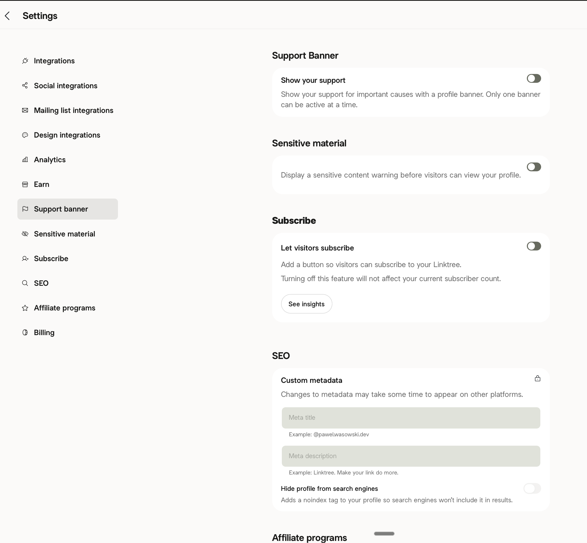

### Layout and visible functionality

- Social connectors shown:
  - Instagram
  - TikTok
  - YouTube
- Advanced toggles:
  - `Show total followers` with `New` badge
  - `Social content analysis`
- Supporting copy explains that connected social data can power:
  - follower display
  - analytics/comparison
  - shoppable posts
  - auto-reply/comment-related features
  - AI-powered recommendations

### How the flow works

- Linktree is not positioning social connections as mere embeds.
- It uses one connection surface to unlock:
  - visible profile enhancements
  - analytics enhancements
  - AI/recommendation features
  - automation-like capabilities

### UI / usability assessment for users

- Strong because it makes the value of connecting accounts feel broad.
- Risk:
  - users may become privacy-sensitive if the product asks for social access
    before clear trust is established
  - `Social content analysis` wording hints at deep data use, which can feel
    powerful or invasive depending on the audience

### Strategic assessment for tadaify

- This is worth studying carefully.
- The lesson is not only "connect Instagram/TikTok/YouTube", but:
  use one integration to unlock multiple visible benefits.

### Irritation risk

- Medium.
- Not because the page is bad, but because connected-account analysis can feel
  intrusive.

### Is it worth implementing?

- Yes, but with explicit transparency and softer defaults.

### How tadaify could do it better

- Make the benefits concrete and separated:
  - `Use this to show follower count`
  - `Use this to create richer cards`
  - `Use this for insights`
- Let users opt into deeper analysis separately from basic visual connection.

### Screen LT-033 — Cleaner `Social integrations` shot

- **Flow:** logged-in settings area; cleaner framing of the social integrations
  detail
- **Source:** screenshot provided in Codex chat on 2026-04-23

### Evidence

- Artifact id: `LT-033`
- Local screenshot path: [lt-033-settings-social-integrations-detail-cleaner-shot.png](./screens/lt-033-settings-social-integrations-detail-cleaner-shot.png)

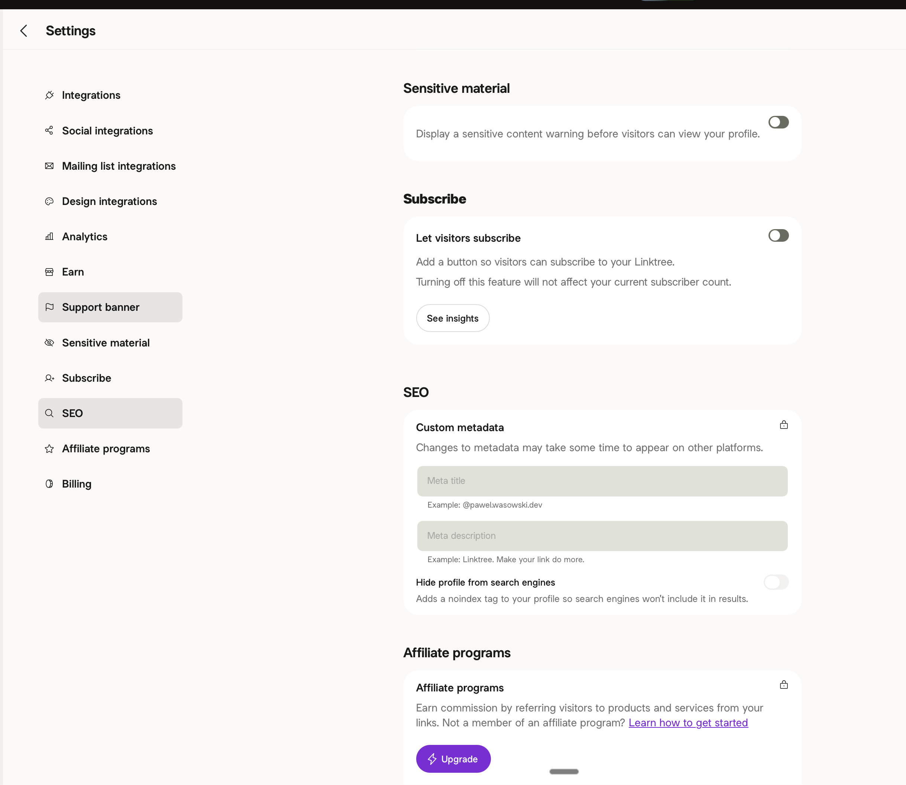

### Layout and visible functionality

- Same social integrations area as LT-032 with cleaner crop and legibility.
- Confirms the same structural pattern:
  connected providers + capability toggles + explanatory copy.

### How the flow works

- This serves as supporting evidence that Linktree is bundling:
  - social connectivity
  - analytics
  - page enrichment
  under a single settings area.

### UI / usability assessment for users

- Clear, calm, admin-style interface.

### Strategic assessment for tadaify

- Good reference for how to present connected-account capabilities without
  making the UI look too technical.

### Irritation risk

- Medium for privacy-sensitive users, otherwise low.

### Is it worth implementing?

- Yes, as a presentation pattern.

### How tadaify could do it better

- Use more explicit trust language around permission scope and data usage.

### Screen LT-034 — Settings page left-rail navigation as product information architecture

- **Flow:** logged-in settings area; broader view emphasizing the entire
  settings navigation structure
- **Source:** screenshot provided in Codex chat on 2026-04-23

### Evidence

- Artifact id: `LT-034`
- Local screenshot path: [lt-034-settings-page-navigation-left-rail.png](./screens/lt-034-settings-page-navigation-left-rail.png)

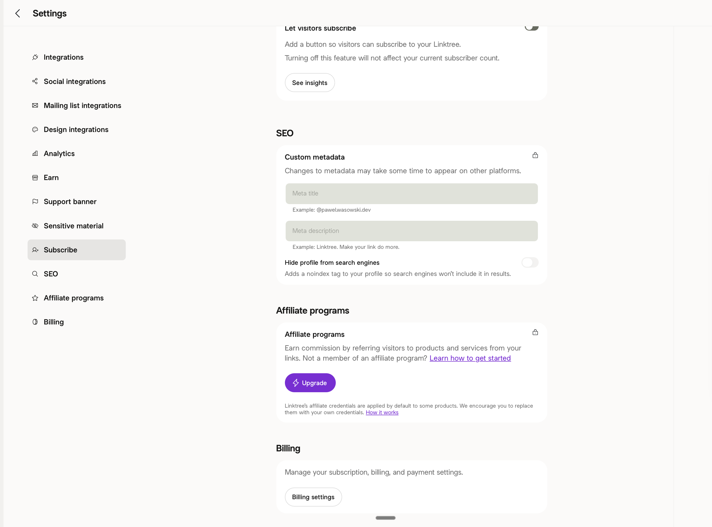

### Layout and visible functionality

- This shot is less about one individual card and more about the complete
  settings IA.
- The settings left rail functions almost like a second-level product map.
- Categories visible:
  - `Integrations`
  - `Social integrations`
  - `Mailing list integrations`
  - `Design integrations`
  - `Analytics`
  - `Earn`
  - `Support banner`
  - `Sensitive material`
  - `Subscribe`
  - `SEO`
  - `Affiliate programs`
  - `Billing`

### How the flow works

- The builder has a primary nav for big product areas, but once inside
  settings, Linktree adds a second internal nav layer.
- This means settings is large enough to justify its own information
  architecture, like a mini app inside the app.

### UI / usability assessment for users

- Good:
  - easy scanning
  - predictable section switching
  - supports future growth
- Weak:
  - starts to feel bloated
  - some categories are thin enough that they probably do not deserve their
    own permanent slot

### Strategic assessment for tadaify

- This is a useful long-term pattern, not a day-one one.
- If tadaify grows into a creator operating system, a settings IA like this
  will become necessary.
- If tadaify launches with this much nav too early, it may feel empty or
  overbuilt.

### Irritation risk

- Low for power users, medium for beginners.

### Is it worth implementing?

- Yes, eventually.
- Not with this many categories in v1.

### How tadaify could do it better

- Start with fewer, broader settings buckets.
- Add subcategories only after usage justifies them.

### Settings observations

- `LT-028` to `LT-034` show that Linktree's settings area is not a generic
  account screen; it is a second control surface for:
  - integrations
  - discoverability
  - safety/policy
  - monetization
  - billing
  - audience growth
- The strongest transferable idea for tadaify is not the exact list of menu
  items, but the structural pattern:
  a left-rail IA with card-based settings grouped by business intent.
- The strongest overreach risk to avoid in tadaify is copying too many
  categories too early.
- Best v1 transfer for tadaify would likely be:
  - `Integrations`
  - `Audience`
  - `Discoverability & Safety`
  - `Monetization`
  - `Billing`
- Lower-priority items that should probably stay out of the first settings IA:
  - `Support banner`
  - very fine-grained integration subcategories as top-level items
  - heavy analytics toggles before analytics is a strong product capability

## 09. Admin / Team / Agency

### Screen LT-035 — Account page with `My information`, MFA, privacy settings, password, and account management

- **Flow:** logged-in account area; account/security surface
- **Source:** screenshot provided in Codex chat on 2026-04-23

### Evidence

- Artifact id: `LT-035`
- Local screenshot path: [lt-035-account-my-information-security-privacy-password.png](./screens/lt-035-account-my-information-security-privacy-password.png)

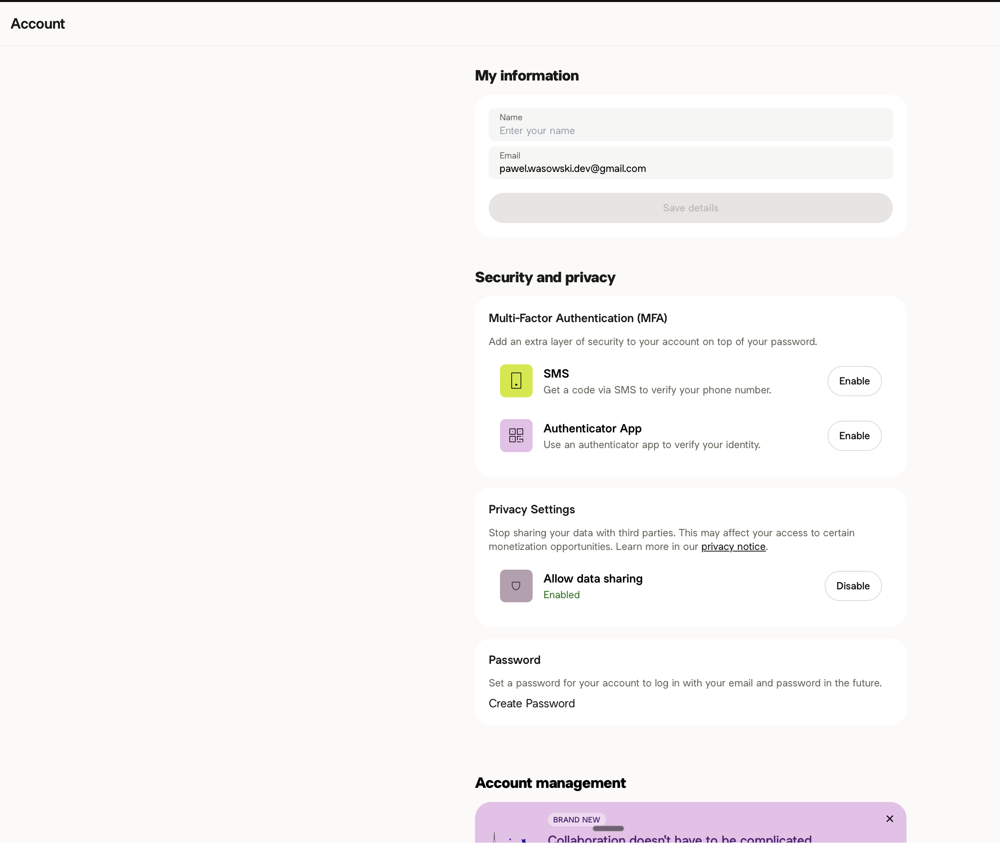

### Layout and visible functionality

- Top-level page title: `Account`.
- Visible cards/sections:
  - `My information`
  - `Security and privacy`
  - `Multi-Factor Authentication (MFA)`
  - `Privacy Settings`
  - `Password`
  - lower section starts `Account management`
- `My information` contains editable profile/account fields such as name and
  email.
- MFA offers two setup paths:
  - `SMS`
  - `Authenticator App`
- Privacy settings include a visible data-sharing control.
- Password setup is a separate card, with clear action wording.

### How the flow works

- Linktree separates account-level concerns from page-level builder settings.
- The structure is classic SaaS account admin:
  identity -> security -> privacy -> password -> account ownership/admin.
- This is different from the Settings area:
  Settings is about the page/product; Account is about the person/account.

### UI / usability assessment for users

- Strong:
  - easy to understand separation between account administration and page
    customization
  - security controls are visible and feel trustworthy
  - MFA choices are concrete, not buried
- Weak:
  - the page is very utilitarian and visually plain
  - some users may not immediately understand the difference between Account
    and Settings if navigation is not explained well elsewhere

### Strategic assessment for tadaify

- This separation is worth copying.
- Tadaify should likely have:
  - `Settings` for page/integrations/growth
  - `Account` for identity, login, privacy, security, and ownership
- The strongest transferable idea is explicit visibility of MFA and privacy
  controls.

### Irritation risk

- Low.

### Is it worth implementing?

- Yes.

### How tadaify could do it better

- Keep this even simpler in v1:
  - profile info
  - login methods
  - password
  - MFA
  - privacy/data export/delete
- Make the distinction between `Account` and `Page settings` very explicit.

### Screen LT-036 — Account management card with workspace upsell, admins, and delete-account area

- **Flow:** logged-in account area; account ownership and collaboration section
- **Source:** screenshot provided in Codex chat on 2026-04-23

### Evidence

- Artifact id: `LT-036`
- Local screenshot path: [lt-036-account-management-workspaces-admins-delete.png](./screens/lt-036-account-management-workspaces-admins-delete.png)

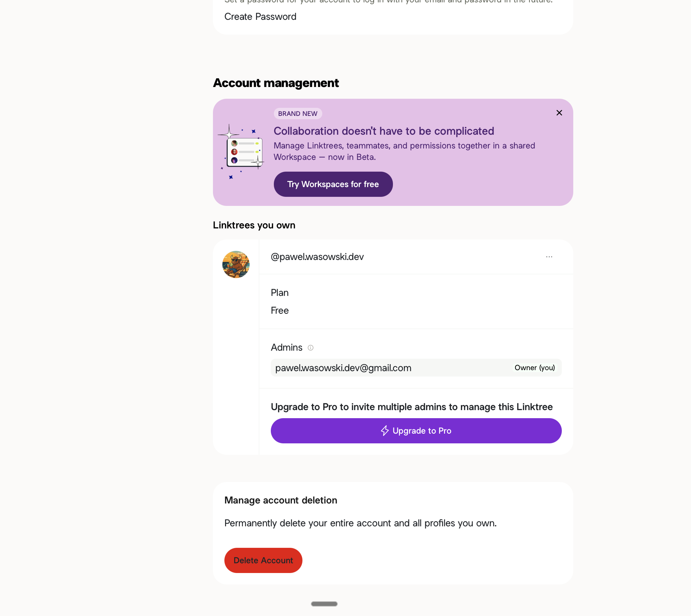

### Layout and visible functionality

- Section heading: `Account management`.
- A large purple promo banner advertises `Workspaces` / collaboration.
- Visible owned Linktree card includes:
  - profile avatar + username
  - plan (`Free`)
  - `Admins` row showing current owner/admin
  - CTA to `Upgrade to Pro` to invite multiple admins
- Lower card contains destructive action:
  - `Manage account deletion`
  - `Delete Account`

### How the flow works

- Linktree uses the account area not only for account operations, but also for
  team/admin monetization.
- Collaboration/workspaces is presented as:
  - account-management value
  - upgrade path
  - team-scale feature
- Admin management and destructive deletion are kept in the same broad area,
  which reinforces that this is the account ownership zone.

### UI / usability assessment for users

- Good:
  - account ownership and admins are visible
  - destructive delete action is clearly separated and visually dangerous
  - collaboration is framed as an advanced account-management feature
- Weak:
  - the workspace upsell is very prominent and sales-forward
  - it can make the account page feel like an upgrade surface, not just an
    admin surface

### Strategic assessment for tadaify

- The admin/ownership card is worth copying.
- The giant collaboration upsell banner is not necessarily worth copying early.
- The strongest product lesson:
  if Tadaify wants team/admin support, it should live in Account/Workspace
  management, not in random settings panels.

### Irritation risk

- Medium.
- Mostly because the upsell is pushed hard inside a management area.

### Is it worth implementing?

- `Admins / ownership`: yes.
- `Workspace promo banner`: later, only if collaboration becomes a real growth
  wedge.

### How tadaify could do it better

- Keep account ownership/admin controls clear and boring.
- Present collaboration as a feature page or subtle inline note, not a huge
  banner in the middle of account admin unless the product really pivots toward
  teams/agencies.

### Screen LT-037 — Account page shown together with account menu and help widget

- **Flow:** logged-in account area; wider contextual shot including left menu
  and in-product help widget
- **Source:** screenshot provided in Codex chat on 2026-04-23

### Evidence

- Artifact id: `LT-037`
- Local screenshot path: [lt-037-account-page-with-help-widget-and-menu.png](./screens/lt-037-account-page-with-help-widget-and-menu.png)

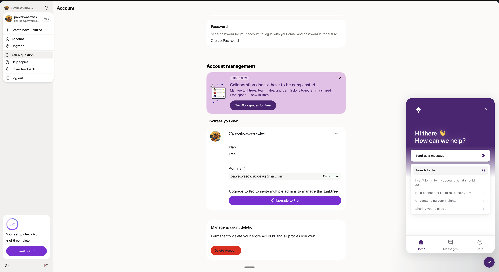

### Layout and visible functionality

- Left floating account/menu panel includes:
  - active account identity
  - `Create new Linktree`
  - `Account`
  - `Upgrade`
  - `Ask a question`
  - `Help topics`
  - `Share feedback`
  - `Log out`
- Main content shows the `Account` page.
- Right side shows an always-available help widget with:
  - `Send us a message`
  - `Search for help`
  - suggested help topics
- Bottom-left still shows the setup checklist.

### How the flow works

- Linktree layers support directly inside the product:
  - one entry point in the account menu
  - one persistent help widget on the right
- This creates a support funnel with multiple paths:
  - self-serve via help topics/search
  - direct contact via message
  - feedback submission

### UI / usability assessment for users

- Strong:
  - help is easy to find
  - there is low-friction self-serve before forced contact
  - suggested topics reduce support effort
- Weak:
  - the right-side help widget is visually heavy
  - on smaller screens or for focused tasks, it may feel distracting

### Strategic assessment for tadaify

- This is very worth studying.
- Tadaify should likely offer:
  - searchable help
  - guided self-serve support
  - optional messaging/contact
- But the exact widget implementation can be lighter than Linktree's.

### Irritation risk

- Low to medium.
- Helpful for confused users, but potentially noisy for focused users.

### Is it worth implementing?

- Yes, in a lighter version.

### How tadaify could do it better

- Start with:
  - `Help` entry in the product nav
  - searchable help center
  - contextual suggestions near the relevant surface
- Delay a persistent chat-style widget until support volume justifies it.

## 13. Help Center / Support Docs

### Official help center structure

Source pages reviewed:

- [Home](https://linktr.ee/help/en)
- [Account support collection](https://linktr.ee/help/en/collections/3020855-account-support)
- [Protect your Linktree account with MFA (Multi-factor Authentication)](https://linktr.ee/help/en/articles/6108442-protect-your-linktree-account-with-mfa-multi-factor-authentication)
- [How to delete your Linktree account or profile](https://linktr.ee/help/en/articles/5434126-how-to-delete-your-linktree-account-or-profile)
- [Manage your Linktree's and teams with Workspaces (Beta)](https://linktr.ee/help/en/articles/13007538-manage-your-linktree-s-and-teams-with-workspaces-beta)

### What is visible on the help center home

- Strong search-first layout.
- Clear top-level collections:
  - `Getting started with Linktree`
  - `Understanding your insights`
  - `How-to's`
  - `Earn with Linktree`
  - `Account support`
  - `Security and Policies`
- `Popular articles` block is visible on the home page.
- Footer links connect help content back to:
  - login
  - marketplace
  - app
  - blog

### How the help center works

- Linktree uses a classic collection -> article model.
- The home page is optimized for:
  - search first
  - category discovery second
  - popular article entry third
- This mirrors the in-app widget seen in LT-037:
  users can search or browse common topics without leaving the support system.

### Article format observations

- Articles have a clean, repeatable structure:
  - title
  - update timestamp (`Updated over X months ago`)
  - table of contents
  - short intro/context
  - step-by-step instructions
  - notes/tips/warnings
  - related articles
  - `Did this answer your question?`
- The writing style is low-jargon and operational.
- The docs regularly link back into product surfaces such as `My Account`.

### Example: MFA article

- Explains:
  - what MFA is
  - why it matters
  - available options
  - how to enable it step by step
- Includes practical constraints, e.g. SMS availability by country.
- Includes FAQ at the end.

### Example: account deletion article

- Starts with consequences and warnings before steps.
- Makes the destructive impact explicit:
  - URL deactivated
  - data removed
  - 14-day cooldown for username/email reuse
- Separates:
  - deleting one profile
  - deleting the entire account

### Example: Workspaces article

- Documents a beta feature as if it is already part of a larger operating
  system.
- Covers:
  - workspace creation
  - adding owned vs managed Linktrees
  - owner approval path
  - team roles
  - invite flow
  - duplication flow
  - aggregated analytics
- This is a good example of docs supporting a more complex team/admin product
  layer.

### UI / usability assessment for users

- Strong.
- Main strengths:
  - very searchable
  - clear category map
  - step-by-step operational writing
  - good internal linking to related topics
  - update timestamps help trust
- Weaknesses:
  - visually generic help-center styling
  - a lot of information is still article-heavy rather than inline in-product

### Strategic assessment for tadaify

- Tadaify should absolutely invest in a searchable help center early.
- The key thing to copy is not the exact visual style, but the operating model:
  - search-first
  - strong category grouping
  - practical step-by-step articles
  - related-article graph
  - in-product support entry points

### Irritation risk

- Low.
- Good help docs reduce support frustration rather than create it.

### Is it worth implementing?

- Yes, strongly.

### How tadaify could do it better

- Keep docs shorter and more visual where possible.
- Tie help articles more closely to product surfaces, e.g.:
  - inline `Learn more`
  - contextual help drawer
  - just-in-time tips for first use
- Build the same article structure, but aim for:
  - fewer dead-end long docs
  - more embedded examples
  - clearer permission/privacy explanations around integrations.

## 14. Activation / Setup Checklist

### Screen LT-041 — Floating setup checklist widget

- **Flow:** logged-in app shell; persistent onboarding/activation widget
- **Source:** screenshot provided in Codex chat on 2026-04-23

### Evidence

- Artifact id: `LT-041`
- Local screenshot path: [lt-041-setup-checklist-widget.png](./screens/lt-041-setup-checklist-widget.png)

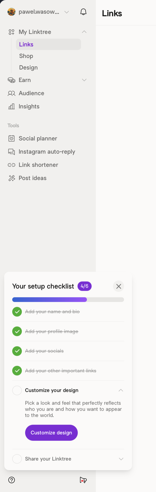

### Layout and visible functionality

- Floating card in the lower-left area of the app shell.
- Header:
  - `Your setup checklist`
  - progress badge `4/6`
  - close/dismiss icon
- Progress bar visually shows completion state.
- Completed tasks are shown with green checkmarks and strike-through text:
  - `Add your name and bio`
  - `Add your profile image`
  - `Add your socials`
  - `Add your other important links`
- Remaining tasks are shown as expandable items:
  - `Customize your design`
  - `Share your Linktree`
- Expanded step includes:
  - explanation copy
  - direct CTA button (`Customize design`)

### How the flow works

- Linktree keeps activation visible after onboarding ends.
- Instead of relying only on the initial onboarding flow, it leaves a
  persistent checklist in the product shell until key setup steps are done.
- This creates a second activation layer:
  - initial onboarding gets the user started
  - checklist drives completion of the most important milestones

### UI / usability assessment for users

- Very strong.
- Good parts:
  - clear sense of progress
  - concrete next action
  - visible payoff as items get completed
  - less overwhelming than a giant onboarding wizard
- Potential downsides:
  - persistent widget can feel visually noisy if it remains too long
  - users who already know what they are doing may find it slightly patronizing

### Strategic assessment for tadaify

- This is one of the highest-value patterns to copy.
- A setup checklist is especially useful for a product like Tadaify because
  first-time value depends on completing a few key setup steps, not just making
  an account.
- It also fits perfectly with the `ta-da` promise:
  the checklist can guide the user toward their first polished, publishable
  reveal moment.

### Irritation risk

- Low.
- Much lower than paywalls or aggressive upsells.
- It only becomes annoying if it is impossible to dismiss or if it lingers
  after the user has clearly moved beyond beginner mode.

### Is it worth implementing?

- Yes, strongly.

### How tadaify could do it better

- Keep the checklist more tightly tied to the first `ta-da` outcome, e.g.:
  - add avatar
  - add one hero block
  - add one link/social
  - choose a look
  - publish/share
- Let the widget collapse into a subtle progress chip after a few interactions.
- Consider celebratory micro-feedback when the final step is completed, so the
  checklist ends with a real reveal moment instead of simply disappearing.

## 15. Marketing Site / Landing Page

### Linktree landing page observations

- **Source:** live review of [linktr.ee](https://linktr.ee) on 2026-04-23

### What the landing page is doing

- Linktree markets itself as much more than a `link in bio`.
- The home page is structured around a broad product platform story:
  - `Link in bio + tools`
  - `Manage your social media`
  - `Grow and engage your audience`
  - `Monetize your following`
  - `Measure your success`
- This is important: the marketing site does not sell one page with links. It
  sells an operating system for creators.

### Primary messaging

- Main hero promise:
  `A link in bio built for you.`
- Supporting copy emphasizes:
  - one link to share everything
  - create, curate, and sell
  - compatibility with many social platforms
- Repeated CTA pattern:
  - `Get started for free`
  - `Get 33% Off Pro`
  - `Explore all plans`

### Core product promises they repeat

- fast setup and customization
- one link that centralizes everything
- QR code distribution
- audience analysis
- monetization
- templates and marketplace
- social media management tools
- email/contact activation

### How they segment the product story

- They organize the whole site by job-to-be-done rather than by internal
  feature taxonomy.
- Examples:
  - share content
  - manage social media
  - grow and engage audience
  - monetize
  - measure success
- This makes the product feel much bigger than just `profile page builder`.

### Proof and trust mechanisms

- repeated social proof:
  - `Join 70M+`
  - many creator/business categories listed
  - public profile examples
  - logos / press mentions
  - user testimonials
- FAQ also acts as trust content:
  - "Is Linktree the original link in bio tool?"
  - "Can you get paid and sell things from a Linktree?"
  - "Is Linktree safe?"
  - "Do I need a website?"

### Positioning strategy

- They are not shy about category ownership.
- They explicitly claim:
  - they invented the category
  - they are the most popular
  - their URL is trusted by audiences
- This is classic market-leader messaging.

### UI / usability assessment for users

- Strong:
  - clear hierarchy
  - many repeated CTAs
  - broad product story
  - lots of proof/trust content
- Weak:
  - the site tries to sell many product surfaces at once
  - can feel sprawling
  - the broadness may reduce clarity for users who only want one simple thing

### Strategic assessment for tadaify

- Tadaify should **not** copy the breadth of the Linktree landing page too
  early.
- The most useful lesson is structural:
  tell the story in jobs-to-be-done, not in internal feature names.
- Good Tadaify landing structure could be:
  - create your reveal page fast
  - make it feel like you
  - turn attention into action
  - learn what works
- That keeps the message tighter and more distinctive.

### Irritation risk

- Low to medium.
- Not because the site is bad, but because the sheer breadth can make it feel
  a bit like a platform brochure rather than a sharp founder-stage product
  story.

### Is it worth implementing?

- Yes, but selectively.

### How tadaify could do it better

- Be narrower, sharper, and more emotionally distinct.
- Linktree sells `everything for everyone`.
- Tadaify should sell:
  - the reveal moment
  - a page that feels alive
  - faster personal expression
  - cleaner activation from attention to action
- In other words:
  less category-sprawl, more identity and first-impression power.
  - Form
  - Contact Form
  - Email signup
  - SMS signup
  - Typeform
  - Laylo
  - Video
  - TikTok Video
  - Vimeo
  - PDF display
  - TikTok Profile
  - X
  - Threads
  - Reviews
  - Coaching & bookings
  - Digital products
  - Courses
  - Affiliate products
  - Quick-add collections
- Strategic takeaway:
  Linktree's moat is not just page polish; it is the breadth of addable content
  types and integrations.
- For tadaify, competing broadly means either:
  - building a comparable catalog over time, or
  - focusing on a narrower but clearly superior niche-specific catalog.

## 09. Admin / Team / Agency

No screens documented yet.

## 10. Design System / UX Patterns

### Early observations

- Strong split-screen onboarding composition: task on the left, aspiration on the right.
- Very low-cognitive-load first-run experience.
- In the logged-in editor, Linktree shifts from low-friction onboarding to a
  more layered but still highly visual builder UI.
- The black monetization banner is the loudest design/business element in the
  post-login workspace and strongly shapes first impression.

## 11. Paywalls / Plan Gating

### Screen LT-002 — Immediate post-signup Pro trial paywall

- **Flow:** immediately after signup / early onboarding, before entering the
  main product experience
- **Source:** screenshot provided in Codex chat on 2026-04-23

### Evidence

- Chat screenshot: 2026-04-23 / Linktree / post-signup Pro trial prompt
- Artifact id: `LT-002`
- Local screenshot path: [lt-002-post-signup-pro-trial-paywall.png](./screens/lt-002-post-signup-pro-trial-paywall.png)

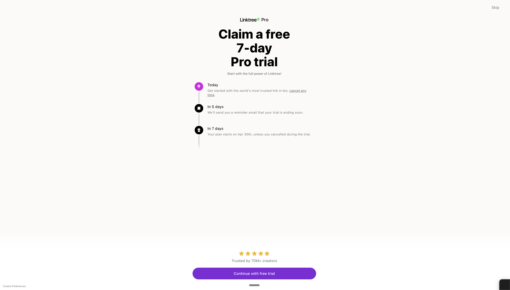

### Layout and visible functionality

- Full-screen upsell for `Linktree Pro`.
- Main headline: `Claim a free 7-day Pro trial`.
- Supporting copy frames trial as starting with the "full power" of Linktree.
- A simple timeline explains:
  - today: start now
  - in 5 days: reminder email
  - in 7 days: paid plan starts unless cancelled
- Primary CTA at the bottom: `Continue with free trial`.
- Secondary exit is visually de-emphasized as `Skip` in the top-right corner.
- Social proof appears above the CTA: star rating + `Trusted by 70M+ creators`.

### How the flow works

- Linktree pushes monetization **before** the user reaches the core product.
- Instead of waiting for feature discovery or activation, it tries to convert
  the user while motivation is still high and the account is fresh.
- The screen is designed to reduce trial anxiety by clarifying reminder timing
  and cancellation.
- The `Skip` option exists, but the visual hierarchy heavily favors trial
  acceptance.

### UI / usability assessment for users

- This is an intentionally aggressive paywall/trial wall.
- Good parts:
  - very clear timeline
  - strong CTA focus
  - explicit cancellation framing reduces fear
  - social proof strengthens trust
- Risky parts:
  - interrupts activation before the user gets product value
  - can feel pushy right after signup
  - may lower trust if the product promise is "simple" or "creator-first"
  - users who came for free value may feel bait-and-switch pressure

### Strategic assessment for tadaify

- Copying this 1:1 is probably **not** the right move for tadaify.
- Linkofme's positioning is strongly free-tier-friendly and trust-based
  (`zero branding`, fairer than Linktree). An aggressive immediate upsell would
  partially conflict with that brand promise.
- Better pattern for tadaify:
  - let the user complete first activation
  - let them create first page / first link / first theme change
  - only then offer Pro in context, tied to a real blocked capability
- If tadaify ever tests a similar screen, it should probably be:
  - after first success moment, not before
  - triggered only for users showing stronger intent
  - softer in tone than a full-screen trial wall

### Irritation risk

- Yes, this kind of screen is very likely annoying for a meaningful subset of
  users.
- The highest-friction audiences are:
  - users who explicitly came for a free tool
  - users who have not seen any product value yet
  - users who dislike trial flows before understanding the product
  - users who are sensitive to anything that feels like a credit-card funnel
- Emotional downside of this pattern:
  - can feel pushy immediately after signup
  - can create a mild bait-and-switch feeling (`I just signed up and now you
    want me on Pro before I even try the product`)
  - can reduce trust, especially in products positioned as creator-friendly or
    fairer than incumbents
- Why Linktree can still justify it:
  - they operate at large scale, so even a small uplift in trial-start rate may
    be worth the annoyance cost
  - they already have stronger brand recognition and user familiarity
  - they can afford some onboarding drop-off if monetization gains offset it
- Why this is more dangerous for tadaify:
  - early-stage challengers need trust and activation more than immediate trial
    starts
  - tadaify's brand promise is more aligned with fairness and user-first value
  - aggressive monetization too early can directly undermine the differentiation
    vs Linktree

### Is it worth implementing?

- For Linktree at scale: probably yes, because even a small increase in
  trial-start rate is valuable at their volume.
- For tadaify as a default onboarding step: no.
- For tadaify as a later experiment on high-intent users: maybe, but only
  after core activation is strong.

### How tadaify could do it better

- Do **not** place a full-screen Pro trial wall immediately after signup in
  tadaify v1.
- Better upgrade moments:
  - when user tries to enable a Pro-only feature
  - after publishing the first page
  - after seeing first analytics traction
  - from billing/settings as an explicit next step
- If testing is desired, run it as an experiment against a softer in-product
  upsell, not as the default path.

### Screen LT-003 — Pricing table shown after clicking `Skip`

- **Flow:** user skips the full-screen Pro trial wall, then receives a pricing
  comparison screen instead of immediate entry into the product
- **Source:** screenshot provided in Codex chat on 2026-04-23

### Evidence

- Chat screenshot: 2026-04-23 / Linktree / pricing table after `Skip`
- Artifact id: `LT-003`
- Local screenshot path: [lt-003-post-skip-pricing-table.png](./screens/lt-003-post-skip-pricing-table.png)

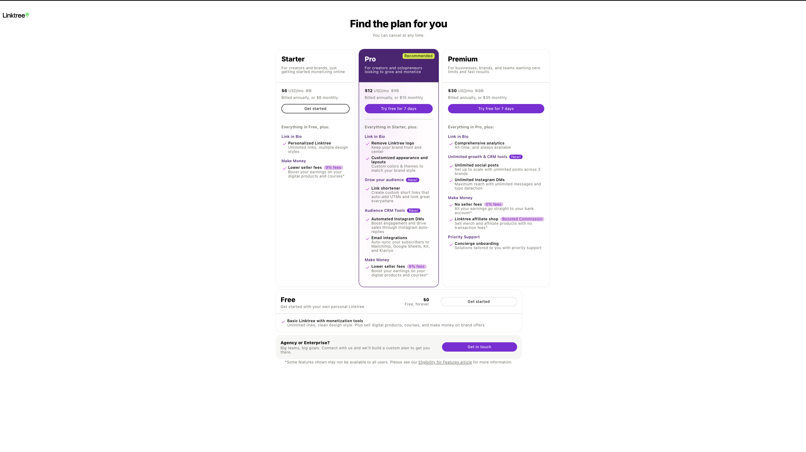

### Layout and visible functionality

- Headline: `Find the plan for you`.
- A full pricing table with four options:
  - `Starter`
  - `Pro` (marked `Recommended`)
  - `Premium`
  - `Free`
- Paid plans use stronger visual emphasis and larger vertical cards.
- `Pro` is visually dominant with a highlighted card and purple accent.
- Trial CTAs are still present on paid tiers (`Try free for 7 days`).
- `Free` exists, but it is visually reduced to a horizontal row at the bottom,
  not a peer card in the main comparison set.
- There is also an `Agency or Enterprise?` section below with a separate CTA.

### How the flow works

- Linktree does **not** treat `Skip` as a true exit from monetization.
- Instead, `Skip` appears to mean: skip the first trial pitch, then view the
  broader pricing choice architecture.
- This is a second conversion attempt immediately after the first one.
- The pricing screen reframes the decision from:
  - `Do you want a Pro trial right now?`
  to:
  - `Which plan is right for you?`
- The flow keeps the user inside a monetization funnel even after declining the
  first upsell.

### UI / usability assessment for users

- This is a classic "soft fallback paywall":
  - user says no to the strong ask
  - product immediately serves a calmer but still sales-led ask
- Good parts:
  - explains plan differences more concretely than the previous trial wall
  - lets the user feel like they are making an informed choice
  - gives a visible `Free` route, which may reduce outright frustration
- Bad parts:
  - still interrupts activation
  - may feel manipulative because `Skip` does not actually skip the upsell path
  - creates the impression that the product is trying to monetize before
    helping the user get started
  - the `Free` plan is visually treated as second-class even though it is the
    likely destination for many new users

### Strategic assessment for tadaify

- For Linktree at scale, this likely makes sense as a funnel design:
  - first ask: emotional / trial-led
  - second ask: rational / plan-comparison-led
  - this catches users who reject the first framing but may still convert when
    shown plan differentiation
- For users, this can absolutely be annoying:
  - especially because `Skip` does not seem to mean `take me into the product`
  - it adds another layer of sales friction before activation
- For tadaify, this is probably still the wrong default pattern.

### Irritation risk

- Medium to high.
- This is less aggressive than the full-screen trial wall, but still feels
  annoying because it appears immediately after the user already tried to skip.
- The likely frustration source is not just pricing itself, but the mismatch
  between expected and actual meaning of `Skip`.

### Is it worth implementing?

- As a default onboarding recovery step for tadaify: no.
- As a dedicated pricing page available from explicit upgrade entry points: yes.
- As part of an onboarding experiment: only with careful measurement, and only
  if it does not materially reduce activation.

### How tadaify could do it better

- Do **not** make `Skip` mean `show another paywall`.
- If a user skips an upgrade prompt in tadaify, default behavior should be:
  take them into the product.
- A pricing table can still exist, but it should live in:
  - billing/settings
  - contextual upgrade modals
  - explicit upgrade entry points
- If tadaify ever uses a comparison table in onboarding, it should be:
  - optional
  - easy to dismiss
  - clearly secondary to activation

## 12. Open Questions

- What happens when the suggested username is unavailable?
- Does Linktree validate in real time or only on submit?
- Is marketing opt-in implied here or only informational copy?
- After clicking `Get started` on `Free`, does Linktree finally enter the main
  app immediately?

## 16. Audience / Growth

### Screen LT-042 — Audience tab with growth tools marketplace

- **Flow:** main product navigation → `Audience`
- **Source:** screenshot provided by user on 2026-04-23

### Evidence

- Local screenshot path: [lt-042-audience-growth-tools-overview.png](./screens/lt-042-audience-growth-tools-overview.png)
- Artifact id: `LT-042`

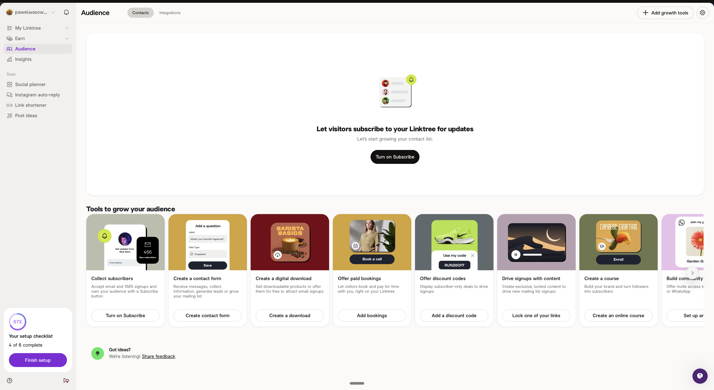

### Layout and visible functionality

- The page title is `Audience`.
- There are two top tabs:
  - `Contacts`
  - `Integrations`
- The default visible state is a large, mostly empty hero card focused on one
  main audience action:
  - `Let visitors subscribe to your Linktree for updates`
  - CTA: `Turn on Subscribe`
- Below the hero card, there is a horizontal section:
  - `Tools to grow your audience`
- This section behaves like a growth tools shelf or mini marketplace.
- Visible cards include:
  - `Collect subscribers`
  - `Create a contact form`
  - `Create a digital download`
  - `Offer paid bookings`
  - `Offer discount codes`
  - `Drive signups with content`
  - `Create a course`
  - a partially visible community / messaging card on the right edge
- Each card has:
  - a preview image / visual
  - a short growth-oriented description
  - a single CTA button
- The left navigation still shows the broader product IA:
  - `My Linktree`
  - `Earn`
  - `Audience`
  - `Insights`
  - tools such as `Social planner`, `Instagram auto-reply`, `Link shortener`,
    `Post ideas`
- The activation widget remains pinned in the lower-left corner.

### How the flow works

- Linktree treats `Audience` less like a traditional CRM screen and more like
  a guided growth workspace.
- The page starts from the assumption that many users have no audience system
  configured yet.
- Instead of showing an empty table or blank contacts state, it gives:
  - one recommended first step (`Turn on Subscribe`)
  - a catalog of adjacent growth tools that can feed the audience funnel
- The `Contacts / Integrations` tabs suggest that the wider module is meant to
  cover:
  - collecting contacts
  - connecting audience systems
  - turning monetization / content blocks into list growth inputs
- The design strongly nudges the user toward activation rather than pure
  inspection.

### UI / usability assessment for users

- This is much better than an empty CRM page.
- Strong parts:
  - clear first action
  - good use of large visual cards to explain abstract tools
  - feels more like "ways to grow" than "settings and data"
  - useful for creators who do not yet know what type of audience feature they
    need
- Weak parts:
  - the module name `Audience` may undersell what is really a growth / capture
    toolkit
  - cards mix very different jobs together:
    lead capture, monetization, bookings, gated content, education
  - this can start to feel like a feature supermarket rather than one coherent
    product surface
- Overall, it is strong activation UX and weaker product clarity UX.

### Strategic assessment for tadaify

- This is one of the better Linktree patterns for tadaify to study.
- The biggest insight is structural:
  - they are not waiting for the user to ask "how do I manage my audience?"
  - they proactively frame audience growth as a set of actionable blocks
- For tadaify, this is likely more useful than copying their classic
  dashboard-style pages.
- The page also reveals a broader business strategy:
  - Linktree expands product value by turning one audience problem into many
    attachable revenue and capture tools
  - `Audience` becomes a gateway into forms, gated content, bookings, offers,
    and community mechanics

### Irritation risk

- Low to medium.
- This screen is mostly helpful and not especially annoying.
- The only real risk is cognitive overload if too many tools are shown before
  the user understands the core product.
- Compared with their pricing and premium gates, this page is much less
  irritating and much more activation-friendly.

### Is it worth implementing?

- Yes, but not as a direct copy.
- The core idea is worth implementing:
  - a dedicated audience-growth module
  - a clear "first growth action"
  - a curated set of growth blocks
- What is **not** worth copying 1:1:
  - a very broad, mixed shelf of semi-related tools
  - treating every adjacent monetization feature as part of the same first-run
    audience screen

### How tadaify could do it better

- Reframe the module more clearly around the actual job:
  - `Grow`
  - `Audience`
  - or `Capture`
- Keep the first-run state more focused:
  - one hero recommendation
  - three to five best next blocks
  - not eight-plus mixed growth cards at once
- Organize blocks by intent, not just by existence:
  - `Collect leads`
  - `Start conversations`
  - `Book time`
  - `Sell access`
  - `Unlock content`
- The tadaify version should feel less like a feature mall and more like a
  reveal-driven growth path:
  - first capture attention
  - then collect intent
  - then convert into audience ownership
