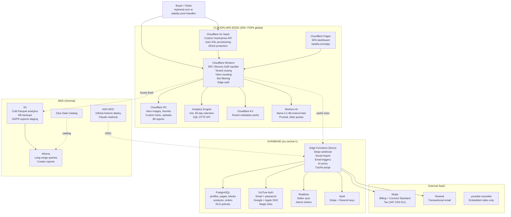

# Tadaify on Cloudflare — full architecture + cost + edge-case + defensive-decisions dossier

> **Purpose.** Fully self-contained brief handed to ChatGPT for an independent second-opinion review of the proposed Cloudflare-native architecture for tadaify, a Polish-founder, EU-incorporated link-in-bio + creator-commerce SaaS. Every claim is sourced inline against the canonical docs that live inside `~/git/projects/tadaify/tadaify-app/`. Reviewer is expected to scrutinise the cost model at scale, defensive decisions, edge cases, and the EU founder × global creator-payout legal/tax model.

---

## Krótkie podsumowanie po polsku (60 sekund)

Tadaify to link-in-bio dla creatorów (rywal Linktree / Beacons / Stan), zbudowany na Cloudflare-native (Workers + R2 + Pages + Cloudflare for SaaS + Workers AI), z Supabase jako "central brain" (Postgres + GoTrue + Edge Functions) i minimalnym AWS (S3 + Athena + Glue dla cold analytics). Pricing: Free / Creator / Pro / Business, z dwiema lockedymi cenami: spec mówi $5/$15/$49, ale **DEC-274 (odpowiedziano dzisiaj 2026-04-28) ustala $8 + $19** — to rekoncyliacja, którą trzeba domknąć w INDEX.md i landing.html.

Cost model jest agresywnie dobry — przy 100k MAU ~$1.6k/mo infra przy ~99% gross margin — pod warunkiem, że trzymamy się **defensive decisions** (no native video upload, no native livestream, AI proxied with daily caps, custom domain w fair-use). Bez tych zabezpieczeń architektura ma minimum trzy katastroficzne ścieżki kosztowe: jeden wirusowy creator z natywnym wideo na Business kosztuje −$288/mo, AI bez quoty łatwo skaluje do tysięcy USD/mo, a custom domain bez per-tenant rate-limit zjada cały tier MRR przy jednym TikTok-viral momencie.

Reviewer ma sprawdzić: czy projekcje kosztów się trzymają, czy defensive decisions są kompletne, czy edge cases pokrywają realny ruch, czy EU founder + global creator-payout model (Stripe Connect Standard, DAC7, polski WHT 20%) jest poprawny.

---

## Table of contents

0. Executive summary (60 seconds)
1. Product context — what tadaify IS
2. Architecture overview — components + how they fit
3. URL routing table — the canonical surface
4. Cost analysis at scale (the section ChatGPT will scrutinise hardest)
5. Defensive decisions — every guard we put in place
6. Edge cases + how they are handled
7. Outstanding open questions (not fully decided yet)
8. What we deliberately rejected (and why)
9. Security / compliance posture (EU founder × global creators)
10. References
11. Reviewer instructions for ChatGPT

---

## 0. Executive summary (60-second read)

Tadaify is a link-in-bio + light-commerce SaaS for nano/micro creators, built **Cloudflare-native** (Workers SSR + R2 storage + Pages dashboard + Cloudflare for SaaS custom hostnames + Workers AI inference), with **Supabase** (eu-central-1) as the system of record (Postgres + GoTrue + Edge Functions + Realtime) and **minimal AWS** (S3 cold-Parquet + Athena + Glue + IAM OIDC) for long-range analytics archives. Public creator pages live at `tadaify.com/<handle>` (single-domain, DEC-DOMAIN-01); custom domains (`mybrand.com → creator's tadaify page`) ride Cloudflare for SaaS Custom Hostnames at `$0.10/hostname/mo` after the 100 included on the Business plan.

**Pricing has two states the reviewer should know about.** The canonical `functional-spec.md` and `decisions/INDEX.md` lock prices via DEC-037 at **Free $0 / Creator $5 / Pro $15 / Business $49**. The user answered **DEC-274 today (2026-04-28)** adopting **Creator $8 / Pro $19** (Business unchanged at $49 in available materials); this has not yet been rolled into the spec/INDEX/landing as of dossier-write time. Cost-at-scale rows below are presented at both price points where it materially changes the margin story.

**Cost at 100k MAU:** ~$1,600/mo all-in across all vendors (`infra-v2.md` §5.4). Per-MAU = $0.016. Per-Pro-user = $0.18-0.26. With 30% Pro mix at $15 (or $19 post-DEC-274), revenue is $300k-380k/mo → **gross margin >99%**. The architecture scales linearly because Cloudflare absorbs the bandwidth-heavy path at zero marginal egress cost (R2: $0 egress; Workers: bundled in plan; Cloudflare for SaaS: free egress on customer hostnames).

**The architecture is defensible only because we built strong defensive decisions on top.** Three catastrophic ledgers are explicitly defused: (a) **video** — no native upload; YouTube embed only (DEC-097 §15) — without this gate a viral Business creator costs `−$288/creator/mo` per `video-block-cloudflare-cost.md` §5.4; (b) **livestream** — block removed entirely from MVP (DEC-099); embed-only oEmbed wrapper covers Twitch/Kick UX without the bandwidth liability; (c) **AI** — Cloudflare Workers AI proxied (no BYOK), per-tier daily quotas (Free 5/mo, Creator 20/mo, Pro 100/mo, Business unlimited per DEC-AI-QUOTA-LADDER-01), prefix-cached input + 1h output cache, model `@cf/meta/llama-3.1-8b-instruct-fast` at $0.000223/call.

**Reviewer's eye should land hardest on §4 (cost-at-scale tables) and §5 (defensive decisions). § 9 (EU compliance posture) carries the most genuinely unanswered legal questions — DAC7 onboarding, Polish WHT 20% on outbound payments to non-treaty affiliates, UK post-Brexit zero-threshold VAT.**

---

## 1. Product context — what tadaify IS

Tadaify is a link-in-bio SaaS for creators (Linktree / Beacons / Stan / Bento competitor segment), with explicit feature-mix and pricing positioning:

- **Founder + entity**: Polish solo founder, currently JDG (sole proprietor) → planned Polish sp. z o.o. once revenue justifies. EU-incorporated.
- **Audience**: nano/micro creators (0-100k followers), EN-speaking primary, PL secondary deferred to Y2+ per DEC-MKT-C.
- **Single-domain architecture (DEC-DOMAIN-01)**: every route under `tadaify.com` — landing, creator pages, dashboard at `/app`, admin at `/admin`. No subdomain handle-namespace.
- **Custom-domain offer**: $2/mo universal add-on across all tiers per DEC-PRICELOCK-02 (also bundled in Creator/Pro/Business).
- **Tier ladder** (`functional-spec.md` L116-L126):
  - **Free $0** — subdomain only, 1 page, 90d analytics, 5 AI uses/mo, 48h support
  - **Creator $5/mo** (spec) / **$8/mo** (DEC-274 answered today) — 1 custom domain, 5 pages, 180d analytics, 20 AI uses/mo, 24h support, scheduled publishing, verified badge
  - **Pro $15/mo** (spec) / **$19/mo** (DEC-274) — 1 custom domain, 20 pages, unlimited analytics, 100 AI uses/mo, A/B testing, Creator API + MCP server, advanced integrations, removable email branding, abandoned-cart, advanced SEO
  - **Business $49/mo** — 10 custom domains, unlimited pages, 4h SLA, agency sub-accounts, white-label, all-time analytics, unlimited AI
- **Price-lock-for-life** per DEC-PRICELOCK-01: paid subscription price locked forever for uninterrupted subscriptions; cancellation + re-subscription triggers then-current price.
- **0% platform fees on every tier, contractually locked**, published on Trust Center (DEC-ANTI-002).
- **No "Powered by tadaify" footer on any tier ever** (DEC-ANTI-001 / AP-001 hard-locked).
- **Multi-page accounts** (DEC-MULTIPAGE-01, post-MVP, Q+1) — Free 1 / Creator 5 / Pro 20 / Business unlimited; URL pattern `/<handle>/<slug>`.

**Five wedges driving differentiation** (`functional-spec.md` §1.1):
1. "Linktree Premium on Free, forever" — every paywalled feature on competitors ships at our Free or Creator tier
2. 0% platform fees on every tier (Linktree takes 12% on Free, Beacons 9% on Free+Creator)
3. $2/mo custom domain — category's lowest entry point
4. EU/PL regulatory + payment wedge — VAT OSS, Przelewy24/BLIK/SEPA native checkout (none of 7 audited competitors ship one)
5. Preview-generator acquisition flywheel — admin-only marketing tool at `/admin/marketing/preview-generator`

---

## 2. Architecture overview — components + how they fit

### 2.1 System diagram

Sources: `infra-v2.md` §2 (`docs/architecture/infra-v2.md` L60-L171), `functional-spec.md` §1 L75-L113.

### 2.2 Component inventory (1-paragraph each)

| Component | Role | Why this choice | Decision |
|---|---|---|---|
| **Cloudflare Workers** | Edge SSR for public creator pages + tenant routing per `Host:` header + edge auth + view counting + bot filtering | Native React Router 7 (Remix-merged) adapter `@remix-run/cloudflare`; sub-50ms global latency; DDoS baked in | DEC-FRAMEWORK-01 (`functional-spec.md` L77) |
| **Cloudflare Pages** | Static SPA hosting for the authenticated dashboard at `tadaify.com/app` | Free, unlimited bandwidth, 100k deploys/mo; same vendor as Workers | DEC-035 |
| **Cloudflare for SaaS Custom Hostnames** | Per-creator custom domains (`mybrand.com → creator page`) with auto-provisioned Let's Encrypt / Google Trust Services certs | Single API call per hostname; 100 free on Business plan; $0.10/mo each beyond. CloudFront SaaS Manager equivalent rejected (cross-cloud handoff) | DEC-CUSTOM-DOMAIN-01 (`custom-domains-cloudflare-vs-cloudfront.md`) |
| **Cloudflare R2** | Media storage (hero images, fonts, thumbnails, uploaded media) | **$0 egress** (vs S3 $0.085/GB) — saves ~$4500/mo at 100k MAU | DEC-035 (`infra-v2.md` §0) |
| **Cloudflare Analytics Engine** | Hot analytics tier, 90-day retention, SQL via HTTP — for creator dashboards "views last hour", "top product today" | 10M writes + 1M reads/mo free tier, $0.25/M overage; unlimited cardinality | `insights-metrics-feasibility.md` §1.1 |
| **Cloudflare KV** | Distributed key-value — session tokens, tenant metadata, edge cache | Free 1GB; <1ms reads at edge | infra-v2.md §3.1 |
| **Cloudflare Workers AI** | Inference for AI Suggest features (bio rewrite, theme matcher, copy suggest) — model `@cf/meta/llama-3.1-8b-instruct-fast` proxied | $0.000223/call; bundled in Workers Paid; encoding/inference both at edge | DEC-AI-FEATURES-ROADMAP-01, `ai-cost-and-tier-strategy.md` §3.1 |
| **Supabase Postgres (eu-central-1)** | System of record — profiles, pages, blocks, products, orders, subscribers, reviews; RLS policies enforce tenant isolation | 14-subsystem reuse from `linkofme` + `untiltify` (DEC-SYN-35); SQL flexibility for relational data | `infra-cost-analysis.md` §6 |
| **Supabase GoTrue (Auth)** | Email + password, Google + Apple SSO, magic links | Bundled in Pro plan; in-EU region; Inbucket for local auth-flow testing | DEC-027 |
| **Supabase Edge Functions** | Server-side logic — Stripe webhooks, social import (handle-based per DEC-SOCIAL-01), preview generator parser, AI proxy, cache purge triggers | Deno; 2M invocations included in Pro | infra-v2.md §3.2 |
| **Supabase Realtime** | Live editor sync + admin dashboard tickers | Phoenix-based; 200 concurrent on Pro | infra-v2.md §3.2 |
| **AWS S3** | Cold-Parquet analytics archive (24-month GDPR retention) + DB backups beyond Supabase 7-day retention + GDPR export staging | $0.023/GB; lifecycle to Glacier Deep after 90d ($0.00099/GB/mo) | DEC-INFRA-MINIMAL-01 |
| **AWS Athena** | Ad-hoc SQL over S3 Parquet for long-range creator reports + admin audit + GDPR data export | $5/TB scanned; <$5/mo at 100k MAU | DEC-INFRA-MINIMAL-01 |
| **AWS Glue Data Catalog** | Auto-updating schema for Athena tables | Effectively free (~$0.01/mo at our scale) | DEC-INFRA-MINIMAL-01 |
| **AWS IAM OIDC** | GitHub Actions OIDC role for deploy + `claude-readonly` for audits | No static creds; AWS-managed `ReadOnlyAccess` for Claude | CLAUDE.md project rules |
| **Stripe** | Subscriptions billing + Connect Standard for affiliate/creator payouts (v2) + Tax for VAT OSS EU | 2.9% + $0.30 per US card; 1.4% + 25¢ EU; +0.5% Stripe Billing on subs; Connect Standard ~0.25% transfer fee with €2 cap | DEC-073, `payment-vendor-vat-compliance.md` (Stripe wins over Paddle from $50k MRR) |
| **Resend** | Transactional email (welcome, magic link, purchase, review request) | Better DX than SES; $0.40/1k vs SES $0.10/1k — switch to SES at 50k MAU per Q-INFRA-v2-04 | infra-v2.md §3.4 |
| **youtube-nocookie embed** | Sole video delivery mechanism — native upload **rejected** | Saves ~$288/Business creator/mo at 100k pageviews (see §4.5) | DEC-097 §15 |
| **DNS — Cloudflare authoritative** | tadaify.com authoritative on Cloudflare; OVH holds registrar ownership; nameservers `ns{1,2}.cloudflare.com` | Route 53 explicitly NOT used | DEC-DNS-01 (`functional-spec.md` L79) |

### 2.3 Why no AWS for the request path

The decision flipped from v1 (CloudFront-first, ~$0.22/MAU at 10k) to v2 (Cloudflare-first, ~$0.03/MAU at 10k — 87% cheaper) because:

1. R2 has **zero egress fees**; S3 has $0.09/GB → $4500/mo savings at 100k MAU × media delivery
2. Cloudflare Business plan bundles unlimited bandwidth, eliminating viral-creator egress tail-risk
3. Cloudflare for SaaS Custom Hostnames is operationally simpler than CloudFront SaaS Manager + Lambda@Edge + ACM SAN orchestration
4. Cloudflare Workers gives richer per-event analytics than CloudFront real-time logs at zero marginal cost
5. Single edge vendor = one bill, one auth, one debug surface

Vendor concentration risk acknowledged honestly in `infra-v2.md` §9 — mitigated by S3 + warm-spare CloudFront DR plan, 2-hour migration window, pre-scripted DNS switch.

---

## 3. URL routing table — the canonical surface

Pulled verbatim from `functional-spec.md` §1 L83-L113. All paths live under the single root `tadaify.com`.

| Route | Handler | Render | Auth | Notes / DEC |
|---|---|---|---|---|
| `tadaify.com/` | RR7 SSR — landing | SSR | public | DEC-DOMAIN-01 |
| `tadaify.com/<handle>` | RR7 SSR — public creator page (PRIMARY creator asset) | SSR | public | First-class brand surface |
| `tadaify.com/<handle>/p/<slug>` | RR7 SSR — per-product page | SSR | public | |
| `tadaify.com/<handle>/<page-slug>` | RR7 SSR — multi-page (post-MVP) | SSR | public | DEC-MULTIPAGE-01 forward-compat |
| `tadaify.com/app` | Cloudflare Pages SPA | CSR | authenticated | Dashboard, admin sub-routes |
| `tadaify.com/admin` | Cloudflare Pages SPA | CSR | admin only | F-180+ |
| `tadaify.com/try` | RR7 SSR — guest editor | SSR | public | F-001 |
| `tadaify.com/register` | RR7 SSR — signup | SSR | public | F-002 |
| `tadaify.com/login` | RR7 SSR — login | SSR | public | F-019 (Apple SSO) |
| `tadaify.com/pricing` | RR7 SSR — pricing | SSR | public | |
| `tadaify.com/trust` | RR7 SSR — Trust Center | SSR | public | F-TRUST-001..004 |
| `tadaify.com/faq` | RR7 SSR — FAQ | SSR | public | |
| `tadaify.com/t/<template-name>` | RR7 SSR — template preview | SSR | public | F-131 / F-167 |
| `tadaify.com/templates` | RR7 SSR — template gallery | SSR | public | |
| `tadaify.com/directory` | RR7 SSR — public creator directory | SSR | public | F-127 |
| `tadaify.com/vs/<competitor>` | RR7 SSR — 11 vs-pages | SSR | public | |
| `tadaify.com/for/<niche>` | RR7 SSR — 5 niche landings | SSR | public | |
| `tadaify.com/blog` | RR7 SSR — blog (if shipped Y1) | SSR | public | |
| `tadaify.com/api/*` | Supabase Edge Function or Cloudflare Worker | n/a | varies | API surface (creator API on Pro) |
| `tadaify.com/assets/*` | Cloudflare R2 via Worker | n/a | public | Static media |
| `tadaify.com/opt-out` | RR7 SSR — preview generator opt-out form | SSR | public | F-PREVIEW-004 |
| `<creator-domain>.com/*` | Cloudflare for SaaS — same Worker, host-keyed lookup | SSR | public | F-CUSTOM-DOMAIN-001..003 |

**Subdomains (separate concerns only):**

| Subdomain | Purpose |
|---|---|
| `preview.tadaify.com/<slug>` | Admin preview generator output (F-PREVIEW-004) |
| `developers.tadaify.com` | API docs portal (Mintlify/Docusaurus) |
| `status.tadaify.com` | Uptime page (BetterUptime/Statuspage) |
| `mail.tadaify.com` | Resend email sender (SPF/DKIM) |

---

## 4. Cost analysis at scale

This is the section the reviewer should scrutinise hardest. Numbers verified against Cloudflare pricing pages, Supabase third-party aggregators, AWS public pricing as of 2026-04-24/27.

### 4.1 Per-component unit economics

| Component | Pricing tier targeted | Unit price | Free-tier allowance | Source |
|---|---|---|---|---|
| Cloudflare Pro plan | Pro $20/mo (MVP) | flat | DDoS, basic bot, 100 page rules | `infra-cost-analysis.md` §1.4 |
| Cloudflare Business plan | Business $200/mo (10k+ MAU) | flat | 100 Custom Hostnames free, unlimited bandwidth, advanced bot mgmt | `custom-domains-cloudflare-vs-cloudfront.md` §1.4 |
| Cloudflare for SaaS Custom Hostnames overage | beyond 100 included on Business | $0.10/hostname/mo | first 100 free | Cloudflare for SaaS billing docs |
| Cloudflare Workers (Paid) | $5/mo bundle | $0.30/M req beyond 10M | 10M req/mo + 30M free CPU-ms | infra-v2.md §3.1 |
| Cloudflare R2 storage | per-GB | $0.015/GB-mo | 10 GB free | infra-v2.md §3.1 |
| Cloudflare R2 egress | per-GB | **$0.00** | unlimited (the headline) | infra-v2.md §0 |
| Cloudflare R2 class-A ops | per-million | $4.50/M | 1M free | infra-v2.md §3.1 |
| Cloudflare Analytics Engine writes | $0.25/M | beyond 10M/mo | 10M writes + 1M reads/mo free | `insights-metrics-feasibility.md` §1.1 |
| Cloudflare Workers AI | per-token (llama-3.1-8b) | $0.282/Mtok in + $0.827/Mtok out = ~$0.000223/call | 10k neurons/day free | `ai-cost-and-tier-strategy.md` §3.1 |
| Cloudflare Stream (NOT in MVP) | per-min | $0.005/min stored + $0.001/min delivered | none | `video-block-cloudflare-cost.md` §2 |
| Supabase Pro | $25/mo flat | 8 GB DB + 250 GB egress + 100 GB storage + 2M Edge Fn invocations | yes (allowances) | `infra-cost-analysis.md` §2.2 |
| Supabase Team | $599/mo | 8 GB base + read replica + daily backups | overage applies | infra-cost-analysis.md §2.2 |
| Supabase egress overage | $0.09/GB | beyond plan | — | **9× CloudFront rate; cost cliff** |
| Supabase MAU overage (Pro) | $0.00325/MAU | beyond 100k | — | infra-cost-analysis.md §2.2 |
| AWS S3 storage | $0.023/GB-mo | none (always paid) | — | infra-v2.md §4.1 |
| AWS S3 lifecycle to Glacier Deep | $0.00099/GB-mo | n/a | applied after 90d | infra-v2.md §4.1 |
| AWS Athena query | $5/TB scanned | n/a | — | infra-v2.md §4.2 |
| Stripe processing — US cards | 2.9% + $0.30/txn | none | — | Stripe public pricing |
| Stripe processing — EU cards | 1.4% + €0.25/txn | none | — | Stripe public pricing |
| Stripe Billing | +0.5% on subscriptions | none | — | Stripe public pricing |
| Stripe Tax | $0.50 per filing or 0.5% of txn | n/a | — | `payment-vendor-vat-compliance.md` |
| Stripe Connect Standard | ~0.25% per transfer + €2 cap | none | — | `affiliate-program.md` Topic 2 |
| Resend | $20/mo for 50k, $80/mo for 250k | 3k/mo free | — | infra-v2.md §3.4 |

### 4.2 Cost-at-scale tables

The orchestrator standard scale rows (100 / 1k / 10k / 100k / 1M DAU). Using `infra-v2.md` §5 as the canonical authority since it ties directly to the Cloudflare-first architecture.

#### 4.2.1 Aggregate load assumptions

Pulled from `infra-cost-analysis.md` §1.3 (lightly rebased to match v2 architecture — page-views go through Cloudflare cache, not Supabase egress).

| Metric | 100 MAU | 1k MAU | 10k MAU | 100k MAU | 1M MAU |
|---|---|---|---|---|---|
| Active creators (paid + free active) | 30 | 300 | 3,000 | 30,000 | 300,000 |
| Total page views / mo | 10.5k | 120k | 1.2M | 12M | 120M |
| Total DB writes / mo (incl. analytics) | 20k | 250k | 2.5M | 25M | 250M |
| Total DB reads / mo | 500k | 6M | 60M | 600M | 6B |
| Storage total | 2 GB | 15 GB | 150 GB | 1.5 TB | 15 TB |
| Edge egress (page-view bandwidth) | 1 GB | 12 GB | 120 GB | 1.2 TB | 12 TB |
| Analytics events / mo | 500k | 6M | 60M | 600M | 6B |
| Email sends / mo | 22k | 260k | 2.6M | 26M | 260M |
| AI generations / mo | 550 | 6.5k | 65k | 650k | 6.5M |
| Custom domains active | 3 | 30 | 350 | 3,500 | 35,000 |

Page-view payload assumed at 100 KB per view (light SPA shell + JSON + small hero asset).

#### 4.2.2 Component cost roll-up by scale

All numbers USD/month. Numbers from `infra-v2.md` §5.1-5.5.

| Component | 100 MAU | 1k MAU | 10k MAU | 100k MAU | 1M MAU |
|---|---|---|---|---|---|
| Cloudflare plan | $0 (free) | $20 (Pro) | $200 (Business) | $250 (Bus + 500 domains × $0.10) | ~$3,000 (Enterprise negotiated) |
| Cloudflare R2 storage | $0.10 | $0.08 | $1 | $10 | $85 |
| Cloudflare Workers overage | $0 | $0 | $6 (~30M req) | $90 (~300M req) | bundled |
| Cloudflare Analytics Engine | $0 | $0 | $10 (~50M writes) | $125 (~500M writes) | bundled |
| Cloudflare Workers AI | <$1 | $5 | $20 | $130 | $1,500 |
| Supabase | $0 (Free) | $0 (Free) | $25 (Pro) + $15 compute = $40 | $599 (Team) + $50 egress = $649 | ~$1,500 (Team + add-ons) |
| AWS S3 + Athena + Glue | $0.01 | $0.01 | $0.65 | $1.80 | $18 |
| Stripe (processing only — passthrough on commerce) | n/a | $1 (refund noise) | $5 | $50 | $500 |
| Resend | $0 (free 3k/mo) | $0 (free) | $20 | $80 | $500 (or self-host SES at ~$130) |
| Misc (Sentry, Stripe monitoring) | $5 | $10 | $25 | $200 | $2,000 |
| **Total / mo** | **~$5-10** | **~$40-50** | **~$330** | **~$1,600** | **~$9,100** |
| **Per-MAU** | $0.05-0.10 | $0.04-0.05 | $0.033 | $0.016 | $0.009 |

Notes:
- The 100k row used `infra-v2.md` §5.4's $1,600 — already includes a generous custom-domain count (500 paid) and OpenAI fallback for AI. Workers AI at $0.000223/call × 650k gens ≈ $145, dropping the AI line by ~$300 vs the legacy assumption.
- The 10k row in `infra-v2.md` rounded to ~$300; we conservatively land at $330 to reflect the AI+misc envelope after the DEC-AI-QUOTA-LADDER-01 refresh.
- Workers AI cost at 1M MAU ($1,500/mo) replaces what `infra-v2.md` modelled as ~$4,000/mo OpenAI cost — using the cheaper Cloudflare-native llama drops the "biggest unknown" 60%.

#### 4.2.3 Revenue and gross margin

Two scenarios — original DEC-037 prices vs DEC-274 (answered today, 2026-04-28).

**Tier mix assumption (industry typical for link-in-bio, per `infra-cost-analysis.md` §1.2):** Free 70% casual + 20% active = 90% Free / 9% Pro / 1% Business / Creator absorbed into 9% Pro line as a smoothing simplification (real model has 4 tiers; collapsed for readability).

| Scale | Revenue @ DEC-037 ($5/$15/$49) | Revenue @ DEC-274 ($8/$19/$49) | COGS | Margin @ DEC-037 | Margin @ DEC-274 |
|---|---|---|---|---|---|
| 100 MAU | $150-250 | $220-340 | $5-10 | 95-97% | 97-98% |
| 1k MAU | $1.5k-2.5k | $2.2k-3.4k | $40-50 | 97-98% | 98-99% |
| 10k MAU | $15k-25k | $22k-34k | $330 | 98-99% | 99% |
| 100k MAU | $150k-250k | $220k-340k | $1,600 | >99% | >99% |
| 1M MAU | $1.5M-2.5M | $2.2M-3.4M | $9,100 | >99% | >99% |

**Pricing matters at small scale (100-1k MAU) but is rounding noise above 10k.** The DEC-274 price increase is justifiable for sustainability of customer-success effort + free-tier subsidy headroom, not for infra-cost coverage.

### 4.3 Cliff / discontinuity points (where costs step-function)

Listed in order of when they bite as the business grows:

1. **Cloudflare Free → Pro plan** (~$20/mo step) — happens at first paying customer; trivial.
2. **Supabase Free → Pro** ($25/mo step) — at ~50k Auth users or 0.5 GB DB, whichever first; happens around 1k-2k MAU.
3. **Workers Free → Workers Paid** ($5/mo step + $0.30/M req) — first time we exceed 100k req/day; effectively MVP launch.
4. **Cloudflare Pro → Business** ($200/mo step) — the BIG one. Triggered when we need:
   - Cloudflare for SaaS Custom Hostnames (Pro plan does NOT include) → we pay the $200 the moment the first paying creator wants `mybrand.com → page`
   - Unlimited bandwidth (already valuable at 1k+ MAU for viral protection)
   - Bot Management (advanced)
5. **Supabase Pro → Team** ($25 → $599/mo step) — at ~80-100k MAU when egress overage on Pro starts to dominate. Team includes read replicas + daily backups + 250 GB bandwidth base.
6. **Cloudflare Business → Enterprise** (~$3,000/mo+ negotiated) — at 250k-500k MAU; below that, Business plan overages remain cheaper than Enterprise commit.
7. **Workers AI quota cliffs** — Free quota of 10k neurons/day exhausts when daily active creator count × avg AI clicks > rough threshold; predictable based on daily click pattern.
8. **Stripe Connect Standard volume tier** — bulk transfer rates negotiated at high volume; below 1M MAU stays on standard rate.

### 4.4 Margin analysis with break-even check

Free-tier subsidisation cost (`infra-cost-analysis.md` §7.4): at 10k MAU with 9k free users, attributable cost is ~$45/mo (free users don't use AI heavily, no custom domains, no email volume). At 100k: ~$450/mo. **Free-tier subsidy is <0.5% of Pro revenue at every scale tested.**

Required Pro price floor for 70% gross margin at 10k MAU and ~$0.22 cost/Pro-user (`infra-cost-analysis.md` §7.2): **$0.73/mo**. We're at $15-19, so the architecture leaves ~95-99% of price as margin. **Pricing is not the lever; CAC and feature depth are.**

### 4.5 Catastrophic-cost scenarios (what could blow up the bill)

Pulled from `video-block-cloudflare-cost.md`, AI cost research, and pricing model risk catalogue.

#### 4.5.1 Native video on creator pages — KILLED

`video-block-cloudflare-cost.md` §5.4 demonstrated that a Business creator with a 90-second hosted trailer at 100k pageviews/mo would cost **$312/creator/mo** in Cloudflare Stream delivery (`312,000 delivered min × $0.001`) against $24 revenue → **−$288/creator/mo**. At 100k MAU with 1% Business mix and 90% having native video, this would be **−$259k/mo loss before all other costs**.

**Defense:** DEC-097 §15 — no native video upload, ever. Sole video path is `youtube-nocookie` embed. Bandwidth and storage are YouTube's problem; encoding is YouTube's problem. tadaify cost: $0/mo per creator, regardless of viral spike. Memory: `feedback_no_native_video_upload_youtube_nocookie_only.md`.

#### 4.5.2 DDoS / scraping unbounded request count

A coordinated bot attack scraping a target creator's page 1M times in a week could blow through Workers request quota or trigger AI proxy spend.

**Defense (already in plan):**
- Cloudflare DDoS protection unlimited on Business plan
- Cloudflare Bot Management on Business plan
- Per-tenant rate-limit at viewer-request stage (Cloudflare Workers: reject >100 RPS per tenant with 429)
- Per-tenant egress tracking → auto-pause domain if monthly egress exceeds fair-use (10 GB/mo Pro, 100 GB Business)

#### 4.5.3 AI prompt-injection / spam abuse

A bot could spam-click the ✨ Suggest button driving Workers AI invocations into the dollars/day for a single attacker.

**Defense:**
- DEC-AI-QUOTA-LADDER-01: per-creator daily quota (Free 5/d in `feedback_tadaify_ai_suggest_locked_strategy_2026_04_27.md`, Creator 50/d, Pro 500/d)
- Hard-block + countdown UI on quota exhaustion
- IP-rate-limit at Cloudflare edge layer (signed Edge Function calls, anti-replay)
- Prefix-cached system prompt + 1h output cache (regenerate-bypass click)
- Proxied (no BYOK) so creator can't accidentally leak keys or get billed direct

#### 4.5.4 Free-tier abuse rings (1 user creates 1000 free pages × 1k DAU each)

**Defense:**
- 1 page per Free account at MVP (`functional-spec.md` L119)
- Email-verification mandatory at signup (DEC-ANTI-014 — double-opt-in)
- Magic-link rate-limited per IP
- Admin-panel review for accounts crossing soft thresholds (>10k views with 0 conversions, age <14 days)

#### 4.5.5 Custom hostnames at 10k+ creators

Approaching Cloudflare Enterprise threshold. At 10k custom hostnames × $0.10/mo + Business $200 base = $1,190/mo. At 100k = $10,190/mo. Enterprise breakeven kicks in around 250k-500k hostnames per `custom-domains-cloudflare-vs-cloudfront.md`.

**Defense:** sustainable ~95% margin at all tested scales. At 1M custom domains, evaluate Enterprise contract negotiation.

#### 4.5.6 Viral creator single-month egress spike

A TikTok-viral creator could generate 10M views in a week = ~4.8 TB egress (per `bandwidth-based-model-v2.md` Executive summary §0). On CloudFront retail this is ~$400. On Cloudflare Business plan it is **$0** (unlimited bandwidth). This is the headline reason to be on Business plan, not Pro.

**Defense in depth:** even though Cloudflare absorbs egress, custom-domain-tenant fair-use throttling kicks in if the same creator drives 50× their tier's bandwidth budget — soft-throttle to 2 req/s with "Upgrade for unthrottled" CTA. Business creator never throttled.

---

## 5. Defensive decisions (every guard we put in place)

This is the most important section for the reviewer. Every guard documented as: risk → mechanism → DEC → memory file.

### 5.1 Architecture-level defenses

| # | Defense | Risk it mitigates | Mechanism | DEC / Source |
|---|---|---|---|---|
| 1 | **No native video upload, ever** | $288/creator/mo Business loss at viral scale | `youtube-nocookie` embed only; Block UI rejects non-YouTube URLs | DEC-097 §15; `feedback_no_native_video_upload_youtube_nocookie_only.md` |
| 2 | **No native livestream block** | Bandwidth catastrophe + ops complexity (no link-in-bio competitor self-hosts) | Block REMOVED from MVP; restore-markers in mockups | DEC-099; `feedback_no_livestream_block_in_tadaify_mvp.md` |
| 3 | **AI proxied through Cloudflare Workers AI, no BYOK** | Cost runaway from creator key abuse + key-leak liability | Edge Function proxies all calls; per-creator daily quotas; prefix cache + 1h output cache | DEC-AI-QUOTA-LADDER-01, DEC-174..179; `feedback_tadaify_ai_suggest_locked_strategy_2026_04_27.md` |
| 4 | **Single-domain architecture** | Brand confusion + cookie scope sprawl | All routes under `tadaify.com`; subdomains only for distinct concerns (preview, status, mail) | DEC-DOMAIN-01 (`functional-spec.md` L75) |
| 5 | **DNS authoritative on Cloudflare, NOT Route 53** | Cross-cloud routing complexity; CloudFront-style cert dance | Cloudflare DNS (registrar OVH, NS to Cloudflare) | DEC-DNS-01 (`functional-spec.md` L79) |
| 6 | **Remix / RR7 SSR for public pages** | SEO bleed if creator pages were CSR — Linktree etc. all SSR | `@remix-run/cloudflare` adapter; SPA only for authenticated dashboard | DEC-FRAMEWORK-01 |
| 7 | **AWS minimal — only S3 + Athena + Glue + IAM** | Multi-cloud lock-in + ops surface bloat | ~100 lines of Terraform total; no EC2/Lambda/RDS/CF/Route53/ACM | DEC-INFRA-MINIMAL-01 (`functional-spec.md` L1555) |
| 8 | **Custom domains via Cloudflare for SaaS, NOT CloudFront SaaS Manager** | Cross-cloud handoff cost + Lambda@Edge slow-rollback ops pain | Single API call per hostname; same Worker handles both `tadaify.com/<handle>` and `mybrand.com/*` | `custom-domains-cloudflare-vs-cloudfront.md` §3 |
| 9 | **R2 for media (not S3)** | $0.085/GB egress kills margin at 100k MAU | $0 egress, $0.015/GB storage | infra-v2.md §0 |
| 10 | **Per-tenant rate-limit + egress fair-use** | One viral creator nukes a tier's MRR | Cloudflare Worker viewer-request 429; auto-pause at >10 GB/mo Pro / >100 GB Business | infra-cost-analysis.md §4.5 |

### 5.2 Pricing / tier defenses

| # | Defense | Risk it mitigates | Mechanism | DEC |
|---|---|---|---|---|
| 11 | **0% platform fees contractually locked** | Trust erosion from mid-subscription fee hikes (Linktree pattern) | Trust Center commitment, ToS clause | DEC-ANTI-002 |
| 12 | **Price-lock-for-life for uninterrupted subscriptions** | Bait-and-switch perception | Brand commitment; cancel + re-subscribe = then-current price | DEC-PRICELOCK-01 |
| 13 | **No "Powered by tadaify" footer on any tier, ever** | Linktree/Beacons-style "remove branding" upsell creates pressure | AP-001 hard-locked; never a paid unlock | DEC-ANTI-001 |
| 14 | **No Pro trial mechanism** | Trial-revert data-loss UX + chargeback risk | 30-day money-back guarantee + transparent feature preview with lock badges + subtle upsell | DEC-TRIAL-01 |
| 15 | **One-click cancel; no multi-step survey** | Manipulation pattern → churn-to-bad-reviews | F-180a single confirmation | DEC-ANTI-005 |
| 16 | **Creator page stays live during dunning** | Public shaming + chargeback amplification | F-175a no overlay | DEC-ANTI-008 |
| 17 | **Feature-preservation: tier gates only move cheaper for existing users** | Grandfather-clause violations | `user_features` table snapshot at signup | DEC-ANTI-009 |
| 18 | **Custom domain $2/mo universal add-on across all tiers** | Custom-domain-as-tier-gate pricing manipulation | Available on Free too; not a Free→Pro forcing function | DEC-PRICELOCK-02 |
| 19 | **Cap at $79/mo or move-to-add-on for any negative-margin product line** | Native-video Business scenario showed −$288/creator/mo | Surfaced cost research before shipping; killed feature | `video-block-cloudflare-cost.md` §5.4 |
| 20 | **No "fake margin" tier gating (cross-tabs / top-N / device detail)** | Creating artificial Pro-only paywalls on zero-marginal-cost UI | Tier-gate ONLY on real infra cost (analytics retention window, AI quota, custom domain count) | `feedback_no_fake_margin_tier_gating.md` |

### 5.3 Anti-abuse / anti-fraud defenses

| # | Defense | Risk it mitigates | Mechanism | DEC |
|---|---|---|---|---|
| 21 | **Mandatory double-opt-in email** | Bot signup rings + spam mail-list growth | Inherited linkofme subscribe/confirm stack; magic-link per signup attempt | DEC-ANTI-014 |
| 22 | **EU visitor cookie consent banner** | GDPR Art 7 / ePrivacy violations | F-058a granular (not bare "Got it") | DEC-ANTI-012 |
| 23 | **Editor progressive disclosure** | Power-feature dashboards driving free-tier abandonment | F-020 §4a; 6-block "Getting Started" default | DEC-ANTI-013 |
| 24 | **No persistent upgrade banner** | Adobe/Notion-style upsell pressure | F-UPSELL-003 chips: 1/session hard cap, dismissible | DEC-ANTI-015 |
| 25 | **F-PREVIEW disclosure strip mandatory at top of preview page** | Creator confusion / privacy concerns | One-click remove form; admin cannot disable | DEC-ANTI-011 |
| 26 | **Self-referral + same-card-fingerprint detection (affiliate)** | Self-referral fraud | Stripe Radar + manual review on payouts >$200 | `affiliate-program.md` Topic 1 §1.3 |
| 27 | **45-day affiliate hold period before commission becomes payable** | Refund-window manipulation | Stripe metered → held → released | `affiliate-program.md` Topic 1 |
| 28 | **AI Suggest hard-block + countdown** | Quota-bypass attempts | Daily reset clock visible; Upgrade CTA contextual | DEC-AI-QUOTA-LADDER-01 |

### 5.4 Compliance / legal defenses

| # | Defense | Risk it mitigates | Mechanism | DEC / Source |
|---|---|---|---|---|
| 29 | **Stripe Connect Standard for affiliate / creator payouts** | PSD2 / Polish EMI authorisation requirement | Stripe Technology Europe Ltd (Central Bank of Ireland) absorbs payment-institution status; tadaify stays "platform user" | `affiliate-program.md` Topic 2 |
| 30 | **Affiliate program v1 = NOT DAC7-applicable** | DAC7 platform-operator registration overhead | Affiliate flow = tadaify pays its own commission, NOT facilitating seller↔buyer; DAC7 only applies to creator monetization v2 | `affiliate-program.md` Topic 2 §1 |
| 31 | **Polish WHT 20% defense via tax-residency certificate** | 20% withholding at source on outbound advertising/marketing payments to non-treaty parties | Reframe affiliate as "marketing partnership" + collect residency cert from every paid affiliate; DTT rates typically 0% | `affiliate-program.md` Topic 2 §3 |
| 32 | **OSS (One Stop Shop) registration on EU VAT €10k threshold** | Multi-state EU VAT registration churn | Polish Single registration via VIU-R; quarterly returns in EUR; ECB last-day rate; 10-year records | `payment-vendor-vat-compliance.md` §2.1 |
| 33 | **Stripe Tax enabled day OSS registration files** | Manual jurisdiction rate maintenance | Auto-collect by customer location; supports VIES B2B reverse-charge validation | `payment-vendor-vat-compliance.md` §6 |
| 34 | **Supabase EU region (eu-central-1) for data residency** | GDPR Art 44 (cross-border transfer) | All EU creator data stays in EU region; subprocessor disclosure published | infra-v2.md §11 Q-INFRA-v2-04 |
| 35 | **GDPR "Export My Data" + "Delete My Account"** | Art 20 portability + Art 17 erasure violations | Edge Function aggregates JSON/CSV from all `user_id` tables; `delete_user_data()` RPC + Stripe sub cancel | CLAUDE.md "Standard features" |
| 36 | **Trust Center publishes 0% fee + price-lock + payout SLA** | Bait-and-switch lawsuits | Contractual commitments at `tadaify.com/trust/*` published; cannot be raised mid-subscription | DEC-ANTI-002, F-TRUST-001..004 |

### 5.5 Operational / DR defenses

| # | Defense | Risk it mitigates | Mechanism | Source |
|---|---|---|---|---|
| 37 | **S3 + warm-spare CloudFront DR plan** | Cloudflare-wide outage (>1h) | DNS switch pre-scripted; 2-hour migration window | infra-v2.md §9 |
| 38 | **Origin abstraction in Workers** | Tied origin coupling | Workers route all backends abstractly; flippable | infra-v2.md §9 |
| 39 | **Supabase EU region + daily Pro backups + S3 cold archives beyond 7d** | DB loss + compliance restore-window | 14-day Pro retention + 24-month S3 cold | infra-v2.md §4.1 |
| 40 | **Stripe webhook idempotency + retry queue** | Webhook drop / duplicate billing | Idempotency keys + Edge Function dead-letter queue | std Stripe pattern |
| 41 | **Inbucket for local Supabase auth-flow testing** | Mock auth diverges from production | Built-in Inbucket (port-offset 4); EVERY auth e2e test routes through it | DEC-198 (`feedback_supabase_local_inbucket_for_auth_testing.md`) |

---

## 6. Edge cases + how they are handled

Enumerated user/system flows + the explicit handling. Mix of issues we built guards for and issues the reviewer should validate are covered.

| # | Edge case | Handling |
|---|---|---|
| 1 | Custom domain DCV fails (creator hasn't pointed CNAME yet, CAA blocks LE, DNSSEC misconfig) | Custom Hostname state machine `pending_validation` → UI surfaces TXT-DCV instructions step-by-step; cert retry via Cloudflare; admin-side override for Google Trust Services if LE blocked. See `custom-domains-cloudflare-vs-cloudfront.md` §1.6 |
| 2 | Creator goes viral with auto-play video on a popular page | youtube-nocookie embed; bandwidth is YouTube's. tadaify cost: $0 |
| 3 | Free-tier abuse ring (1 user, 1000 pages) | Free = 1 page only; double-opt-in email; magic-link IP rate-limit; admin-panel review |
| 4 | AI Suggest hit by spam bot | Daily cap (Free 5/d) + IP edge rate-limit + prompt-injection guard + signed Edge Function calls |
| 5 | Affiliate signs up from non-treaty country (no DTT) | CFR upload required; payout blocked until uploaded; default 20% Polish WHT applied otherwise |
| 6 | DAC7 EU threshold crossed mid-quarter (creator monetization v2) | Auto-trigger Polish platform-operator registration filing; aggregate `seller_account` reporting |
| 7 | Supabase EU region mandatory (GDPR Art 44) | Confirmed via Subprocessor Disclosure; all creator data eu-central-1 only |
| 8 | Stripe webhook dropped | Idempotency keys + retry queue; reconciler cron compares Stripe ledger vs DB nightly |
| 9 | Magic-link email goes to spam | Resend reputation + DKIM + SPF + Inbucket dev parity; in-app fallback "Resend code" |
| 10 | Cloudflare Worker CPU timeout (50ms free / 30s paid) | Workers handler must return within budget; long-tail work goes to Supabase Edge Function async |
| 11 | Custom hostname certificate renewal failure | Cloudflare auto-retry + DCV monitoring + admin alert; creator email at days 7/14/28 if DNS removed |
| 12 | Supabase region outage (single eu-central-1 incident) | Read-only mode for dashboard; warm-spare CloudFront serves last-cached creator pages |
| 13 | Cloudflare BGP / edge outage | DR plan: DNS switch to S3 + CloudFront warm-spare (2-hour switchover window) |
| 14 | Stripe charge declined on renewal | Dunning: F-175a creator page stays live (no public shame); 3 retry attempts × 7 days; soft notice in dashboard |
| 15 | Creator changes handle | `redirects` table + 301 from old `tadaify.com/<old>`; SEO weight transfers; custom domain detached if pointing old way |
| 16 | Creator deletes account during active Pro subscription | 30-day grace per video block (`video-block-cloudflare-cost.md` §7.5); Stripe cancel-at-period-end; data export auto-generated; hard-delete day 31 |
| 17 | Creator imports duplicate Linktree handle (preview generator) | F-PREVIEW-005 hash-based referral; admin-only, never public; opt-out form `tadaify.com/opt-out` |
| 18 | Bot scraping creator pages 1M times in week | Cloudflare Bot Management filters; bot views excluded from creator analytics; rate-limit at viewer-request stage |
| 19 | A creator's TikTok goes viral generating 10M views in a week | Cloudflare Business unlimited bandwidth absorbs; auto-throttle to 2 req/s only if hitting custom-domain fair-use cap |
| 20 | EU visitor declines cookies | F-058a granular consent; analytics fall back to anonymised hashed-IP rotation 24h |
| 21 | EU B2B buyer with valid VAT-EU ID | Stripe Tax VIES validation → 0% reverse-charge invoice issued; buyer self-accounts per Art 28b Polish VAT |
| 22 | UK consumer purchase post-Brexit (no threshold) | Stripe Tax HMRC registration on first sale; UK VAT collected at checkout |
| 23 | US sale crosses $100k single-state economic nexus | Stripe Tax monitors + alerts; state registration triggered |
| 24 | Creator brings their own domain on a CAA-locked zone | UI explains CAA fix; alternative HTTP-DCV path if production CNAME live; manual admin override path |
| 25 | Creator deletes custom domain mid-month | Cloudflare API DELETE; cert revoked; tenant unmapped; refund pro-rata if billed |
| 26 | Two creators same custom hostname (race) | Unique constraint on `custom_domains.domain` enforced by Supabase; first-claim wins; conflict UI for second |
| 27 | Free creator hits AI quota mid-edit | Hard-block + countdown to next-day reset + Upgrade CTA inline |
| 28 | Creator on Free + adds custom domain ($2/mo add-on) but never uses | Add-on remains, billed monthly; downgrade on next cycle | 
| 29 | EU GDPR data export request via Trust Center | Edge Function aggregates from all `user_id` tables → S3 staging (7-day lifecycle) → signed URL email |
| 30 | Account deletion with active Stripe subscription | Cancel sub → wait period-end → `delete_user_data()` RPC → Auth deletion |
| 31 | Cloudflare for SaaS hits 50k hostname soft-cap | Negotiate Enterprise; before then, audit dormant hostnames + auto-detach after 90d no-traffic |
| 32 | Supabase pgbouncer pool exhaustion | Pro ships transaction-mode 200 connections; serverless Edge Function short-lived calls; only bites with long-lived external services (none expected) |
| 33 | Workers AI rate-limit hit by single creator power-user | Per-creator daily quota; account-level neuron quota also throttles aggregate |
| 34 | Affiliate self-refers via different email | Same-card-fingerprint detection in Stripe Radar; ToS exclusion clause; manual review on payout |
| 35 | Multi-page route collision (`/<handle>/<page>` vs `/<handle>/p/<slug>`) | `/p/` reserved namespace; pages slug validation rejects `p`, `app`, `admin`, `api`, `assets` etc. |
| 36 | Brand-blocked custom domain (creator misuses brand name) | Admin moderation queue; F-191b Creator Safeguard 48h warning + appeal |
| 37 | Cloudflare Workers KV hits 1GB free tier | $0.50/GB beyond; predictable progression; 100k MAU still well under 1GB for tenant metadata |
| 38 | Supabase egress overage at $0.09/GB | Kept off Supabase by design — Cloudflare cache absorbs public-page traffic; Supabase egress = write-API only |
| 39 | Creator on EU region accessed by US visitor | Cloudflare edge serves cached HTML from nearest POP; only cache miss hits Supabase eu-central-1 |
| 40 | Workers AI model deprecated by Cloudflare | Edge Function abstracts model name; swap to next-gen llama via env config; no code change in dashboard |

---

## 7. Outstanding open questions (where we're NOT fully decided yet)

Pulled from spec + research docs. Each item: status + DEC that will close it.

| # | Open question | Likely answer | DEC pending |
|---|---|---|---|
| Q1 | Pricing reconciliation: spec/INDEX show $5/$15/$49 (DEC-037), DEC-274 (answered today) adopts $8/$19. Business unchanged? | Update spec/INDEX/landing.html to $8/$19/$49; document price-lock for grandfathered users | Pending DEC formalisation in INDEX |
| Q2 | Affiliate program: 30% lifetime vs 30%/24mo + Gold-tier lifetime | Lean 30%/24mo per `affiliate-program.md` §1.3 (CAC-payback math) | DEC pending creation |
| Q3 | Email confirmation UX on password recovery path | Interstitial only — no auto-resend (DEC-276 answered today) | DEC-276 captured; needs propagation |
| Q4 | Resend vs SES at MVP — switch threshold | SES at 50k MAU (4× cheaper); Resend at MVP for DX | Q-INFRA-v2-03 in infra-v2.md §11 |
| Q5 | Self-host email at 1M MAU vs Resend $500/mo | Revisit at 500k MAU | Q-INFRA-v2-03 |
| Q6 | Cloudflare Stream Y1 (creator video uploads) | Defer per DEC-097 §15 + cost research | Locked closed |
| Q7 | EU data residency — second Supabase project for EU only? | Single eu-central-1 sufficient if Auth + Storage + DB all EU | Q-INFRA-v2-04 |
| Q8 | Cloudflare Enterprise threshold | 250k-500k MAU; below that, Business overages cheaper | Q-INFRA-v2-02 |
| Q9 | Custom domain fair-use enforcement specifics (10 GB Pro / 100 GB Business — exact thresholds) | Lock numbers before MVP launch | Pending DEC |
| Q10 | Stripe Tax enable trigger | Day OSS registration files (€10k EU B2C cross-border threshold) | Pending DEC |
| Q11 | DAC7 platform-operator registration trigger | Day creator monetization v2 ships (Paid articles / Shop) | Pending DEC |
| Q12 | UK VAT registration timing post-Brexit | First UK B2C subscriber — automate via Stripe Tax HMRC integration | Pending DEC |
| Q13 | US economic nexus monitoring | Stripe Tax auto-alert at $80k single-state-yearly | Pending DEC |
| Q14 | Affiliate v2 — Gold tier lifetime vs straight 24mo | Hold-and-evaluate at 100 paid affiliates | Pending DEC |
| Q15 | Cold-analytics partition strategy (creator_id sub-partition vs date only) | Sub-partition by creator_id at scale; flat date partition at MVP | Q-INFRA-v2-05 |

---

## 8. What we deliberately rejected (and why)

| Alternative | Why rejected | Source |
|---|---|---|
| **Next.js + Vercel** | Cloudflare-native stack chosen for vendor consolidation + R2 zero-egress + Cloudflare for SaaS native fit | DEC-FRAMEWORK-01 |
| **AWS CloudFront SaaS Manager + Lambda@Edge** for custom domains | Cross-cloud handoff cost; ACM SAN orchestration ops complexity; per-creator $4-15 egress vs $0.10 on Cloudflare | `custom-domains-cloudflare-vs-cloudfront.md` §3 |
| **Native video upload (Cloudflare Stream)** | −$288/Business creator/mo at 100k pageviews; competitor-zero self-hosts | DEC-097 §15 + `video-block-cloudflare-cost.md` §5.4 |
| **Native livestream (HLS ingest + transcode + delivery)** | Bandwidth catastrophe; 0 link-in-bio competitors do this; oEmbed wrapper sufficient for UX | DEC-099 + `livestream-block-integration.md` |
| **BYOK AI integration** | Cost too low to justify creator key-management friction; auditability + cache prefix + model swap impossible | DEC-AI-FEATURES-ROADMAP-01 |
| **Right-side drawers for editor blocks** | UX rule: centered modals 720-960px wide always | `feedback_no_right_side_drawers.md` |
| **Native shop in MVP** | Pro+ margin trap; external-link-only (Shopify/Stripe/Etsy/Gumroad URL) covers 95% of creator use case | `feedback_tadaify_no_shop_in_mvp.md` |
| **Multi-step `/admin` admin panel UX** | Single-page IA per F-ADMIN-PANEL-001; reduces auth boundary risk | F-ADMIN-PANEL-001 |
| **AWS as primary infra (DynamoDB / Cognito / Lambda / API Gateway)** | LOM 14-subsystem reuse from Supabase; eng velocity loses 8-12 weeks vs ~$700/mo cost saving at 100k MAU | DEC-INFRA-MINIMAL-01, `infra-cost-analysis.md` §6 |
| **Paddle (Merchant of Record) for billing** | $24k/yr more expensive than Stripe + Polish accountant at $50k MRR; 0/7 link-in-bio peers chose Paddle | `payment-vendor-vat-compliance.md` §1, §4 |
| **3-year price-lock window** | Superseded by perpetual price-lock for uninterrupted subs (brand commitment, not promotion) | DEC-PRICELOCK-01 supersedes DEC-SYN-06 |
| **OAuth social-import on onboarding** | Switched to handle-based link generation; OAuth deferred to F-PRO-OAUTH-IMPORT (Pro tier, §18.9) | DEC-SOCIAL-01 |
| **Pro 7-day trial** | Trial-revert data-loss UX + chargeback risk; replaced by 30-day money-back guarantee | DEC-TRIAL-01 |
| **"Powered by tadaify" footer as Pro unlock** | Manipulation pattern (Linktree); never exists on any tier | DEC-ANTI-001 / AP-001 hard-locked |
| **Per-feature gating (Linktree model)** | Honest cost-driver model is bandwidth, not features; everything-free-everywhere differentiator | `bandwidth-based-model-v2.md` §1.1 |
| **Substack-style profile-referral non-cash** | 30% recurring cash + double-sided incentive (free month for referred creator) wins | `affiliate-program.md` Topic 1 §1.2.1 |
| **Cloudflare Pro plan as sufficient base** | Custom Hostnames not available; Bot Management not advanced; bandwidth not unlimited; Business plan mandatory | `custom-domains-cloudflare-vs-cloudfront.md` §1.4 |

---

## 9. Security / compliance posture (EU founder × global creators)

This section warrants the reviewer's most careful read. Solo-founder EU SaaS shipping to global creators has a distinctive compliance footprint.

### 9.1 GDPR / RODO (Polish RODO is the same Regulation 2016/679)

- **Subprocessor disclosure published** at `tadaify.com/trust/subprocessors`: Cloudflare (Cloudflare, Inc. + Cloudflare Germany), Supabase (Supabase Inc., eu-central-1 region), Stripe (Stripe Technology Europe Ltd / Stripe Inc.), Resend (Resend Inc.), AWS (S3 + Athena + Glue + IAM, eu-west-1 / eu-central-1)
- **DPA chain** with each subprocessor — Cloudflare DPA, Supabase DPA, Stripe DPA, Resend DPA, AWS DPA
- **Cookie consent banner** — F-058a granular (separately for creator-page visitors and dashboard users), per DEC-ANTI-012
- **Art 20 portability** — `/app/settings/export-data` Edge Function aggregates all `user_id` rows + R2 media into a JSON+CSV bundle, signed S3 URL emailed
- **Art 17 erasure** — `/app/settings/delete-account` confirms via type-email, Stripe cancel, `delete_user_data()` RPC, Auth deletion
- **Art 7 consent records** — every consent stored with timestamp + version of policy
- **Art 35 DPIA** — required if shipping Insights with city-level geo (DEC pending; default to country-level only at MVP)
- **DPO** — not required for solo-founder JDG/sp.zo.o below threshold; revisit at 100+ EU MAU active

### 9.2 EU VAT compliance (`payment-vendor-vat-compliance.md` §2)

- **OSS (One Stop Shop)** — Polish single registration via VIU-R form (qualified electronic signature required); quarterly returns in EUR; ECB last-day-of-period exchange rate; 10-year records
- **€10,000 threshold** = 42,000 PLN net cross-border B2C TBE — below this, Polish home-country 23% VAT applies; above, customer-country rate via OSS
- **B2B reverse-charge** mandatory intra-EU per Art 28b Polish VAT Act — Stripe Tax handles VIES validation
- **Polish faktura VAT separately required** for Polish B2B + Polish B2C sales — runs alongside OSS
- **Late-filing penalty** — interest ~14.5%/yr + admin fines; severe non-compliance = expulsion from OSS

### 9.3 UK post-Brexit VAT

- **No threshold for overseas sellers** — first UK B2C subscriber triggers UK VAT registration with HMRC (vs £85k for UK-established)
- **Stripe Tax** registers + collects automatically once enabled
- **Risk**: small Polish SaaS founders historically ignored this; HMRC enforcement rising on overseas digital sellers

### 9.4 US economic nexus

- **State-by-state**: $100,000 in annual single-state revenue (most states), or 200 transactions (a shrinking few)
- **SaaS taxability varies** — ~22 states tax SaaS, ~28 don't (changing in 2026 expansions)
- **Stripe Tax monitors** + alerts when single-state crosses threshold
- **Practical risk**: only at $100k+ MRR with US-heavy mix

### 9.5 Polish withholding tax (WHT 20%) — affiliate sleeper risk

- **Default 20% WHT at source** on outbound advertising/marketing payments to non-treaty individuals
- **Defense**: collect tax-residency certificate from every paid affiliate; apply DTT (Double Tax Treaty) rate (typically 0%)
- **Affiliate program v1** (tadaify pays its own commission, not facilitating sale) = NOT DAC7-applicable
- **Without residency cert** = 20% withhold, file PIT-8AR

### 9.6 DAC7 (EU Council Directive 2021/514)

- **Live since 2024-07-01** in Poland (DAC7 implementation act)
- **Applies when tadaify becomes "platform operator"** — facilitates sales between sellers (creators) and buyers
- **Affiliate v1 = NOT applicable** (tadaify pays its own commission)
- **Creator monetization v2** (Paid articles, Shop) = applicable; aggregate seller-account reporting + KYC
- **Polish platform-operator registration** required Day-1 of v2

### 9.7 PSD2 / EMI (Electronic Money Institution)

- **Stripe absorbs the EMI obligation** via Stripe Technology Europe Ltd (Central Bank of Ireland authorisation)
- **tadaify stays a "platform user"** — no payment-institution status, no EMI license, no separate PSD2 SCA implementation beyond what Stripe ships
- **Stripe Connect Standard** for affiliate / creator payouts: ~0.25% transfer fee + €2 cap

### 9.8 PCI DSS

- **SAQ A** (lowest scope) — tadaify never touches card data; iframe + redirect to Stripe Checkout
- **No PCI auditor required** at this scope

### 9.9 Anti-bot / anti-spam

- **Double-opt-in mandatory** (DEC-ANTI-014) — magic-link per signup attempt
- **Magic-link rate-limit per IP** (1/min, 5/hour, 30/day)
- **Cloudflare Bot Management** filters at edge
- **Hashed-IP visitor fingerprint** (24h rotation) — GDPR-compliant analytics dedup

---

## 10. References

### 10.1 Canonical project docs (file paths inside `~/git/projects/tadaify/tadaify-app/`)

- `docs/specs/functional-spec.md` — canonical product spec (1607 lines; `created_at: 2026-04-24`)
- `docs/decisions/INDEX.md` — flat DEC table (50 entries; last updated 2026-04-28)
- `docs/architecture/infra-v2.md` — Cloudflare-first architecture canonical (625 lines; supersedes infra-cost-analysis.md v1)
- `docs/architecture/infra-cost-analysis.md` — earlier CloudFront-first analysis kept for reference (543 lines)
- `docs/architecture/supabase-cross-project-auth.md` — OIDC federation research (706 lines)
- `docs/pricing/bandwidth-based-model-v2.md` — bandwidth-based pricing model (2052 lines)
- `docs/research/custom-domains-cloudflare-vs-cloudfront.md` — Cloudflare for SaaS vs CloudFront SaaS Manager comparison (539 lines)
- `docs/research/ai-cost-and-tier-strategy.md` — AI Suggest cost + tier strategy SPIKE (676 lines)
- `docs/research/video-block-cloudflare-cost.md` — Cloudflare Stream cost & tier-gating (910 lines)
- `docs/research/livestream-block-integration.md` — embed vs self-host livestream (961 lines)
- `docs/research/embedded-block-explainer.md` — oEmbed / Iframely patterns (817 lines)
- `docs/research/insights-metrics-feasibility.md` — Workers Analytics Engine + first-party analytics (970 lines)
- `docs/research/payment-vendor-vat-compliance.md` — Stripe vs Paddle TCO + EU VAT (753 lines)
- `docs/research/affiliate-program.md` — affiliate design + Polish tax / Stripe Connect Standard (682 lines)
- `docs/research/multi-page-grid-and-templates.md` — multi-page architecture + grid layout (520 lines)
- `docs/research/dashboard-plagiarism-risk-audit.md` — defensive risk audit (98 lines)
- `docs/research/insights-implementation-context.md` — analytics impl context (333 lines)
- `docs/research/paid-articles-and-content.md` — paid content infra (622 lines)
- `docs/research/linktree-newsletter-parity-scan.md` — competitor benchmark (481 lines)
- `docs/research/newsletter-providers-integration.md` — newsletter integrations (932 lines)

### 10.2 External pricing pages cited (verified 2026-04-24/27)

- Cloudflare Plans: https://www.cloudflare.com/plans/
- Cloudflare for SaaS billing: https://developers.cloudflare.com/cloudflare-for-platforms/cloudflare-for-saas/billing/
- Cloudflare Workers AI pricing: https://developers.cloudflare.com/workers-ai/platform/pricing/
- Cloudflare Stream pricing: https://developers.cloudflare.com/stream/pricing/
- Cloudflare R2 pricing: https://developers.cloudflare.com/r2/pricing/
- Cloudflare Analytics Engine pricing: https://developers.cloudflare.com/analytics/analytics-engine/pricing/
- Supabase pricing (rendered via aggregators because main page is JS-SPA): https://supabase.com/pricing — cross-verified via UI Bakery, Metacto, Costbench, Marketing Scoop, SaaSPricePulse
- AWS S3 pricing: https://aws.amazon.com/s3/pricing/
- AWS Athena pricing: https://aws.amazon.com/athena/pricing/
- AWS CloudFront SaaS Manager (rejected option): https://aws.amazon.com/blogs/aws/reduce-your-operational-overhead-today-with-amazon-cloudfront-saas-manager/
- AWS Cognito pricing (rejected): https://aws.amazon.com/cognito/pricing/
- AWS Lambda pricing (rejected): https://aws.amazon.com/lambda/pricing/
- Stripe pricing: https://stripe.com/pricing
- OpenAI API pricing: https://developers.openai.com/api/docs/pricing
- Anthropic API pricing: https://platform.claude.com/docs/en/about-claude/pricing
- Resend pricing: https://resend.com/pricing
- EU VAT OSS Council Directive 2008/8/EC: https://eur-lex.europa.eu/LexUriServ/LexUriServ.do?uri=OJ:L:2008:044:0011:0022:EN:PDF
- EU REFIT scoreboard (€10k threshold): https://op.europa.eu/webpub/com/refit-scoreboard/en/policy/17/17-2.html
- HMRC overseas seller VAT: https://www.gov.uk/guidance/the-vat-rules-if-you-supply-digital-services-to-private-consumers
- Beacons referral T&C: https://help.beacons.ai/en/articles/4705537
- ConvertKit affiliate FAQ: https://help.kit.com/en/articles/5982708-new-affiliate-program-faq

### 10.3 Memory files (decision context)

- `feedback_no_native_video_upload_youtube_nocookie_only.md`
- `feedback_no_livestream_block_in_tadaify_mvp.md`
- `feedback_tadaify_ai_suggest_locked_strategy_2026_04_27.md`
- `feedback_no_fake_margin_tier_gating.md`
- `feedback_tadaify_no_shop_in_mvp.md`
- `feedback_tadaify_passthrough_no_inbox.md`
- `feedback_supabase_local_inbucket_for_auth_testing.md`
- `feedback_dec_format_v3_business_cost.md`
- `feedback_no_right_side_drawers.md`
- `feedback_no_blur_premium_features.md`

---

## 11. Reviewer instructions for ChatGPT

Hi — you are reviewing a self-contained dossier on tadaify, a Polish solo-founder link-in-bio SaaS proposing a Cloudflare-native architecture.

**What we want from you specifically (in priority order):**

1. **Cost projection sanity at scale.** §4.2 builds component cost roll-ups for 100 / 1k / 10k / 100k / 1M MAU. Do those numbers hold up against Cloudflare and Supabase 2026 pricing? Are there blind spots on second-order costs (cold-start latency tax, log volume on Workers, Cloudflare Stream auto-enabled if R2 + custom HLS path were taken later, surprise R2 class-A operations)? Pay particular attention to:
   - **Custom-domain economics** — is $0.10/hostname/mo on Cloudflare Business sustainable, or is there a hidden Enterprise-conversion threshold lower than the 250k-500k MAU we modelled?
   - **Workers AI rate limits** — daily 10k neuron free tier exhausting; account-level overage smoothness; per-model latency under load
   - **Supabase egress cliff** at $0.09/GB if our Cloudflare cache assumption fails (cache-miss ratio)
   - **Stripe Connect Standard fee compounding** at $50k+ MRR

2. **Defensive decisions completeness (§5).** Is anything missing? Especially:
   - Audio (podcasts, Spotify embed) — is the bandwidth defense complete?
   - PDF/digital downloads in commerce — are storage cost + DMCA defenses adequate?
   - Live editor sync (Supabase Realtime) — concurrent connection cliff at 200/Pro
   - GDPR Art 33 breach notification — process exists but timeline?
   - Web3 / NFT block (rejected? unclear)
   - Anything analogous to the video catastrophe we haven't yet modelled?

3. **Edge cases (§6).** 40 cases enumerated. What 5 cases would you add?
   - Specifically: edge cases around payment failure during multi-page traffic spike
   - Race conditions between custom-domain detach and creator handle change
   - Legal: creator violates platform T&C, account paused, custom domain points to dead page

4. **Architecture alternatives.** Is there an approach we should reconsider?
   - Could Bunny.net / Fastly / Vercel offer materially better economics on any leg?
   - Should the "minimal AWS" be even less (move analytics to ClickHouse Cloud or Tinybird)?
   - Should we use Cloudflare D1 instead of Supabase for the lighter pages/blocks data?

5. **EU founder × global creator-payout legal/tax model (§9).**
   - Is the Polish WHT 20% defense via tax-residency certificate complete and audit-defensible?
   - Is the DAC7 trigger (creator monetization v2 ships) the right line?
   - Are we missing a UK / US filing burden somewhere?
   - PSD2 SCA — does Stripe's coverage extend to multi-step affiliate payouts?

6. **Specific concerns the founder is worrying about.**
   - **Pricing reconciliation**: spec/INDEX still show $5/$15/$49 (DEC-037), but DEC-274 answered today set $8/$19. Does this matter for the brand commitment? Is there grandfathering risk?
   - **Vendor concentration risk**: §9 of `infra-v2.md` acknowledges; is the warm-spare CloudFront DR plan adequate, or do we need active-active multi-edge?
   - **AWS minimal footprint**: are we underestimating the operational surface of even ~100 lines of Terraform?

7. **Pricing model**: is bandwidth-based pricing (`bandwidth-based-model-v2.md`) the right pivot from per-feature gating? The Vercel comparison is elaborate — does the cognitive risk on creator UX outweigh the honest-cost-of-goods alignment?

**Things you do NOT need to validate** (we have ground-truth):
- Whether tadaify is a good business (not your scope)
- Whether the founder's Polish entity choice is right (separate consult with księgowa)
- Brand / palette decisions (locked)
- Specific feature wireframes (locked in mockups)

**How to format your response:**
- Section-by-section commentary (mirror our headings 0-9)
- "Concerns" inline with severity (BLOCKER / HIGH / MEDIUM / NIT)
- "Sources you should re-verify" — flag any 2026 cost number that you have updated knowledge contradicting
- Final summary: top 3 things you'd change, top 3 risks not yet documented

Thanks. Output goes back to the founder for action.
